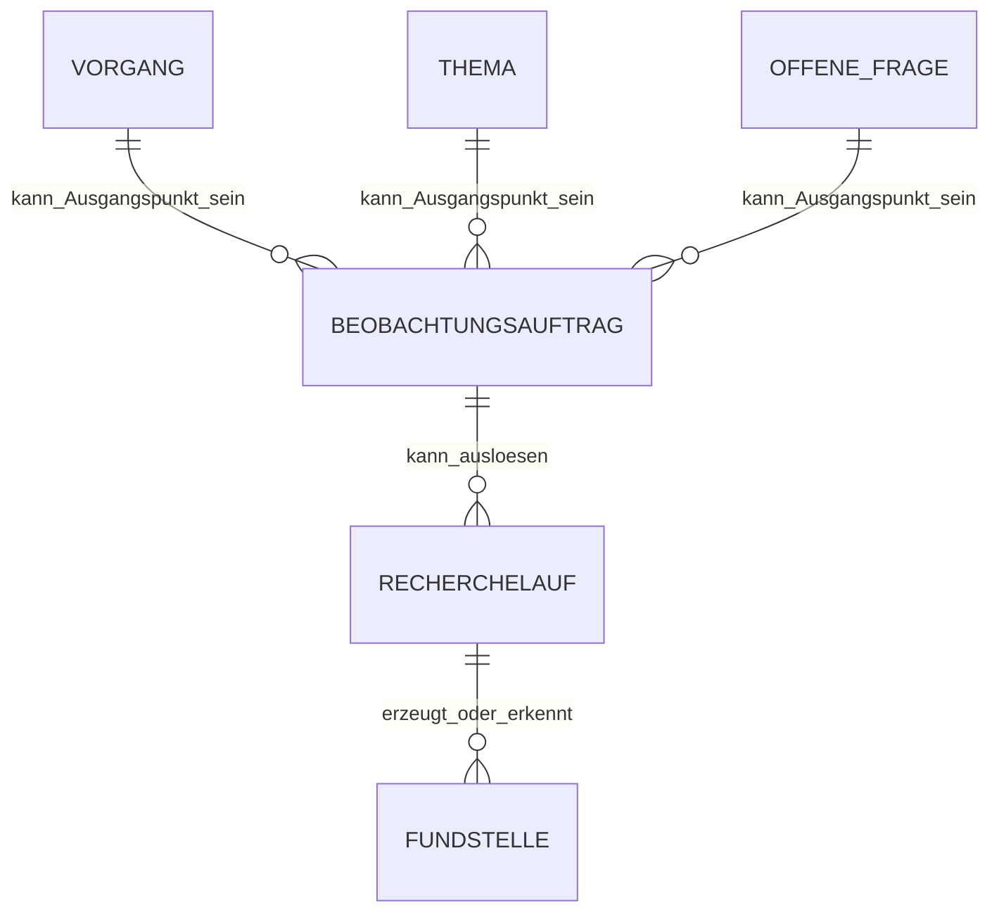

# Beobachtungs- und Recherchemodell – FIB Echtsystem

## Dokumentstand

| Version | Stand | Verantwortlich |
|---|---|---|
| 1.0 | 05.10.2026 | Josef Walter – erstellt mit KI-Unterstützung |

## 1. Zweck und Geltung

Dieses Dokument ist die verbindliche fachliche Primärquelle für die Datenbeziehungen zwischen **Beobachtungsauftrag**, **Recherchelauf** und den daraus entstehenden **Fundstellen** im FIB-Echtsystem.

Die übergeordneten Rechercheprinzipien bleiben in `docs/Recherchearchitektur-und-Referenzrahmen.md` definiert. Dieses Dokument konkretisiert ausschließlich die persistente fachliche Struktur und vermeidet eine zweite Beschreibung der allgemeinen Recherchelogik.

## 2. Grundmodell

Ein `Beobachtungsauftrag` beschreibt einen konkreten dauerhaften oder zeitweise aktiven Informationsbedarf. Ein `Recherchelauf` beschreibt dagegen eine konkrete Ausführung von Recherche zu einem bestimmten Zeitpunkt bzw. Anlass.

Verbindliche Trennung:

> **Beobachtungsauftrag = was FIB beobachten oder klären will. Recherchelauf = konkrete Ausführung der Recherche.**

Ein Beobachtungsauftrag kann mehrere Rechercheläufe auslösen. Ein Recherchelauf kann außerdem ohne Beobachtungsauftrag aus der offenen Recherche entstehen.



## 3. Beobachtungsauftrag

### 3.1 Primärbezug

Jeder Beobachtungsauftrag besitzt **genau einen fachlichen Primärbezug** auf einen der folgenden Gegenstände:

- `Vorgang`,
- `Thema`,
- `offene Frage / Wissenslücke`.

Ein Vorgang, Thema oder eine offene Frage kann keine, eine oder mehrere Beobachtungsaufträge besitzen.

Der Primärbezug verhindert unklare Sammelaufträge. Weitere FIB-Objekte können bei der Recherche als Kontext verwendet werden, werden dadurch aber nicht zu zusätzlichen Primärbezügen.

### 3.2 Fachlicher Inhalt

Ein Beobachtungsauftrag enthält entsprechend dem allgemeinen Recherchemodell mindestens:

- Primärbezug und Bezugstyp,
- Beobachtungsfrage bzw. Informationsbedarf,
- Status,
- Herkunft,
- kurze Begründung/Zweck,
- nachvollziehbare Änderungshistorie.

Optional können ein konkreter nächster Prüfzeitpunkt oder ein fachlicher Auslöser geführt werden, wenn sich dieser aus dem Sachverhalt ergibt.

Eine allgemeine Pflichtpriorität wird im MVP nicht eingeführt.

### 3.3 Status

Es gelten die bereits fachlich festgelegten Zustände:

- `aktiv`,
- `pausiert`,
- `beendet`.

Pause oder Ende werden fachlich begründet und nachvollziehbar gespeichert. Die KI darf sie vorschlagen, aber nicht eigenständig verbindlich entscheiden.

### 3.4 Keine fest verdrahtete Suchstrategie

Ein Beobachtungsauftrag speichert **keine verpflichtende feste Liste von Suchbegriffen, Quellen oder Akteuren**.

Die konkrete Recherchestrategie wird bei jedem Recherchelauf aus Beobachtungsfrage, aktuellem FIB-Wissen, Referenzwissen, Referenzrahmen, bekannten Quellen und offenem Rechercheauftrag abgeleitet.

Damit kann FIB auf neue Begriffe, Quellen und Entwicklungen reagieren, ohne Beobachtungsaufträge ständig technisch nachpflegen zu müssen.

## 4. Recherchelauf

### 4.1 Bedeutung

Ein `Recherchelauf` ist die nachvollziehbare fachliche Provenienz einer konkreten Rechercheausführung.

Er muss mindestens erkennen lassen:

- Art/Herkunft des Laufs,
- Zeitpunkt bzw. Zeitraum,
- auslösenden Beobachtungsauftrag, falls vorhanden,
- gegebenenfalls auslösenden AI Task bzw. dessen konkreten Lauf, soweit dies für die Nachvollziehbarkeit relevant ist,
- angewandten Recherchekontext bzw. maßgebliche Regelstände in nachvollziehbarer Form,
- Ergebnisstatus,
- neu erkannte oder geänderte Fundstellen,
- wesentliche Fehler oder Einschränkungen.

Die technische Speicherung einzelner Suchabfragen, Providerantworten oder Crawlerdetails ist Betriebs-/Auditinformation und nicht automatisch fachlicher Bestandteil des Recherchelaufs.

### 4.2 Herkunftstypen

Ein Recherchelauf kann insbesondere entstehen aus:

1. einem `Beobachtungsauftrag`,
2. der systemweiten offenen Recherche,
3. einem manuellen redaktionellen Rechercheauftrag,
4. einem anlassbezogenen Rückblick, insbesondere dem vereinbarten Sechs-Monats-Rückblick bei neuem oder wesentlich geschärftem Suchkontext.

Ein Lauf der offenen Recherche besitzt keinen künstlichen Beobachtungsauftrag.

### 4.3 Beziehung zu Fundstellen und Ereigniskandidaten

Neu gefundene oder veränderte Inhalte werden als `Fundstellen` registriert. Für jede relevante Fundstelle muss nachvollziehbar sein, aus welchem Recherchelauf sie erkannt bzw. erneut als verändert festgestellt wurde.

Ein späterer Ereigniskandidat wird **nicht direkt an den Beobachtungsauftrag gebunden**. Seine Herkunft ist über die verwendeten Fundstellen und deren Recherchelauf nachvollziehbar.

Damit gilt:

```text
Beobachtungsauftrag
→ Recherchelauf
→ Fundstelle
→ Ereigniskandidat
→ bestätigtes Ereignis
```

bzw. für offene Recherche:

```text
Offene Recherche
→ Recherchelauf
→ Fundstelle
→ Ereigniskandidat
```

Diese Trennung verhindert, dass ein Ereignis fachlich von dem Auftrag abhängig wird, durch den es zufällig entdeckt wurde.

## 5. Verhältnis zu AI Tasks

`Beobachtungsauftrag`, `Recherchelauf`, `AI Task` und `AI Task Run` sind nicht dasselbe:

- `Beobachtungsauftrag` = fachlicher Informationsbedarf,
- `AI Task` = operative Definition einer automatischen Arbeit,
- `AI Task Run` = konkrete technische/operative Ausführung dieses Tasks,
- `Recherchelauf` = fachlich nachvollziehbare konkrete Rechercheausführung und Herkunft der Rechercheergebnisse.

Ein AI Task kann einen Recherchelauf auslösen. Ein Recherchelauf kann aber auch manuell oder durch offene Recherche entstehen. Die spätere technische Umsetzung darf AI Task Run und Recherchelauf eng miteinander verknüpfen, muss ihre unterschiedlichen fachlichen Bedeutungen jedoch erhalten.

## 6. Persistenz und Historie

- Beobachtungsaufträge werden bei Pause oder Ende nicht gelöscht.
- Rechercheläufe bleiben als Herkunftsnachweis erhalten.
- Ein späterer ergebnisloser Recherchelauf entwertet keine zuvor bestätigten Ereignisse, Fundstellen oder fachlichen Beziehungen.
- Änderungen am Beobachtungsauftrag bleiben nachvollziehbar.
- Wiederaufnahme eines pausierten Auftrags setzt den bestehenden Auftrag fort, statt ohne fachlichen Grund eine neue Identität zu erzeugen.

## 7. Abgrenzung zu Fachfunktionen

Die Fachfunktionen werden in `docs/MVP-Fachfunktionen.md` definiert. Dieses Teilmodell liefert dafür insbesondere die fachliche Grundlage für:

- `manage_observation_task`,
- `run_research`,
- `register_finding`,
- zugehörige `get_*`-/`list_*`-Zugriffe.

## Regelstand je Recherchelauf und Testläufe

Jeder produktive Recherchelauf speichert den verwendeten Recherche- und Relevanzregelstand.

Regeltests sind von produktiven Rechercheläufen getrennt. Ein Regeltest kann zwei Teile enthalten:

- Regression über einen historischen Testbestand mit relevanten, nicht relevanten und unklaren Fundstellen;
- Probe-Recherche mit altem und neuem Regelstand zur Ermittlung der Entdeckungsdifferenz.

Fundstellen, die fachlich als nicht relevant abgeschlossen wurden, bleiben für diese Regression verfügbar und werden nicht allein wegen dieser Einstufung gelöscht.

Testergebnisse werden dem Regelentwurf zugeordnet. Sie verändern weder den Status historischer Fundstellen noch erzeugen sie ohne gesonderte Bestätigung neue produktive Recherchekandidaten.

## Änderungshistorie

| Version | Datum | Änderung |
|---|---|---|
| 1.0 | 05.10.2026 | Beobachtungsauftrag und Recherchelauf als getrennte fachliche Objekte verbindlich modelliert; genau ein Primärbezug je Beobachtungsauftrag, offene Recherche ohne künstlichen Beobachtungsauftrag, Provenienz über Recherchelauf und Fundstellen sowie Abgrenzung zu AI Task/AI Task Run festgelegt. |
