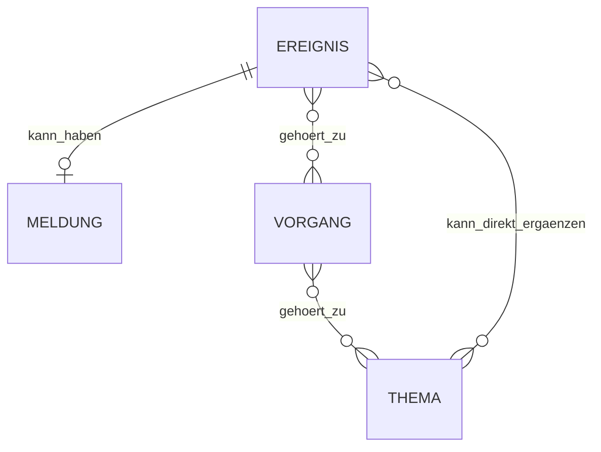
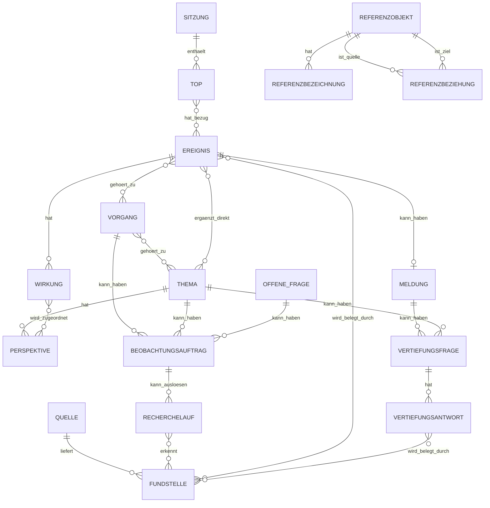

# Fachliche Datenanforderungen und logisches Datenmodell – FIB Echtsystem

## Dokumentstand

| Version | Stand | Verantwortlich |
|---|---|---|
| 3.0 | 05.10.2026 | Josef Walter – erstellt mit KI-Unterstützung |

## 1. Zweck und Geltung

Dieses Dokument ist die **konsolidierte Integrationsquelle** für die fachlichen Datenanforderungen und das logische Datenmodell des FIB-Echtsystems.

Es legt fest:

- welche zentralen fachlichen Objekte FIB kennt,
- wie diese Objekte grundsätzlich zusammenhängen,
- welche Kardinalitäten und Lebenszyklen für die Integration maßgeblich sind,
- welche spezialisierten Primärdokumente Detailregeln eines Teilbereichs verbindlich festlegen.

Konkrete PostgreSQL-/Supabase-Tabellen, Datentypen, Primär-/Fremdschlüssel, Indizes, Views, RLS-Policies und technische API-Schemas gehören **nicht** in dieses fachliche Modell. Sie werden aus diesem Dokument und den jeweils genannten Teilmodellen in der technischen/physische Modellierung abgeleitet.

Verbindlicher Dokumentationsgrundsatz:

> **Ein Sachverhalt – eine verbindliche Quelle.**

Deshalb wiederholt dieses Dokument spezialisierte Detailregeln nicht vollständig, sondern integriert deren fachliche Ergebnisse und verweist auf die jeweilige Primärquelle.

## 2. Modellierungsgrundsätze

- Fachliche Objekte werden nicht vorschnell mit Datenbanktabellen gleichgesetzt.
- Sachinformation und politische Einordnung bleiben unterscheidbar.
- Dokument/Fundstelle und Ereignis sind getrennte Objekte.
- Redaktionelle Texte sind keine zusätzliche unabhängige Tatsachenquelle.
- KI darf Vorschläge erzeugen; fachlich oder öffentlich wirksame Entscheidungen folgen den definierten Bestätigungs- und Freigaberegeln.
- Fachlich bestätigte Objekte und Beziehungen werden nicht spurlos gelöscht, nur weil sie später nicht mehr aktuell oder auffindbar sind.
- Historisierung erfolgt so schlank wie möglich und so vollständig wie fachlich erforderlich.
- Referenzwissen ergänzt den Wissenskern gezielt, ersetzt ihn aber nicht.
- Allgemeines Weltwissen wird nicht vorsorglich als eigener FIB-Datenbestand dupliziert.
- Fachfunktionen arbeiten auf diesem Datenmodell; sie definieren keine zweite Datenstruktur.

Detailquellen insbesondere:

- Persistenz/Lebenszyklus: `docs/Persistenz-und-Lebenszyklusmodell.md`
- Sitzung/Beschluss: `docs/Sitzungs-und-Beschlussmodell.md`
- Wirkung: `docs/Wirkungsmodell.md`
- Beobachtung/Recherchelauf: `docs/Beobachtungs-und-Recherchemodell.md`
- „Mehr wissen?“: `docs/Mehr-wissen-Modell.md`
- Plausibilität/Freigabe: `docs/Fachliche-Plausibilitaets-und-Freigaberegeln.md`
- Themen/Vorgänge: `docs/Themen-und-Vorgangslogik.md`
- Fachfunktionen: `docs/MVP-Fachfunktionen.md`

## 3. Fachlicher Wissenskern

Die zentrale fachliche Struktur besteht aus:

- `Ereignis`
- `Meldung`
- `Vorgang`
- `Thema`

Sie bildet **keine starre Hierarchie**.



### 3.1 Ereignis

Ein `Ereignis` ist ein fachlich relevantes Geschehen oder eine relevante Entwicklung in der Wirklichkeit.

Beispiele:

- eine neue Beschlussvorlage wird veröffentlicht,
- ein Gemeinderat behandelt einen TOP oder fasst einen Beschluss,
- ein Planungsstand ändert sich,
- ein Vorhabenträger veröffentlicht neue relevante Unterlagen,
- eine neue belastbare Information verändert den Stand eines laufenden Sachverhalts.

Ein Dokument selbst ist kein Ereignis. Seine Veröffentlichung kann jedoch ein Ereignis sein.

Fachliche Zustände bestätigter Ereignisse:

- `bestätigt`,
- `zurückgenommen`,
- `zusammengeführt`.

Ein Ereignis wird nicht allein wegen Alters oder fehlender späterer Treffer inaktiv oder gelöscht.

### 3.2 Meldung

Eine `Meldung` ist die redaktionelle öffentliche FIB-Darstellung eines berichtenswerten Ereignisses.

Verbindliche Kardinalität:

- Ereignis → Meldung: `0..1`
- Meldung → Ereignis: genau `1`

Damit kann ein Ereignis ohne Meldung bestehen; eine Meldung ohne Ereignis nicht.

Veröffentlichungsstatus:

- `Entwurf`,
- `freigegeben`,
- `veröffentlicht`,
- `zurückgezogen`.

`aktualisiert` und `korrigiert` sind keine eigenen Dauerstatus, sondern nachvollziehbare Änderungen einer fortbestehenden Meldung.

### 3.3 Vorgang

Ein `Vorgang` bündelt mehrere Ereignisse desselben konkreten länger laufenden Sachverhalts.

Verbindliche Kardinalität:

- Ereignis → Vorgang: `0..n`
- Vorgang → Ereignis: `1..n`

Der Normalfall ist eine Ereigniszuordnung zu genau einem Vorgang. Mehrfachzuordnung bleibt möglich, wenn ein reales Ereignis mehrere konkrete Vorgänge tatsächlich berührt.

Eine Meldung wird nicht zusätzlich unabhängig einem Vorgang zugeordnet. Der Zusammenhang wird über `Meldung → Ereignis → Vorgang` abgeleitet.

Vorgangsstatus:

- `aktiv`,
- `ruhend`,
- `abgeschlossen`,
- `archiviert`.

### 3.4 Thema

Ein `Thema` ist eine übergeordnete Fragestellung, die mehrere Vorgänge und gegebenenfalls einzelne zusätzliche Ereignisse verbindet und dadurch Erklärungsgewinn erzeugt.

Beziehungen:

- Vorgang ↔ Thema: `0..n : 0..n`
- Ereignis ↔ Thema: `0..n : 0..n` als direkte Zusatzbeziehung

Vorgänge sind der bevorzugte Auswahlweg eines Themas. Mit einem ausgewählten Vorgang werden dessen Ereignisse in die Themenanalyse einbezogen. Direkte Ereignisbeziehungen dienen zusätzlichen Einzelereignissen, die nicht bereits sinnvoll über einen ausgewählten Vorgang enthalten sind.

Für Vorgang↔Thema und direkte Ereignis↔Thema-Beziehungen wird die redaktionell bestätigte `Bedeutung für das Thema` geführt:

- `prägend`,
- `relevant`,
- `ergänzend`.

Themenstatus:

- `aktiv`,
- `ruhend`,
- `archiviert`.

Ein Thema besitzt bewusst keinen Status `abgeschlossen`.

Die detaillierte Entstehungs-, Dublett- und Bearbeitungslogik steht in `docs/Themen-und-Vorgangslogik.md`.

## 4. Strukturierter Redaktionsstand und politische Einordnung

### 4.1 Grundsatz

> **Der strukturierte Redaktionsstand ist die fachliche Quelle. Die Textfassung ist eine daraus abgeleitete sprachliche Darstellung.**

Für Vorgänge und Themen werden fachlich relevante strukturierte Gesamtstände versioniert. Einzelne Analysebausteine erhalten keine parallelen eigenen Versionsketten.

Öffentlich wird grundsätzlich nur der aktuell freigegebene Stand gezeigt. Frühere bestätigte Gesamtstände bleiben im Redaktionssystem rekonstruierbar.

### 4.2 Perspektive

Eine `Perspektive` ist ein sachlicher Betrachtungsaspekt innerhalb eines Themas, z. B. Lärm, Verkehrssicherheit, Flächenverbrauch oder kommunaler Handlungsspielraum.

Eine Perspektive gehört zu einem Thema und kann mehrere Wirkungen strukturieren.

### 4.3 Wirkung

Eine `Wirkung` ist eine sachlich belegbare oder begründet erwartbare Folge.

Verbindliche Integrationsregel:

> **Jede Wirkung ist an genau einem Ereignis verankert. Zusätzlich besitzt sie einen fachlichen Herkunftskontext, insbesondere Vorgang oder Thema. Dieser Herkunftskontext bestimmt, wo die Wirkung fachlich geändert werden darf.**

Ein Ereignis kann mehrere eigenständige Wirkungen besitzen. Gleichbedeutende Wirkungen dürfen in einer übergeordneten Analyse nicht mehrfach gewichtet werden.

Eine vorhandene Wirkung kann in anderen Bearbeitungskontexten analysiert werden, ohne dort stillschweigend verändert zu werden.

Die detaillierte Wirkungslogik steht in `docs/Wirkungsmodell.md`.

### 4.4 Wirkung ↔ Perspektive

Wird eine Wirkung in einem Thema berücksichtigt, wird sie einer oder mehreren bestätigten Perspektiven dieses Themas zugeordnet.

Die Zuordnung wird persistent gespeichert und nur bei fachlichem Anlass erneut geprüft, z. B. bei Änderung der Wirkung, Änderung der Perspektive, neuer Perspektive, auffälliger Plausibilität oder ausdrücklicher redaktioneller Neubewertung.

### 4.5 Strukturierte Bewertung

Für die politische Einordnung werden insbesondere getrennt geführt:

- Zielbereich bzw. einschlägiger Referenzmaßstab,
- Wirkungsrichtung,
- Bedeutung der Wirkung,
- Verlässlichkeit,
- politisches Gewicht,
- jeweils zugehörige Begründungen,
- Gestaltungsoptionen,
- Zielkonflikte,
- strukturierte Abwägung.

Feste fachliche Wertemengen:

**Wirkungsrichtung**
- unterstützt die Zielerreichung,
- behindert die Zielerreichung,
- keine erkennbare Auswirkung,
- unklar.

**Bedeutung der Wirkung**
- hoch,
- mittel,
- gering,
- unklar.

**Verlässlichkeit**
- hoch,
- mittel,
- gering,
- unklar.

**Politisches Gewicht**
- hoch,
- mittel,
- gering,
- offen.

FIB strukturiert die Abwägung, erzeugt aber **kein pauschales Gesamturteil positiv/negativ** über Vorgang oder Thema.

### 4.6 Gesamtversionierung

Eine neue bestätigte Gesamtversion eines Vorgangs oder Themas entsteht, wenn sich fachliche Aussage, Sachstand oder politische Einordnung relevant ändern.

Typische Auslöser sind:

- neue, entfallene oder wesentlich geänderte Wirkung,
- relevante Änderung von Perspektive oder Zuordnung,
- relevante Änderung von Bewertungswert oder Begründung,
- geänderte Gestaltungsoption oder Abwägung,
- relevante Änderung einer offenen Frage,
- wesentliche Änderung von Leitfrage/Abgrenzung eines Themas,
- neuer Sachstand oder neue Entscheidung eines Vorgangs.

Reine Rechtschreib-, Stil-, Format- oder technische Metadatenänderungen erzeugen keine neue fachliche Gesamtversion.

## 5. Quelle, Fundstelle und Beleg

### 5.1 Quelle

Eine `Quelle` bezeichnet Herkunft bzw. Träger einer Information, z. B. Gemeinde, Pressemedium, Behörde, Initiative oder Partei.

### 5.2 Fundstelle

Eine `Fundstelle` ist die konkrete Seite, Datei, das Dokument oder die sonstige Informationseinheit.

Eine Quelle kann mehrere Fundstellen besitzen.

Getrennt zu führen sind insbesondere:

- fachliche Existenz der Fundstelle,
- technischer Speicherort/Bereitstellung,
- ursprüngliche öffentliche Verfügbarkeit,
- aktuelle technische Erreichbarkeit,
- öffentliche Sichtbarkeit über FIB,
- Rechte zur öffentlichen Bereitstellung.

Eine nicht mehr erreichbare URL ist kein Löschgrund für eine bereits als Beleg verwendete Fundstelle.

### 5.3 Öffentliche Bereitstellung

Öffentliche Bereitstellung einer gespeicherten Datei oder eines Bildes setzt eine positiv geklärte öffentliche Nutzungs-/Veröffentlichungsberechtigung voraus.

Ungeklärte Rechte reichen nicht aus.

Öffentliche Freigabe ist eine geschützte S3-Aktion. Detailregeln: `docs/Fachliche-Plausibilitaets-und-Freigaberegeln.md`.

## 6. Recherche, Informationsbedarf und Beobachtung

### 6.1 Beobachtungsauftrag

Ein `Beobachtungsauftrag` beschreibt einen konkreten fachlichen Informationsbedarf.

Jeder Beobachtungsauftrag besitzt genau einen Primärbezug auf:

- einen Vorgang,
- ein Thema oder
- eine offene Frage/Wissenslücke.

Status:

- `aktiv`,
- `pausiert`,
- `beendet`.

Der Beobachtungsauftrag speichert keine fest verdrahtete Suchwort- oder Quellenliste. Die konkrete Recherchestrategie wird bei einem Recherchelauf aus dem aktuellen FIB-Kontext abgeleitet.

### 6.2 Recherchelauf

Ein `Recherchelauf` dokumentiert eine konkrete Rechercheausführung und ihre fachliche Provenienz.

Ein Beobachtungsauftrag kann mehrere Rechercheläufe auslösen. Ein Recherchelauf kann auch ohne Beobachtungsauftrag aus offener Recherche, einem manuellen Auftrag oder einem anlassbezogenen Rückblick entstehen.

Provenienzkette:

```text
Beobachtungsauftrag (optional)
→ Recherchelauf
→ Fundstelle
→ Ereigniskandidat
→ bestätigtes Ereignis
```

Ein Ereigniskandidat wird nicht direkt dauerhaft an den Beobachtungsauftrag gebunden.

Detailmodell: `docs/Beobachtungs-und-Recherchemodell.md`.

## 7. Offene Frage / Wissenslücke

Eine `offene Frage` beschreibt einen noch nicht geklärten, noch nicht entschiedenen, nicht ausreichend belegten oder noch nicht bekannten Aspekt eines FIB-Sachverhalts.

Sie ist ein eigenständiges fachliches Objekt und nicht identisch mit einer öffentlichen „Mehr wissen?“-Frage.

Fachlicher Erkenntnisstatus:

- `offen`,
- `teilweise geklärt`,
- `geklärt`,
- `gegenstandslos`.

Zusätzlicher Bearbeitungsstatus:

- `aktiv`,
- `zurückgestellt`.

Offene Fragen können mit Meldung, Vorgang und/oder Thema in fachlichem Zusammenhang stehen. Ein Beobachtungsauftrag kann eine offene Frage als Primärbezug besitzen.

Geklärte oder gegenstandslos gewordene Fragen werden nicht gelöscht; Statusänderung und Auflösungsbezug bleiben nachvollziehbar.

## 8. Sitzung, TOP und Beschluss

Das Detailmodell steht in `docs/Sitzungs-und-Beschlussmodell.md`.

### 8.1 Sitzung und TOP

Eine `Sitzung` ist ein konkreter Termin eines politischen Gremiums. Ein `TOP` gehört genau zu einer Sitzung.

Kardinalität:

- Sitzung → TOP: `0..n`
- TOP → Sitzung: genau `1`

Ein TOP ist kein Ereignis. Er beschreibt den Verfahrens-/Behandlungskontext.

### 8.2 Sitzung/TOP ↔ Ereignis

Sitzung und TOP können mit mehreren Ereignissen verbunden sein; ein Ereignis kann mehreren Sitzung-/TOP-Kontexten zugeordnet sein, wenn dies sachlich tatsächlich zutrifft.

Meldungsbezüge werden abgeleitet:

```text
Meldung → Ereignis → TOP → Sitzung
```

Es werden keine zusätzlichen autoritativen Beziehungen `Meldung ↔ TOP` oder `Meldung ↔ Sitzung` gespeichert.

### 8.3 Vorlage, Beratung und Beschluss

Verbindliche Trennung:

- Beschlussvorlage = Fundstelle/Dokument,
- Veröffentlichung der Vorlage = mögliches Ereignis,
- tatsächliche Beratung/Behandlung = späteres Ereignis,
- Vertagung/Absetzung = späteres Ereignis, soweit fachlich relevant,
- Beschlussfassung = späteres Ereignis bzw. Teil desselben realen Behandlungs-/Entscheidungsschritts.

Der ursprüngliche Beschlussvorschlag bleibt als Vergleichsfassung erhalten.

### 8.4 Beschlusspunkt, Fassung und Abstimmung

Beschlusspunkte und Abstimmungen werden erst aus der Niederschrift bzw. der belastbaren Dokumentation des tatsächlichen Sitzungsverlaufs erzeugt.

Ein Beschlusspunkt kann mehrere Fassungen und mehrere Abstimmungen besitzen. Die tatsächlich abgestimmte Fassung bleibt mit ihrem Abstimmungsergebnis und der belegenden Fundstelle nachvollziehbar.

## 9. Referenzwissen

Referenzwissen ist unterstützender Recherche- und Zuordnungskontext und kein paralleler allgemeiner Wissensbestand.

MVP-Bausteine:

- `Referenzobjekt`,
- `Referenzbezeichnung`,
- `Referenzbeziehung`.

Typische Bereiche:

1. Orts- und Objektwissen,
2. selektives Akteurs-/Zuständigkeitswissen,
3. FIB-spezifisches Kontextwissen.

Beziehungen:

- Referenzobjekt → Referenzbezeichnung: `0..n`
- Referenzobjekt ↔ Referenzobjekt: `0..n` über Referenzbeziehung
- Referenzobjekt ↔ Ereignis/Vorgang/Thema: `0..n` als Kontextbeziehung

MVP-Beziehungstypen insbesondere:

- ist Teil von,
- liegt in/an,
- verbindet,
- erschließt/versorgt,
- steht in funktionalem Zusammenhang mit.

Status bestätigbarer Referenzobjekte/-beziehungen:

- `vorgeschlagen`,
- `bestätigt`,
- `nicht mehr gültig / zurückgenommen`.

Nur bestätigtes Referenzwissen erweitert den verbindlichen Recherchekontext.

## 10. Referenzmaßstab

Ein `Referenzmaßstab` ist ein dokumentierter, versionierter Maßstab, der Recherchefragen, Relevanz-/Qualitätsprüfungen oder politische Einordnung ausrichtet, ohne die Tatsachenbasis zu verändern.

FIB unterscheidet drei Ebenen:

1. allgemeine FIB-Qualitätsmaßstäbe,
2. demokratisch-gesellschaftliche Maßstäbe,
3. grün-politische Maßstäbe einschließlich dokumentierter lokaler Positionen.

Ein Referenzmaßstab muss fachlich mindestens eindeutig identifizierbar sein und Ebene, Aussage, Herkunft/Quelle, Geltungsbereich, Status und Version erkennen lassen.

Neue oder geänderte Referenzmaßstäbe werden auf:

- Dublette/Nähe,
- Widerspruch,
- Abgrenzung,
- Ergänzung/Konkretisierung,
- Erfordernis einer neuen Version

geprüft.

Ein neuer Referenzmaßstab wird nur vorgeschlagen, wenn er gegenüber dem aktiven Referenzrahmen konsistent, hinreichend abgegrenzt und nicht redundant ist.

## 11. „Mehr wissen?“ – öffentliche Vertiefung

Detailmodell: `docs/Mehr-wissen-Modell.md`.

Für den MVP werden unterschieden:

- `Vertiefungsfrage`,
- `Vertiefungsantwort`.

Eine Vertiefungsfrage besitzt genau einen primären öffentlichen Kontext:

- Meldung oder
- Thema.

Eine Vertiefungsantwort gehört zu einer Vertiefungsfrage und ist quellengebunden.

Öffentliche Tatsachenbehauptungen einer Vertiefungsantwort müssen auf nachvollziehbare Fundstellen zurückführbar sein.

Eine Vertiefungsfrage ist nicht identisch mit einer offenen Frage/Wissenslücke. Im MVP werden öffentlich grundsätzlich nur Fragen mit veröffentlichungsfähiger Antwort angeboten.

## 12. Bild und Bildverwendung

`Bild` und `Bildverwendung` sind getrennte Objekte.

### Bild

Beschreibt das wiederverwendbare Asset, insbesondere:

- Speicherreferenz,
- Herkunft/Urheber,
- Nutzungsrecht/Lizenz und ggf. Nachweis,
- Datenschutz-/Persönlichkeitsrechtsstatus soweit erforderlich,
- Alt-Text,
- Bildunterschrift,
- ggf. Aufnahmeort/-datum,
- Schlagworte/Motivbezug,
- Freigabestatus.

### Bildverwendung

Beschreibt die konkrete Verwendung eines Bildes an einem Zielobjekt, insbesondere Meldung, Vorgang, Thema oder ggf. Sitzung.

Sie hält mindestens Sachbezug, Rolle/Verwendungsart, konkrete Freigabe und Aktualität/Gültigkeit der Zuordnung fest.

Mehrfachverwendung ist möglich, wenn jede Verwendung fachlich passt und rechtlich zulässig ist.

## 13. AI Task und AI Task Run

`AI Task` und `AI Task Run` sind operative Objekte und vom fachlichen Informationsbedarf getrennt.

- `AI Task` = persistente Definition automatisierter Arbeit, ihres Auslösers, zulässiger Fachfunktionen und Betriebsrahmens.
- `AI Task Run` = konkrete Ausführung dieses Tasks.

Ein AI Task kann einen fachlichen Recherchelauf auslösen. AI Task Run und Recherchelauf bleiben jedoch wegen ihrer unterschiedlichen Bedeutung getrennt.

Detailregeln zu Routing, Kosten und Qualitätsklassen stehen in `docs/KI-Betrieb-und-Kosten.md` und `docs/KI-Qualitaet-und-Modellunabhaengigkeit.md`.

## 14. Persistenz und Lebenszyklus

Detailquelle: `docs/Persistenz-und-Lebenszyklusmodell.md`.

Verbindlicher Grundsatz:

> **Ein fachlich bestätigtes Objekt oder eine fachlich bestätigte Beziehung wird nicht spurlos gelöscht, nur weil sie später nicht mehr aktuell, relevant oder auffindbar ist.**

Je nach Objekt kommen stattdessen insbesondere Änderung, Rücknahme, Zusammenführung, Archivierung, Aufhebung einer Beziehung oder Historisierung über einen Gesamtstand in Betracht.

Echte technische Löschung bleibt auf nicht fachlich wirksame technische Zwischenstände, unbeabsichtigte technische Dubletten oder vergleichbare Fälle beschränkt.

Rein technische Betriebsdaten wie Cache, Retry-Informationen, Performance-Metriken oder kurzlebige Session-Daten unterliegen nicht automatisch den fachlichen Persistenzregeln.

## 15. Plausibilität, Freigabe und Rechte

Detailquelle: `docs/Fachliche-Plausibilitaets-und-Freigaberegeln.md`.

Verbindliche Unterscheidung:

- **harte Fachregel:** ein objektiv unzulässiger Zustand wird serverseitig blockiert,
- **Plausibilitätsprüfung:** semantische Auffälligkeit oder Entscheidungsspielraum erzeugt einen sichtbaren Prüfhinweis; die redaktionelle Entscheidung bleibt erforderlich.

Beispiele blockierender Regeln sind insbesondere unzulässige Kardinalitäten, fehlende notwendige Beziehungen, nicht erfüllte Veröffentlichungsvoraussetzungen oder öffentliche Mediennutzung ohne positiv geklärte Rechte.

## 16. Fachfunktionen als einziger regulärer fachlicher Zugriffsweg

Die Fachfunktionen werden in `docs/MVP-Fachfunktionen.md` beschrieben; Rollen, Bestätigungs- und Zugangslogik in `docs/KI-Zugangswege-und-Fachfunktionen.md`.

Verbindlich gilt:

> **Reguläre fachliche Lese- und Schreibzugriffe aus Web-App, FIB-Chat und AI Tasks laufen über dieselbe Fachfunktions-/Service-Schicht.**

Damit werden Fachregeln, Rechte, Versionierung, Bestätigungen und Audit unabhängig vom Zugangskanal einheitlich durchgesetzt.

Direkte technische Datenbankzugriffe sind ausschließlich für technische Betriebsaufgaben wie Migration, Backup, Restore oder Wartung vorgesehen und kein alternativer fachlicher Arbeitsweg.


## 17. Fachliche Schwellenwert- und Statusregel

Für systemweit konsistente Warn- und Hervorhebungslogik wird ein eigenes fachliches Konfigurationsobjekt **Schwellenwert-/Statusregel** vorgesehen.

Es beschreibt mindestens:

- stabilen Regeltyp bzw. technischen Schlüssel;
- fachliche Bezeichnung und Beschreibung;
- Geltungsbereich / Objekttyp;
- Art der Regel: numerischer Schwellenwert oder semantischer Status;
- Warnschwelle und kritische Schwelle, soweit numerisch;
- Einheit;
- Aktivstatus;
- Änderungs-/Auditinformationen.

Verbindlich gilt:

- zulässige Regeltypen sind systemseitig definiert;
- Admins ändern fachliche Parameter, nicht ausführbaren Code oder freie Regeldefinitionen;
- Listen, Dashboard, Arbeitskorb und Auswertungen verwenden dieselben zentralen Regeln;
- Änderungen an Regeln werden nachvollziehbar historisiert;
- semantische Regeln wie „Medienrechte ungeklärt“ können ohne numerischen Grenzwert eine definierte Warnstufe auslösen.

Die konkrete PostgreSQL-Tabelle, Datentypen und Indizes werden im physischen Modell festgelegt.

## 18. Konsolidierte Beziehungsübersicht



Die Darstellung ist fachlich/logisch zu lesen. Ob eine n:m-Beziehung später über eine eigene technische Relationstabelle, eine normalisierte Zuordnung oder eine andere PostgreSQL-Struktur umgesetzt wird, wird erst im physischen Modell entschieden.

## 19. Nach G3 offene technische/physische Modellierungsfragen

Nach der fachlichen Konsolidierung bleiben keine bekannten offenen G3-Grundsatzfragen zurück.

Für die nächste Phase sind insbesondere technisch zu entscheiden:

- konkrete PostgreSQL-/Supabase-Tabellen,
- technische Primär- und Fremdschlüssel,
- Datentypen und Enums,
- Relationstabellen und Historisierungsstruktur,
- Indizes und Such-/Vector-Strukturen,
- RLS/Policies und Authentifizierung,
- technische Auditstruktur,
- API-/JSON-Schemas der Fachfunktionen,
- technische Aufbewahrungsfristen für Betriebsdaten,
- konkrete Datei-/Storage-Struktur,
- Routing-/Providerkonfiguration des KI-Betriebs.

Diese Punkte verändern das fachliche Modell nicht und gehören in die anschließenden Gründungs-/Architekturphasen.

## 20. Redaktionelle Koordination und Benutzer

### 20.1 FIB-Benutzer

Ein `FIB-Benutzer` verbindet die Supabase-Auth-Identität mit den FIB-spezifischen Eigenschaften der redaktionellen Anwendung.

Mindestens zu führen sind:

- eindeutige Auth-Identität,
- vollständiger Anzeigename,
- optionaler Rufname,
- Rolle: `Redakteur` oder `Admin`,
- Aktivstatus,
- Einrichtungs-/Einladungsstatus,
- MFA-/Zugangsstatus soweit für die Anwendung erforderlich,
- Erstellungs- und Änderungszeitpunkt.

Der Rufname ist ausschließlich Darstellungsinformation und besitzt keine Berechtigungswirkung.

Ein deaktivierter Benutzer bleibt für Historie, Audit und bestehende fachliche Verweise erhalten.

Eine endgültige Löschung ist nur zulässig, wenn keine fachlich relevante Historie oder Referenz auf den Benutzer besteht. Andernfalls wird deaktiviert.

### 20.2 Federführung

`Federführung` ist eine weiche organisatorische Zuordnung zu einem aktiven FIB-Benutzer. Sie ist keine Berechtigung und keine Schreibsperre.

Federführung wird mindestens für Ereignis, Meldung, Vorgang und Thema geführt; für weitere Arbeitsobjekte kann sie bei Bedarf ergänzt werden.

Regeln:

- Wird aus einem Fund ein Ereignis erzeugt, erhält das Ereignis initial die Federführung des bearbeitenden Redakteurs.
- Neu aus einem Ereignis erzeugte Meldungen, Vorgänge und Themen übernehmen initial dessen Federführung.
- Sobald ein Zielobjekt erstmals eine eigene Federführung besitzt, wird sie durch spätere Änderungen am Ursprung nicht automatisch überschrieben.
- Federführung kann manuell geändert oder freigegeben werden.
- Abweichende Federführungen zwischen verbundenen Objekten erzeugen höchstens einen Hinweis, keine automatische Synchronisierung.

### 20.3 Letzte Bearbeitung

Die `Letzte Bearbeitung` ist abgeleitete Koordinationsinformation aus der letzten fachlich relevanten Änderung eines Objekts.

Sie enthält mindestens Bearbeiter und Zeitpunkt. Sie erzeugt keine Exklusivität und keine Berechtigung.

### 20.4 Bearbeitungssperre

Eine `Bearbeitungssperre` ist ein kurzlebiges technisches Koordinationsobjekt für exklusiven Schreibzugriff.

Sie enthält mindestens:

- Objekttyp und Objekt-ID,
- sperrenden FIB-Benutzer,
- Beginn,
- letzte Erneuerung,
- Ablaufzeitpunkt.

Verbindliche Regeln:

- Lesen erzeugt keine Sperre.
- Die Sperre wird erst beim ersten tatsächlichen Bearbeitungsversuch angefordert.
- Pro Objekt darf höchstens eine aktive Sperre bestehen.
- Während der Bearbeitung wird die Sperre regelmäßig erneuert.
- Beim regulären Ende wird sie freigegeben; ohne Erneuerung verfällt sie automatisch.
- Ein Admin kann eine offensichtlich verwaiste fremde Sperre aufheben; dies wird auditiert.

Die Sperre ist kein fachlicher Dauerzustand und gehört nicht in die fachliche Versionshistorie des Objekts.

### 20.5 Übernahmeanfrage

Eine `Übernahmeanfrage` ist eine kooperative Nachricht zwischen Redakteuren zu einem konkreten Arbeitsobjekt.

Sie enthält mindestens:

- anfragenden Benutzer,
- angefragten Benutzer,
- Zielobjekt,
- optionale Nachricht,
- Zeitpunkt,
- Status: `offen`, `angenommen`, `abgelehnt`, `erledigt` bzw. `gegenstandslos`.

Die Anfrage ändert weder Federführung noch Rechte automatisch. Eine tatsächliche Übernahme erfolgt durch eine separate bewusste Aktion.

## 21. Operative Umsetzungspflicht

Für die in diesem Datenmodell beschriebenen Koordinations- und Benutzerobjekte gilt die projektweite Umsetzungsregel:

> Datenhaltung, Fachfunktion, Arbeits-/KI-Prozess, Rechte/Audit und Test müssen vor Implementierung des jeweiligen UI-Bereichs vollständig zugeordnet sein.

## Änderungshistorie

| Version | Datum | Änderung |
|---|---|---|
| 3.0 | 05.10.2026 | G3-Gesamtkonsolidierung: zentrales Datenmodell zur Integrationsquelle gestrafft; Wissenskern, strukturierter Redaktionsstand, Quellen/Fundstellen, Beobachtungsauftrag/Recherchelauf, Sitzung/Beschluss, Referenzwissen, Referenzmaßstab, „Mehr wissen?“, Bilder, AI Tasks, Persistenz, Plausibilität/Freigabe und gemeinsame Fachfunktionsschicht integriert. Veraltete offene G3-Punkte entfernt; Vorlage als Fundstelle und spätere Behandlung/Beschlussfassung als getrennte Ereignisentwicklung konsolidiert. Verbleibende Fragen ausdrücklich auf technische/physische Modellierung begrenzt. |
| 2.1 | 05.10.2026 | Schlankes Referenzwissen in das konzeptionelle G3-Datenmodell integriert. |
| 2.0 | 04.10.2026 | Sitzung und TOP in den Wissenskern integriert. |
| 1.9 | 04.10.2026 | Status- und Rücknahmelogik für Ereignis und Meldung festgelegt. |
| 1.8 | 04.10.2026 | Lebenszyklusstatus für Vorgang und Thema festgelegt. |
| 1.7 | 04.10.2026 | Schwelle für Gesamtversionen konkretisiert. |
| 1.6 | 04.10.2026 | Versionierungsgrundsatz für strukturierte Gesamtstände festgelegt. |
| 1.5 | 04.10.2026 | Offene Fragen/Wissenslücken und Lebenszyklus ergänzt. |
| 1.4 | 04.10.2026 | Demonstrator-Transferentscheidungen zu Einordnung, offenen Fragen und Bildern nachgezogen. |
| 1.3 | 03.10.2026 | Politischen Bezug und Begründungslogik konkretisiert. |
| 1.2 | 03.10.2026 | Feste fachliche Wertemengen festgelegt. |
| 1.1 | 03.10.2026 | Persistente Wirkung-Perspektive-Zuordnung festgelegt. |
| 1.0 | 03.10.2026 | Wirkungsmodell konkretisiert. |
| 0.9 | 03.10.2026 | Themenmodell ergänzt. |
| 0.8 | 03.10.2026 | Themenmodell korrigiert. |
| 0.7 | 03.10.2026 | Quellenmodell konkretisiert. |
| 0.6 | 02.10.2026 | Bestätigungslogik und feldübergreifende Plausibilitätsprüfung festgelegt. |
| 0.5 | 02.10.2026 | Strukturierter Redaktionsstand als fachliche Quelle festgelegt. |
| 0.4 | 02.10.2026 | Vorgang↔Thema konkretisiert. |
| 0.3 | 02.10.2026 | Beziehung Ereignis↔Vorgang festgelegt. |
| 0.2 | 02.10.2026 | Kardinalität Ereignis↔Meldung festgelegt. |
| 0.1 | 01.10.2026 | G3-Primärdokument angelegt. |