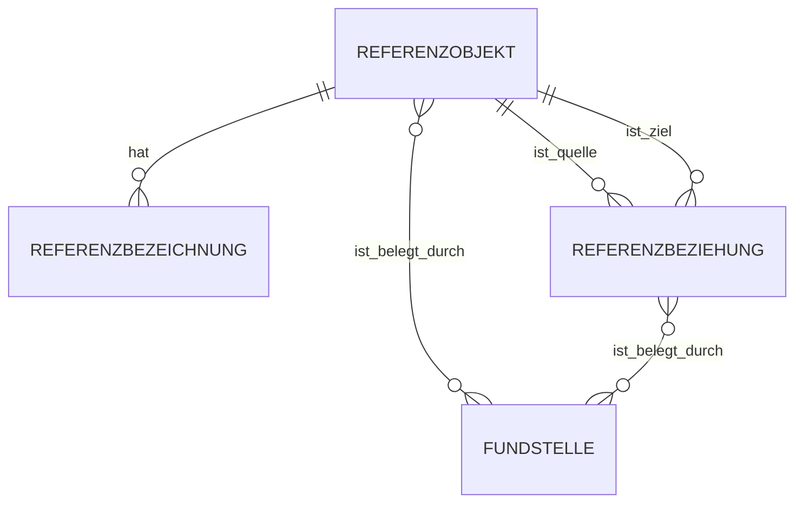

# Fachliche Datenanforderungen und logisches Datenmodell – FIB Echtsystem

## Dokumentstand

| Version | Stand | Verantwortlich |
|---|---|---|
| 2.1 | 05.10.2026 | Josef Walter – erstellt mit KI-Unterstützung |

## 1. Zweck und Geltung

Dieses Dokument ist die verbindliche Primärquelle für die fachlichen Datenanforderungen und das logische Datenmodell des FIB-Echtsystems.

Es beschreibt zunächst fachliche Entitäten, Beziehungen, Kardinalitäten, Status und Historisierung. Konkrete PostgreSQL-/Supabase-Tabellen, Datentypen, Indizes und technische Implementierungsdetails folgen erst in späteren Schritten.

Ziel ist ein robustes und langfristig tragfähiges Modell, das für einen kleinen Ortsverband mit begrenztem Redaktionsaufwand praktisch betreibbar bleibt.

## 2. Modellierungsgrundsätze

- Fachliche Objekte werden nicht vorschnell mit Datenbanktabellen gleichgesetzt.
- Ein Sachverhalt erhält nur eine verbindliche fachliche Primärquelle.
- Historisierung wird dort vorgesehen, wo fachlich relevante Veränderungen nachvollziehbar bleiben müssen.
- Technische Änderungen dürfen nicht automatisch als fachliche Änderungen gelten.
- Sachinformation und „Unsere Einordnung“ bleiben fachlich und technisch unterscheidbar.
- Das Modell unterstützt KI-gestützte Arbeit, bleibt aber modellunabhängig.
- Redaktionelle Bestätigung bleibt für veröffentlichungsrelevante und fachlich wirksame Entscheidungen vorgesehen.
- Für KI-formulierte Einordnungen ist der strukturierte Redaktionsstand die fachliche Quelle; die Textfassung ist eine daraus abgeleitete Darstellung.
- Fachlich-politische Qualität wird nicht nur über Einzelwerte, sondern auch über Plausibilitätsprüfungen zwischen mehreren strukturierten Angaben abgesichert.
- Herkunft einer Quelle, konkrete Fundstelle bzw. Datei, technischer Speicherort und öffentliche Sichtbarkeit werden getrennt modelliert.
- Abgeleitete redaktionelle Texte dürfen bei Analysen nicht als zusätzliche unabhängige Tatsachenbelege für denselben Sachverhalt gezählt werden.
- Wirkungen werden an Ereignissen verankert; ihr fachlicher Herkunftskontext bestimmt, wo sie geändert werden dürfen.
- Gleichbedeutende Wirkungen dürfen in einer übergeordneten Analyse nicht mehrfach gewichtet werden.
- Fachlich wirksame Zuordnungen zwischen Wirkungen und Themenperspektiven werden persistent gespeichert und nur bei konkretem Änderungsanlass neu geprüft.
- Offene Fragen/Wissenslücken sind eigenständige fachliche Objekte und werden nicht mit „Mehr wissen?“-Fragen vermischt.
- Bilder und ihre konkrete Verwendung werden getrennt modelliert, damit Rechte, Metadaten und Verwendungskontext nachvollziehbar bleiben.
- Fachlich einmal wirksame Objekte werden bei geändertem Wissensstand grundsätzlich nicht spurlos gelöscht; fachlich relevante Zustandsänderungen bleiben nachvollziehbar.
- Historische Nachvollziehbarkeit von Vorgängen und Themen erfolgt über versionierte strukturierte Gesamtstände; einzelne enthaltene Fachbestandteile wie Wirkung, Perspektive, Bewertung oder Begründung erhalten keine eigene parallele Versionshistorie.
- Öffentlich wird grundsätzlich nur der aktuell freigegebene Stand eines Vorgangs oder Themas gezeigt. Historische Versionen stehen ausschließlich im Redaktionssystem für Vergleich, Nachvollziehbarkeit, Audit und Rekonstruktion früherer Sachstände zur Verfügung.
- Ein späterer Recherche- oder Aktualisierungslauf darf bestätigte fachliche Objekte nicht allein deshalb entfernen oder entwerten, weil sie in diesem Lauf nicht erneut gefunden wurden.
- Planung, tatsächliches Geschehen und nachträgliche Dokumentation werden getrennt modelliert. Insbesondere sind Tagesordnung, Vorlage, Beratung, Beschluss und Niederschrift nicht dasselbe.
- Referenzwissen ergänzt den Wissenskern gezielt, bildet aber keinen parallelen vollständigen Wissensbestand für allgemeines KI-Hintergrundwissen.

## 3. Wissenskern

Die fachliche Grundstruktur lautet:

> **Ereignis → Meldung → Vorgang → Thema**

Diese Struktur ist keine starre Hierarchie. Insbesondere können Vorgänge mehreren Themen zugeordnet sein, Ereignisse mehrere Vorgänge berühren, einzelne Ereignisse zusätzlich direkt einem Thema zugeordnet werden und Sitzungen quer zu mehreren Ebenen liegen.

### 3.1 `Ereignis`

Ein `Ereignis` ist ein fachlich relevantes Geschehen oder eine relevante Entwicklung in der Wirklichkeit.

Beispiele:

- eine Beschlussvorlage wird veröffentlicht,
- ein Gemeinderat fasst einen Beschluss,
- ein Planungsstand ändert sich,
- ein Vorhabenträger veröffentlicht neue Unterlagen,
- eine neue belastbare Information verändert den Stand eines laufenden Sachverhalts.

Ein `Ereignis` ist damit von seiner redaktionellen Darstellung zu unterscheiden.

#### 3.1.1 Fachlicher Status und Rücknahme eines Ereignisses

Ein Recherchefund oder KI-Kandidat wird nicht allein durch sein Auffinden bereits zum bestätigten `Ereignis`. Erst die fachliche Bestätigung macht ihn zum Bestandteil des Wissenskerns.

Für bestätigte Ereignisse gelten folgende Zustände:

- **bestätigt** – das Ereignis ist als fachlich reales und korrekt abgegrenztes Geschehen bestätigt,
- **zurückgenommen** – die frühere Annahme eines eigenständigen Ereignisses hat sich als sachlich falsch oder nicht hinreichend belegbar erwiesen,
- **zusammengeführt** – der Datensatz wurde als Dublette eines anderen bestätigten Ereignisses erkannt und auf dieses fachlich zurückgeführt.

Dabei gilt:

- Ein bestätigtes Ereignis wird nicht allein wegen seines Alters oder fehlender neuer Entwicklung inaktiv oder abgeschlossen. Es ist ein historisch eingetretenes Geschehen und bleibt Bestandteil des Wissensbestands.
- Sachliche Präzisierungen eines bestätigten Ereignisses aktualisieren dessen aktuellen fachlichen Stand und werden nachvollziehbar protokolliert; sie erzeugen keine eigene Ereignis-Versionskette.
- `zurückgenommen` wird nur verwendet, wenn die frühere fachliche Annahme selbst nicht aufrechterhalten werden kann. Grund, Datum und redaktionelle Entscheidung müssen nachvollziehbar gespeichert werden.
- Bei `zusammengeführt` bleibt die frühere Identität nachvollziehbar und verweist auf das fortgeführte Ereignis; Beziehungen werden nicht stillschweigend verloren.
- Ein späterer Recherchelauf, in dem das Ereignis nicht erneut gefunden wird, verändert seinen Status nicht.

### 3.2 `Meldung`

Eine `Meldung` ist die redaktionelle FIB-Darstellung eines eigenständigen berichtenswerten `Ereignisses`.

Verbindliche Entscheidung:

> **`Ereignis` und `Meldung` sind getrennte fachliche Objekte.**

Daraus folgt:

- Ein `Ereignis` kann erkannt und gespeichert werden, ohne zwingend eine eigene veröffentlichte `Meldung` zu erzeugen.
- Eine `Meldung` setzt ausreichenden Nachrichtenwert voraus.
- Neue Informationen zum selben `Ereignis` aktualisieren grundsätzlich die bestehende `Meldung`.
- Ein neues eigenständiges `Ereignis` mit ausreichendem Nachrichtenwert erzeugt grundsätzlich eine neue `Meldung`.
- Die Entscheidung „neues Ereignis oder Aktualisierung“ bleibt eine fachlich wirksame, redaktionell zu bestätigende Entscheidung.

Diese Trennung erlaubt insbesondere die saubere Unterscheidung zwischen:

1. **Was ist tatsächlich passiert?** → `Ereignis`
2. **Welche neuen Informationen liegen dazu vor?** → Quellen/Fundstellen und Aktualisierung
3. **Was veröffentlicht FIB dazu?** → `Meldung`

#### 3.2.1 Veröffentlichungsstatus und Rücknahme einer Meldung

Eine Meldung besitzt einen vom Ereignis getrennten Veröffentlichungsstatus:

- **Entwurf** – redaktionell in Bearbeitung und nicht öffentlich,
- **freigegeben** – fachlich/redaktionell zur Veröffentlichung bestätigt, aber noch nicht veröffentlicht,
- **veröffentlicht** – öffentlich sichtbare aktuelle Meldung,
- **zurückgezogen** – eine zuvor veröffentlichte Meldung soll nicht mehr als regulär gültige Veröffentlichung erscheinen.

Dabei gilt:

- `aktualisiert` und `korrigiert` sind keine dauerhaften Meldungsstatus. Sie beschreiben nachvollziehbare Änderungen an einer grundsätzlich fortbestehenden Meldung.
- Eine fachliche oder sprachliche Korrektur einer veröffentlichten Meldung führt deshalb grundsätzlich wieder zu einer veröffentlichten aktuellen Fassung; relevante Änderungen werden mit Aktualisierungsdatum und Änderungsgegenstand nachvollziehbar gemacht.
- `zurückgezogen` wird nur verwendet, wenn die Meldung als Veröffentlichung nicht fortbestehen soll, beispielsweise wegen eines grundlegenden Fehlers, einer unzulässigen Veröffentlichung oder weil das zugrunde gelegte Ereignis fachlich zurückgenommen wurde.
- Eine zurückgezogene Meldung wird nicht spurlos gelöscht. Im Redaktionssystem bleiben Inhalt, Rücknahmegrund, Zeitpunkt und frühere Veröffentlichung nachvollziehbar.
- Ob und in welcher Form öffentlich ein Hinweis auf eine zurückgezogene Meldung bestehen bleibt, wird in der Informationsarchitektur bzw. im Redaktionsworkflow geregelt; die fachliche Historie bleibt unabhängig davon erhalten.
- Ein späterer Recherchelauf, in dem die Meldung oder ihre Quelle nicht erneut gefunden wird, verändert ihren Veröffentlichungsstatus nicht.

### 3.3 Beziehung `Ereignis ↔ Meldung`

Verbindliche Kardinalität:

> **Ein `Ereignis` kann keine oder genau eine `Meldung` haben. Eine `Meldung` gehört immer genau zu einem `Ereignis`.**

Damit gilt fachlich:

- `Ereignis → Meldung`: `0..1`
- `Meldung → Ereignis`: `1`

Begründung:

- Ein erkanntes `Ereignis` kann fachlich relevant sein, ohne genügend eigenen Nachrichtenwert für eine öffentliche `Meldung` zu besitzen.
- Wird ein `Ereignis` als berichtenswert bestätigt, erhält es genau eine `Meldung`.
- Zusätzliche Quellen oder neue Informationen zum selben `Ereignis` erzeugen keine zweite `Meldung`, sondern können die bestehende `Meldung` aktualisieren.
- Erst ein neues eigenständiges `Ereignis` kann eine weitere `Meldung` erzeugen.
- Ein zunächst nicht berichtetes `Ereignis` kann später aufgrund neuer Erkenntnisse doch eine `Meldung` erhalten.

Beispiel:

- Veröffentlichung einer neuen Beschlussvorlage zur Hundewiese → `Ereignis A` → `Meldung A`.
- Später gefundener Pressebericht zur selben Vorlage → kein neues `Ereignis`; gegebenenfalls Aktualisierung von `Meldung A`.
- Spätere Beratung und Beschlussfassung im Gemeinderat → `Ereignis B` → `Meldung B`.

Damit bleiben Ereignisfolge und redaktionelle Veröffentlichung voneinander unterscheidbar.

### 3.4 Beziehung `Ereignis ↔ Vorgang`

Die fachliche Zuordnung zu einem konkreten länger laufenden Sachverhalt erfolgt über das `Ereignis`, nicht über eine parallele eigenständige Meldung-Vorgang-Beziehung.

Verbindliche Entscheidung:

> **Ein `Ereignis` kann keinem, einem oder mehreren `Vorgängen` zugeordnet sein. Ein `Vorgang` umfasst mindestens ein fachlich zugeordnetes `Ereignis`.**

Damit gilt fachlich:

- `Ereignis → Vorgang`: `0..n`
- `Vorgang → Ereignis`: `1..n`

Der Normalfall ist die Zuordnung eines `Ereignisses` zu genau einem `Vorgang`. Mehrfachzuordnungen sind zulässig, wenn dasselbe `Ereignis` mehrere konkrete Sachverhalte tatsächlich berührt. Bloße thematische Ähnlichkeit reicht dafür nicht aus.

`Meldungen` erhalten keine zusätzliche unabhängige Vorgangszuordnung. Ihre Zugehörigkeit zu einem `Vorgang` wird über das zugrunde liegende `Ereignis` abgeleitet:

`Meldung → Ereignis → Vorgang`

Dadurch werden widersprüchliche Doppelzuordnungen vermieden.

Beispiel „Hundewiese“:

- `Ereignis A`: neue Beschlussvorlage veröffentlicht → `Vorgang` „Hundewiese“ → `Meldung A`.
- `Ereignis B`: Beratung/Beschluss im Gemeinderat → `Vorgang` „Hundewiese“ → `Meldung B`.
- `Ereignis C`: kleiner weiterer Planungsschritt → `Vorgang` „Hundewiese“ → keine eigene `Meldung`.

Damit erzählt der `Vorgang` die Entwicklung des konkreten Sachverhalts, `Ereignisse` bilden die fachlichen Schritte ab, und `Meldungen` sind die veröffentlichten redaktionellen Darstellungen der berichtenswerten `Ereignisse`.

#### 3.4.1 Status eines Vorgangs

Ein `Vorgang` besitzt genau einen fachlichen Lebenszyklusstatus:

- **aktiv** – der Vorgang entwickelt sich weiter oder weitere relevante Ereignisse sind zu erwarten,
- **ruhend** – derzeit ist keine erkennbare Weiterentwicklung vorhanden, eine spätere Fortsetzung bleibt aber möglich,
- **abgeschlossen** – der konkrete Sachverhalt ist fachlich beendet, z. B. weil eine Maßnahme umgesetzt, endgültig verworfen oder das Verfahren abgeschlossen wurde,
- **archiviert** – der Vorgang soll nicht mehr zum laufenden öffentlichen Informationsbestand gehören, bleibt aber im Redaktionssystem vollständig erhalten.

Dabei gilt:

- `ruhend` und `abgeschlossen` bedeuten nicht automatisch, dass der Vorgang öffentlich unsichtbar wird,
- ein abgeschlossener Vorgang kann weiterhin öffentlich auffindbar sein und mit seinem letzten freigegebenen Stand angezeigt werden,
- `archiviert` ist primär eine redaktionelle Bestandsentscheidung; archivierte Vorgänge werden aus der normalen öffentlichen Navigation und Suche entfernt,
- ein archivierter Vorgang kann bei neuem fachlichem Bedarf wieder aktiviert werden,
- Statusänderungen sind fachlich relevant und werden im strukturierten Gesamtstand berücksichtigt.

### 3.5 Beziehungen `Vorgang ↔ Thema` und `Ereignis ↔ Thema`

Ein `Vorgang` kann keinem, einem oder mehreren `Themen` zugeordnet sein. Ein `Thema` umfasst in der Regel mehrere `Vorgänge`. Die Beziehung ist damit grundsätzlich n:m.

Verbindliche Entscheidung für die Themenredaktion:

> **Vorgänge sind der bevorzugte Auswahlweg eines Themas. Mit der Auswahl eines Vorgangs werden dessen zugehörige Ereignisse automatisch in die Themenanalyse einbezogen. Zusätzlich können einzelne weitere relevante Ereignisse direkt einem Thema zugeordnet werden.**

Direkte `Ereignis ↔ Thema`-Beziehungen dienen ausschließlich zusätzlichen Einzelereignissen, die nicht bereits über einen ausgewählten Vorgang im Thema enthalten sind oder bewusst unabhängig von einem Vorgang aufgenommen werden sollen.

Damit gilt fachlich:

- `Vorgang → Thema`: `0..n`
- `Thema → Vorgang`: `0..n`
- `Ereignis → Thema`: `0..n` als direkte Zusatzbeziehung
- ein über einen ausgewählten Vorgang enthaltenes Ereignis benötigt keine redundante zusätzliche direkte Themenzuordnung.

Für die Herkunft im Thema muss erkennbar bleiben, ob ein Ereignis:

1. über einen ausgewählten Vorgang enthalten ist oder
2. als einzelnes weiteres relevantes Ereignis direkt aufgenommen wurde.

Meldungen werden nicht separat einem Thema zugeordnet. Hat ein im Thema enthaltenes Ereignis eine Meldung, wird diese über die Ereignisbeziehung als Analysekontext erschlossen.

Für einen ausgewählten Vorgang werden als Analysegegenstände berücksichtigt:

- seine zugehörigen Ereignisse,
- die Quellen/Fundstellen dieser Ereignisse,
- der aktuelle Vorgangstext bzw. Sachstand als redaktionelle Verdichtung,
- die über Ereignisse erschlossenen Meldungstexte,
- vorhandene redaktionell bestätigte bzw. veröffentlichte „Unsere Einordnung“ dieser Meldungen,
- weitere bestätigte strukturierte Angaben, soweit thematisch relevant.

Dabei gilt:

> **Quelle/Fundstelle und Ereignis bilden die Tatsachenbasis. Meldungs- und Vorgangstexte sind redaktionelle Verdichtungen. „Unsere Einordnung“ ist eine politische Bewertung. Mehrfache textliche Vorkommen desselben Sachverhalts dürfen nicht als voneinander unabhängige Belege oder zusätzliche Gewichtung behandelt werden.**

Die frühere vorgesehene Wirkungsrolle entfällt als eigenes strukturiertes Merkmal. An ihre Stelle tritt die redaktionell bestätigte `Bedeutung für das Thema`.

Die `Bedeutung für das Thema` beschreibt, wie stark ein ausgewählter `Vorgang` oder ein direkt ergänztes einzelnes `Ereignis` das Verständnis oder die Entwicklung eines `Themas` prägt. Es gelten drei Stufen:

- `prägend` – ohne diesen Themenbestandteil lässt sich das Thema derzeit kaum sinnvoll erklären,
- `relevant` – der Themenbestandteil trägt wesentlich zum Verständnis bei,
- `ergänzend` – der Themenbestandteil liefert zusätzlichen Kontext, ist aber nicht zentral.

Die Einstufung gilt sowohl für `Vorgang ↔ Thema` als auch für direkte `Ereignis ↔ Thema`-Beziehungen. Sie wird von der KI vorgeschlagen und muss durch die Redaktion verpflichtend geprüft, bestätigt oder geändert werden, bevor sie fachlich wirksam wird.

Die Bedeutung wird nicht automatisch aus der Zahl der `Meldungen`, `Perspektiven` oder Quellen berechnet. Die KI kann ihren Vorschlag u. a. aus Tragweite, Dauer, Auswirkungen, Einfluss auf andere Vorgänge, Aktualität und Bedeutung für die Leitfrage ableiten; die redaktionelle Entscheidung bleibt maßgeblich.

Die fachliche Erklärung, **warum** ein Vorgang oder Ereignis für ein Thema relevant ist, erfolgt über `Perspektiven` und die darunter ausgewerteten `Wirkungen`.

#### 3.5.1 Status eines Themas

Ein `Thema` besitzt genau einen fachlichen Lebenszyklusstatus:

- **aktiv** – das Thema wird aktiv beobachtet und fachlich fortgeschrieben,
- **ruhend** – derzeit gibt es wenig oder keine relevante Entwicklung, das Thema bleibt jedoch fachlich bestehen und kann wieder aktiv werden,
- **archiviert** – das Thema soll nicht mehr zum laufenden öffentlichen Informationsbestand gehören, bleibt aber im Redaktionssystem vollständig erhalten.

Für Themen wird bewusst kein Status `abgeschlossen` verwendet. Ein Thema ist ein übergeordneter Beobachtungs- und Erklärungszusammenhang und kann in der Regel nicht in demselben Sinn beendet werden wie ein konkreter Vorgang.

Dabei gilt:

- `ruhend` bedeutet nicht automatisch öffentlich unsichtbar,
- archivierte Themen werden aus der normalen öffentlichen Navigation und Suche entfernt,
- archivierte Themen können bei neuer fachlicher Relevanz wieder aktiviert werden,
- Statusänderungen sind fachlich relevant und werden im strukturierten Gesamtstand berücksichtigt.

### 3.6 Themenentstehung und Dublettprüfung

Ein Thema kann aus einem KI-generierten Themenkandidaten oder durch direkte redaktionelle Anlage entstehen.

Bei einer redaktionellen Neuanlage muss vor dem fachlich wirksamen Speichern eine Ähnlichkeits-/Dublettprüfung gegen den bestehenden Themenbestand erfolgen. Sie prüft nicht nur den Titel, sondern insbesondere Leitfrage, Abgrenzung, bereits zugeordnete Vorgänge und Ereignisse, Perspektiven und sachlichen Erklärungszweck.

Das Prüfergebnis muss mindestens unterscheiden können:

- kein ähnliches Thema gefunden,
- ähnliches Thema vorhanden – Zusammenführung oder Abgrenzung prüfen,
- gleiches Thema wahrscheinlich vorhanden – bewusste redaktionelle Entscheidung erforderlich.

Die Herkunft des Themas (`KI-Vorschlag` oder `redaktionelle Anlage`) sowie das Ergebnis einer erforderlichen Dublettprüfung müssen nachvollziehbar gespeichert werden. Die KI darf eine Empfehlung geben, entscheidet aber nicht autonom über Identität, Zusammenführung oder Abgrenzung von Themen.

### 3.7 `Perspektive`, `Wirkung` und `Bewertung`

Für die weitere Modellierung werden folgende Begriffe getrennt:

- `Perspektive` – fachlicher Betrachtungsaspekt innerhalb eines `Themas`, z. B. Lärm, Verkehrssicherheit, Flächenverbrauch oder kommunaler Handlungsspielraum.
- `Wirkung` – sachlich belegbare oder begründet erwartbare Folge, die fachlich an einem `Ereignis` verankert ist.
- `Bewertung` – politische Beurteilung einer `Wirkung` im Rahmen von „Unsere Einordnung“.
- `Begründung` – nachvollziehbare Herleitung der `Bewertung`.
- `politischer Bezug` – grüner Wert, politisches Ziel oder dokumentierte grüne Position, auf die sich die `Begründung` stützt.

#### 3.7.1 Verankerung und Herkunft einer Wirkung

Verbindliche Entscheidung:

> **Jede Wirkung ist einem Ereignis zugeordnet. Zusätzlich wird ihr fachlicher Herkunftskontext gespeichert.**

Als Herkunftskontext kommen insbesondere ein konkreter `Vorgang` oder ein `Thema` in Betracht. Der Herkunftskontext bezeichnet den Bearbeitungszusammenhang, in dem die Wirkung fachlich angelegt und bestätigt wurde.

Damit gilt:

- Ein Ereignis kann keine, eine oder mehrere Wirkungen besitzen.
- Ein Ereignis benötigt weder eine Meldung noch eine Vorgangszuordnung, damit eine Wirkung zu ihm erfasst werden kann.
- Mehrere Wirkungen desselben Ereignisses sind zulässig, wenn sie eigenständige sachliche Aussagen darstellen.
- Eine bereits bestehende Wirkung bleibt fachlich ihrem Herkunftskontext zugeordnet.
- Eine Wirkung darf nur in diesem Herkunftskontext fachlich geändert werden.
- Andere Bearbeitungskontexte dürfen die Wirkung verwenden und analysieren, aber nicht stillschweigend verändern oder durch eine konkurrierende Fassung derselben Aussage ersetzen.

Beispiel:

`Ereignis E1 → Wirkung W1 → Herkunftskontext Vorgang V1`

Ein späteres Thema T1 kann W1 in seiner Analyse berücksichtigen. Soll W1 fachlich geändert werden, muss die Änderung im Vorgang V1 erfolgen.

#### 3.7.2 Mehrere und widersprüchliche Wirkungen

Ein Vorgang bündelt über seine Ereignisse unterschiedliche Wirkungen. Diese können sich ergänzen, in unterschiedliche Richtungen weisen oder scheinbar widersprechen.

Ein solcher Widerspruch ist nicht automatisch ein Datenfehler. Er kann insbesondere entstehen durch:

- gleichzeitig bestehende unterschiedliche Folgen,
- unterschiedliche räumliche oder sachliche Bedingungen,
- zeitliche Veränderungen,
- unterschiedliche Prognosen oder unsichere Erkenntnislagen,
- tatsächliche Inkonsistenzen.

Widersprüchliche oder auffällig gegensätzliche Wirkungen müssen in der Vorgangs- bzw. Themenanalyse als Prüfkonstellation erkennbar sein. Eine automatische Löschung, Überschreibung oder Zusammenführung ist nicht zulässig.

#### 3.7.3 Gleichbedeutende Wirkungen und Analyse-Dubletten

Mehrere Wirkungen desselben Ereignisses können in unterschiedlichen Herkunftskontexten entstanden sein. Sind sie sachlich gleichbedeutend und nur unterschiedlich formuliert, dürfen sie in einer übergeordneten Analyse nicht als mehrere unabhängige Wirkungen gewichtet werden.

Die KI führt deshalb bei neuen oder gemeinsam analysierten Wirkungen eine semantische Plausibilitätsprüfung durch. Eine erkannte mögliche Dublette wird der Redaktion zur Entscheidung vorgelegt.

Die redaktionelle Entscheidung unterscheidet mindestens:

- gleiche Auswirkung,
- unterschiedliche Auswirkungen,
- unsicher.

Bei als gleich bestätigten Wirkungen bleiben die einzelnen Wirkungsdatensätze und ihre Herkunft erhalten. Für Themenanalyse, Abwägung und Textformulierung werden sie jedoch als eine sachliche Aussage behandelt, damit keine künstliche Mehrfachgewichtung entsteht.

#### 3.7.4 Zuordnung `Wirkung ↔ Perspektive`

Für ein Thema werden die Wirkungen aller enthaltenen Ereignisse automatisch berücksichtigt. Eine vorhandene Wirkung wird deshalb nicht erneut für das Thema ausgewählt oder abgewählt.

Die Zuordnung einer Wirkung zu einer oder mehreren bestätigten Perspektiven des Themas ist eine fachlich persistente Zuordnung. Sie wird beim ersten fachlich wirksamen Zuordnen gespeichert und bei späteren Themenanalysen wiederverwendet.

Damit gilt:

- `Wirkung → Perspektive`: `1..n` innerhalb eines konkreten Themas, sofern die Wirkung im Thema berücksichtigt wird,
- eine Perspektive kann `0..n` Wirkungen enthalten,
- eine Wirkung kann mehreren Perspektiven desselben Themas zugeordnet sein,
- eine bestehende Zuordnung wird nicht bei jedem Analyselauf neu erzeugt,
- die KI darf eine erstmalige oder zusätzlich erforderlich gewordene Zuordnung vorschlagen,
- die Redaktion kann die Zuordnung korrigieren,
- eine erneute Prüfung erfolgt nur bei fachlichem Anlass.

Als fachlicher Anlass gelten insbesondere:

- Änderung der zugrunde liegenden Wirkung,
- Umbenennung, Zusammenführung oder Entfernung einer Perspektive,
- neue Perspektive mit möglicher zusätzlicher Relevanz,
- auffällige oder widersprüchliche Zuordnung in einer Plausibilitätsprüfung,
- ausdrückliche redaktionelle Neubewertung.

Die konkrete UI- und Bestätigungslogik wird im Redaktionsworkflow festgelegt. Das Datenmodell muss die persistente Zuordnung und ihre nachvollziehbare Änderung unterstützen.

#### 3.7.5 Strukturierte Bewertungswerte

Für die strukturierte Bewertung einer Wirkung werden vier getrennte Felder mit festen fachlichen Wertemengen verwendet.

**Wirkungsrichtung** – Wirkung auf den gewählten Zielbereich:

- unterstützt die Zielerreichung,
- behindert die Zielerreichung,
- keine erkennbare Auswirkung auf die Zielerreichung,
- unklar.

**Bedeutung der Wirkung** – sachliche Tragweite im konkreten Fall:

- hoch,
- mittel,
- gering,
- unklar.

**Verlässlichkeit** – Belastbarkeit der Einschätzung:

- hoch,
- mittel,
- gering,
- unklar.

**Politisches Gewicht** – Bedeutung in der redaktionellen Abwägung:

- hoch,
- mittel,
- gering,
- offen.

Dabei gilt:

- Wirkungsrichtung und Bedeutung der Wirkung sind getrennt; die Richtung enthält keine Intensitätsstufe.
- `unklar` kennzeichnet eine noch nicht ausreichend geklärte fachliche bzw. sachliche Einschätzung.
- `offen` beim politischen Gewicht kennzeichnet dagegen eine noch nicht getroffene redaktionelle Abwägungsentscheidung.
- Die Werte werden nicht mechanisch ineinander übersetzt.

#### 3.7.6 Politischer Bezug

Der Zielbereich ist der allgemeine politische Maßstab, anhand dessen eine konkrete Wirkung eingeordnet wird. Eine zusätzlich dokumentierte grüne Position ist kein zwingender zweiter Bewertungsmaßstab.

Verbindliche Entscheidung:

> **Eine Bewertung kann auf dem einschlägigen Zielbereich als allgemeinem politischen Maßstab beruhen. Ein konkreter politischer Bezug wird zusätzlich verwendet, wenn eine einschlägige dokumentierte grüne Position vorhanden ist.**

Damit gilt:

- das Fehlen einer konkreten lokalen Position blockiert die Bewertung nicht,
- das Fehlen einer lokalen Position darf nicht als Zustimmung oder Ablehnung interpretiert werden,
- eine einschlägige dokumentierte Position kann die Begründung konkretisieren und ihre politische Herkunft transparenter machen,
- eine konkrete Position ersetzt weder den Zielbereich noch die fallbezogene Begründung,
- dokumentierte lokale Positionen haben bei der Herleitung Vorrang vor allgemeineren grünen Bezugsebenen, soweit sie einschlägig und gültig sind.

#### 3.7.7 Begründungen der strukturierten Bewertung

Die Begründung wird fachlich nicht als ein einziger undifferenzierter Textblock modelliert. Sie wird den jeweiligen Bewertungsurteilen zugeordnet.

Verbindlich werden vier getrennte Begründungen geführt:

1. **Begründung der Wirkungsrichtung** – warum die konkrete Wirkung die Zielerreichung unterstützt, behindert, nicht erkennbar beeinflusst oder warum die Richtung unklar ist.
2. **Begründung der Bedeutung der Wirkung** – warum die sachliche Tragweite als hoch, mittel, gering oder unklar eingeschätzt wird.
3. **Begründung der Verlässlichkeit** – warum die Einschätzung als hoch, mittel, gering oder unklar belastbar gilt. Grundlage sind insbesondere Quellenlage, Datenqualität, Planungs-/Verfahrensstand, Prognosecharakter, Abhängigkeiten sowie Widersprüche und Unsicherheiten.
4. **Begründung des politischen Gewichts** – warum die Wirkung in der Abwägung hoch, mittel oder gering zählt bzw. warum das Gewicht noch offen ist.

Die KI kann diese Begründungen aus bestätigten Fakten, Quellen und strukturierten Werten als Vorschlag formulieren. Fachlich wirksam werden sie erst durch die redaktionelle Prüfung bzw. Bestätigung. Die Begründungen müssen den jeweiligen Wert nachvollziehbar herleiten und dürfen ihn nicht lediglich in anderen Worten wiederholen.

Ein einschlägiger konkreter politischer Bezug kann einer oder mehreren Begründungen zugeordnet werden, ist aber nur dann erforderlich, wenn er tatsächlich als Grundlage der jeweiligen Herleitung verwendet wird.

#### 3.7.8 Strukturierte Abwägung ohne Gesamturteil

Die strukturierte Abwägung führt relevante Wirkungen, Zielkonflikte, Verlässlichkeit, politisches Gewicht, Begründungen und Gestaltungsoptionen zusammen.

Verbindlicher Grundsatz:

> **FIB strukturiert und erläutert die politische Abwägung, leitet daraus aber kein abschließendes Gesamturteil über das Thema oder den Vorgang ab. Das Gesamtfazit bleibt dem Leser überlassen.**

Die Abwägung kann deshalb insbesondere beantworten:

- welche Wirkungen für oder gegen bestimmte Zielerreichungen sprechen,
- welche Wirkungen besonders weitreichend oder unsicher sind,
- welche Zielkonflikte bestehen,
- welche Wirkungen in der Abwägung besonders schwer wiegen,
- welche Gestaltungsoptionen bestimmte Wirkungen verändern können.

Ein strukturiertes oder sprachliches Feld „Gesamtfazit positiv/negativ“ ist nicht Bestandteil des Modells.

### 3.8 Strukturierter Redaktionsstand, Gesamtversionen und Textfassung

Für KI-formulierte Inhalte, insbesondere „Unsere Einordnung“, werden fachliche Struktur und sprachliche Darstellung getrennt behandelt.

Verbindliche Entscheidungen:

> **Der `strukturierte Redaktionsstand` ist die fachliche Quelle. Die `Textfassung` ist eine daraus erzeugte sprachliche Darstellung.**

> **Versioniert wird der bestätigte strukturierte Gesamtstand eines `Vorgangs` bzw. `Themas`, nicht jeder enthaltene Fachbaustein separat.**

Der `strukturierte Redaktionsstand` umfasst die jeweils bestätigten bzw. redaktionell bearbeiteten fachlichen Angaben, insbesondere `Wirkungen`, `Perspektiven`, Zuordnungen zu `Zielbereichen`, `Wirkungsrichtungen`, `Bedeutung der Wirkung`, `Verlässlichkeit`, `politisches Gewicht`, zugehörige `Begründungen`, `Gestaltungsoptionen`, politische Bezüge, offene Fragen und `Abwägung`.

Für einen `Vorgang` bzw. ein `Thema` gilt:

- Es gibt genau einen aktuell fachlich freigegebenen strukturierten Stand.
- Eine fachlich wesentliche Änderung erzeugt einen neuen bestätigten Gesamtstand.
- Frühere bestätigte Gesamtstände bleiben als historische Versionen im Redaktionssystem erhalten.
- Einzelne enthaltene Elemente wie `Wirkung`, `Perspektive`, `Bewertung`, `Begründung` oder `Gestaltungsoption` erhalten keine eigene unabhängige Versionskette.
- Wird beispielsweise eine Wirkung fachlich geändert, wird die aktuelle Wirkung im zuständigen Bearbeitungskontext angepasst; die frühere Fassung ist über den vorherigen Gesamtstand des Vorgangs bzw. Themas rekonstruierbar.
- Mehrere gleichzeitig fachlich unterschiedliche Wirkungen bleiben mehrere Wirkungen; das ist keine Versionierung derselben Wirkung.

#### 3.8.1 Wann entsteht eine neue Gesamtversion?

Eine neue bestätigte Gesamtversion eines Vorgangs oder Themas entsteht, wenn eine Änderung die fachliche Aussage, den aktuellen Sachstand oder die politische Einordnung **inhaltlich relevant verändert**.

Typische Auslöser sind insbesondere:

- eine Wirkung wird neu aufgenommen, entfällt oder in ihrer fachlichen Aussage wesentlich verändert,
- eine Perspektive eines Themas wird neu aufgenommen, entfernt, zusammengeführt oder fachlich wesentlich verändert,
- Wirkungsrichtung, Bedeutung der Wirkung, Verlässlichkeit oder politisches Gewicht ändern sich fachlich relevant,
- eine Begründung oder strukturierte Abwägung ändert ihre fachliche Aussage,
- eine Gestaltungsoption wird neu relevant, entfällt oder verändert die Abwägung,
- eine offene Frage wird neu aufgenommen, wesentlich verändert, teilweise geklärt, geklärt oder gegenstandslos und dies beeinflusst den fachlichen Stand,
- die Leitfrage, Abgrenzung oder Definition eines Themas ändert sich wesentlich,
- bei einem Vorgang ändert sich der aktuelle Stand, eine wichtige Entscheidung, ein nächster belegter Schritt oder eine für die Einordnung wesentliche Zuordnung,
- neue Ereignisse oder Erkenntnisse verändern die bisherige Synthese oder den Zusammenhang so, dass ein Besucher den Sachverhalt danach anders verstehen würde.

Keine neue Gesamtversion entsteht allein durch:

- Rechtschreib-, Zeichensetzungs- oder reine Stilkorrekturen,
- Formatierungsänderungen,
- technische Metadatenänderungen ohne fachliche Bedeutung,
- Austausch eines technisch besseren, inhaltlich identischen Links,
- reine UI-/Darstellungsänderungen,
- Änderungen an internen Bearbeitungshinweisen ohne Auswirkung auf den bestätigten fachlichen Stand.

Solche Änderungen werden bei Bedarf protokolliert, verändern aber nicht die fachliche Gesamtversion.

Entscheidungsregel:

> **Würde ein Vergleich von vorherigem und neuem Stand für Redaktion oder Besucher einen fachlich relevanten Unterschied ergeben, entsteht eine neue Gesamtversion. Andernfalls genügt Protokollierung.**

Die KI kann auf einen möglichen Versionierungsanlass hinweisen. Die Entscheidung, ob eine neue fachliche Gesamtversion erzeugt wird, bleibt redaktionell zu bestätigen.

Öffentliche Nutzung:

- Besucher sehen ausschließlich den aktuell freigegebenen Stand eines Vorgangs oder Themas.
- Historische Versionen werden nicht als parallele öffentliche Fassungen angeboten.
- Frühere öffentliche Meldungen oder Aktualisierungshinweise können weiterhin auf frühere damalige Sachstände Bezug nehmen; deren Rekonstruktion erfolgt redaktionell über die gespeicherten Gesamtversionen.

Redaktionelle Nutzung historischer Versionen:

- Vergleich `vorher / aktuell`,
- Nachvollziehen fachlich relevanter Änderungen,
- Audit und Qualitätssicherung,
- Prüfung, ob KI-generierte Neufassungen unbeabsichtigte Bedeutungsverschiebungen erzeugt haben,
- Rekonstruktion des zu einem früheren Zeitpunkt bestätigten Sachstands.

Für jede veröffentlichte oder freigabefähige `Textfassung` muss nachvollziehbar sein, auf welchem versionierten strukturierten Gesamtstand sie beruht.

Es gelten folgende Konsistenzregeln:

- Eine manuelle sprachliche Änderung der `Textfassung` ändert nicht automatisch den `strukturierten Redaktionsstand`.
- Ändert eine manuelle Textbearbeitung eine fachliche Aussage, Gewichtung, Bewertung, Begründung oder Abwägung, muss die Abweichung erkannt und in den strukturierten Angaben nachvollzogen oder ausdrücklich zurückgenommen werden.
- Bei einer späteren Neugenerierung wird die neue `Textfassung` aus dem aktuellen strukturierten Stand erzeugt.
- Dabei muss ein inhaltlicher Vergleich zur vorherigen freigegebenen `Textfassung` erfolgen.
- Unveränderte strukturierte Kernaussagen dürfen durch die Neugenerierung nicht ohne fachlichen Grund ihre Bedeutung, Gewichtung oder politische Aussage verändern.
- Inhaltliche Änderungen der neuen `Textfassung` sollen grundsätzlich auf tatsächlich geänderte strukturierte Angaben zurückführbar sein.
- Sprachliche Änderungen außerhalb der geänderten fachlichen Bereiche sind zulässig, dürfen aber keine neue oder veränderte Kernaussage erzeugen.
- Der Redakteur muss erkennen können, welche Textänderungen aus welcher strukturierten Änderung entstanden sind.

### 3.9 Bestätigung und Plausibilitätsprüfung

Für den strukturierten Redaktionsprozess werden drei Sicherungsebenen unterschieden:

1. **Pflichtbestätigung** – für Angaben, die die fachliche oder politische Kernaussage unmittelbar prägen.
2. **sichtbarer KI-Vorschlag** – für Angaben, die die KI vorschlagen darf und die vom Redakteur sichtbar geprüft und bei Bedarf geändert werden können.
3. **Plausibilitätsprüfung über mehrere Felder oder Wirkungen** – zur Erkennung auffälliger, widersprüchlicher oder semantisch doppelter Kombinationen.

Zur Pflichtbestätigung gehören grundsätzlich insbesondere:

- `Wirkung`,
- `Zielbereich`,
- `Wirkungsrichtung`,
- `Bedeutung der Wirkung`,
- `politisches Gewicht`,
- relevante `Gestaltungsoptionen`,
- die strukturierte `Abwägung`.

`Verlässlichkeit` kann grundsätzlich als sichtbarer KI-Vorschlag geführt werden. Eine ausdrückliche Prüfung wird erforderlich, wenn ihre Kombination mit anderen Angaben fachlich auffällig ist oder die Abwägung wesentlich beeinflusst.

Plausibilitätsprüfungen sind keine automatische politische Entscheidung. Sie markieren Konstellationen, bei denen die Redaktion die fachliche Herleitung gezielt prüfen muss.

### 3.10 `Sitzung` und `TOP`

Eine `Sitzung` ist ein konkreter Termin eines politischen Gremiums. Ein `TOP` ist ein einzelner Tagesordnungspunkt dieser Sitzung.

Verbindliche Abgrenzung:

> **Ein TOP ist kein Ereignis. Er beschreibt zunächst, dass ein Gegenstand für eine Sitzung vorgesehen ist. Veröffentlichung von Unterlagen, tatsächliche Beratung, Vertagung, Beschluss oder andere Verfahrensschritte sind davon getrennte Ereignisse.**

Damit wird insbesondere verhindert, dass aus einer veröffentlichten Tagesordnung bereits eine tatsächlich erfolgte Beratung oder Entscheidung abgeleitet wird.

#### 3.10.1 Beziehung `Sitzung ↔ TOP`

Es gilt:

- `Sitzung → TOP`: `0..n`
- `TOP → Sitzung`: genau `1`

Ein TOP gehört damit immer genau zu einer konkreten Sitzung. Eine Sitzung kann bereits bekannt sein, bevor einzelne relevante TOPs veröffentlicht oder in FIB erfasst sind.

Ein TOP benötigt mindestens:

- stabile fachliche Identität innerhalb der Sitzung,
- offizielle bzw. nachvollziehbare Bezeichnung,
- gegebenenfalls TOP-Nummer,
- Bezug zur Sitzung,
- Öffentlichkeits-/Sichtbarkeitsmerkmal, soweit bekannt,
- aktuellen Verfahrensstatus,
- relevante Fundstellen und Unterlagen.

#### 3.10.2 Beziehungen `Sitzung/TOP ↔ Ereignis`

Ereignisse bilden die tatsächlichen fachlich relevanten Schritte rund um Sitzungen und TOPs ab.

Es gilt fachlich:

- `Sitzung → Ereignis`: `0..n`
- `Ereignis → Sitzung`: `0..n`
- `TOP → Ereignis`: `0..n`
- `Ereignis → TOP`: `0..n`

Der Normalfall eines TOP-bezogenen Ereignisses ist die Zuordnung zu genau einem TOP und damit mittelbar zu genau einer Sitzung. Mehrfachzuordnungen bleiben möglich, wenn ein reales Ereignis tatsächlich mehrere TOPs oder Sitzungen berührt.

Sitzungsweite Ereignisse können direkt der Sitzung zugeordnet werden, ohne künstlich einem einzelnen TOP zugeschlagen zu werden. Beispiele sind insbesondere Absage einer Sitzung oder öffentlich belegte Genehmigung der Niederschrift.

Typische TOP-bezogene Ereignisse sind:

- eine Beschlussvorlage oder wesentliche Unterlage wird veröffentlicht,
- ein TOP wird tatsächlich beraten,
- ein TOP wird vertagt oder abgesetzt,
- ein Beschluss wird gefasst,
- ein Ergebnis wird nachträglich dokumentiert oder korrigiert.

Für Meldungen gilt weiterhin der Grundsatz der Ableitung:

`Meldung → Ereignis → TOP → Sitzung`

Eine zusätzliche eigenständige `Meldung ↔ TOP`- oder `Meldung ↔ Sitzung`-Fachbeziehung wird nicht gespeichert.

Auch `Vorgang` und `Thema` erhalten nicht allein wegen der Sitzungsebene eine zweite parallele autoritative Zuordnung. Die fachlichen Zusammenhänge werden grundsätzlich aus den Ereignisbeziehungen und den bereits modellierten Beziehungen `Ereignis ↔ Vorgang` bzw. `Vorgang/Ereignis ↔ Thema` erschlossen.

Dadurch kann die öffentliche Funktion **„Zusammenhänge“** Sitzung und TOP direkt anzeigen, ohne redundante fachliche Wahrheiten zu erzeugen.

#### 3.10.3 Tagesordnung, Beschlussvorlage, weitere Unterlagen und Niederschrift

Tagesordnung, Beschlussvorlage, weitere Sitzungsunterlagen und Niederschrift werden als `Fundstellen` mit fachlichem Dokumenttyp geführt, nicht als Ersatz für Ereignisse.

Typische Zuordnung:

- `Tagesordnung` → primär zur `Sitzung`,
- `Beschlussvorlage` und TOP-spezifische Unterlagen → primär zum `TOP`,
- `Niederschrift` → primär zur `Sitzung`; einzelne Aussagen können zusätzlich TOPs oder Ereignisse belegen.

Die Veröffentlichung einer solchen Fundstelle kann selbst ein Ereignis darstellen, wenn sie fachlich relevant ist. Das Dokument und das Ereignis bleiben trotzdem getrennt.

Verbindlich getrennt zu speichern bzw. zu behandeln sind insbesondere:

- Termin der Sitzung,
- Veröffentlichungsdatum der Tagesordnung,
- Veröffentlichungsdatum einer Beschlussvorlage oder anderen Unterlage,
- Datum der tatsächlichen Beratung bzw. Entscheidung,
- Veröffentlichungsdatum der Niederschrift,
- Datum der formalen Genehmigung der Niederschrift, soweit öffentlich belegt.

Keines dieser Daten darf ohne Beleg durch ein anderes ersetzt werden.

Insbesondere gilt:

> **Beschlussvorlage ≠ Beschluss. Tagesordnung ≠ tatsächliche Beratung. Veröffentlichung der Niederschrift ≠ automatisch formale Genehmigung der Niederschrift.**

#### 3.10.4 Lebenszyklusstatus einer Sitzung

Eine Sitzung besitzt genau einen der folgenden fachlichen Status:

- **angekündigt** – die Sitzung ist offiziell terminiert bzw. öffentlich angekündigt,
- **stattgefunden** – die Sitzung hat stattgefunden; der formale Abschluss ist noch nicht öffentlich belegt,
- **abgeschlossen** – die Genehmigung der Niederschrift ist öffentlich belegt,
- **abgesagt** – die angekündigte Sitzung hat nicht stattgefunden.

Dabei gilt:

- Eine bloße Terminänderung erzeugt nicht automatisch eine neue Sitzung; die fachliche Identität bleibt bestehen, solange erkennbar derselbe Sitzungstermin lediglich verlegt wird.
- Eine Sitzung wechselt nicht allein deshalb auf `abgeschlossen`, weil eine Niederschrift im Internet verfügbar ist. Maßgeblich ist der öffentlich belegte formale Genehmigungsstand.
- Die Genehmigung der Niederschrift und deren öffentliche Bereitstellung sind getrennte Eigenschaften bzw. Ereignisse.
- Statusänderungen werden mit Datum und Beleg nachvollziehbar geführt.
- Eine Sitzung wird nicht aus dem Bestand gelöscht, wenn sie später in einer Quelle nicht mehr auffindbar ist.

#### 3.10.5 Verfahrensstatus eines TOP

Ein TOP besitzt einen Verfahrensstatus, der die tatsächliche Behandlung vom bloßen Planungsstand unterscheidet:

- **angekündigt** – der TOP steht auf einer veröffentlichten bzw. bestätigten Tagesordnung,
- **behandelt** – die tatsächliche Behandlung in der Sitzung ist belegt,
- **vertagt** – die Behandlung bzw. Entscheidung wurde auf einen späteren Zeitpunkt verschoben,
- **abgesetzt / nicht behandelt** – der angekündigte TOP wurde in dieser Sitzung nicht behandelt.

`beschlossen` ist bewusst kein TOP-Status. Ein Beschluss ist ein fachliches Ereignis mit eigenem Ergebnis und Beleg. Ein TOP kann behandelt worden sein, ohne dass ein Beschluss gefasst wurde.

Ebenso sind Änderungen an Nummer, Titel oder Reihenfolge eines TOP keine eigenen Dauerstatus. Sie werden nachvollziehbar protokolliert; frühere offizielle Tagesordnungen bleiben als Fundstellen erhalten.

Öffentlichkeitsstatus (`öffentlich / nichtöffentlich / unbekannt`) ist vom Verfahrensstatus getrennt zu führen.

#### 3.10.6 Persistenz und Historie von Sitzung/TOP

Für Sitzungen und TOPs wird keine parallele Gesamtversionslogik wie für Vorgänge und Themen eingeführt.

Stattdessen gilt:

- die aktuelle fachliche Fassung von Sitzung und TOP wird fortgeschrieben,
- fachlich relevante Änderungen an Termin, Titel, Nummer, Status oder Beziehungen werden protokolliert,
- frühere offizielle Tagesordnungen, Vorlagen und Niederschriften bleiben als Fundstellen erhalten,
- ein aus einer aktualisierten Tagesordnung entfernter TOP wird nicht spurlos gelöscht; sein letzter bestätigter Status und die Änderung bleiben nachvollziehbar,
- spätere Rechercheläufe dürfen bestehende Sitzungen, TOPs oder Beziehungen nicht allein wegen Nichtauffindens entfernen.

Damit kann FIB sowohl den aktuellen Sitzungsstand zeigen als auch redaktionell rekonstruieren, was zu einem früheren Zeitpunkt angekündigt bzw. belegt war.

### 3.11 Noch zu klärende Kernbeziehungen

Als nächste Modellierungsschritte werden geklärt:

- konkrete fachliche Plausibilitätsregeln für den Redaktionsprozess,
- Persistenz-/Rücknahme-/Archivierungslogik für weitere fachliche Objekte und Beziehungen,
- Abgrenzung fachlicher Persistenzdaten von rein technischen Betriebsdaten.

## 4. Weitere Modellbereiche

### 4.1 Entscheidungskontext

Der Entscheidungskontext umfasst insbesondere:

- Sitzung,
- TOP,
- Tagesordnung,
- Beschlussvorlage und weitere Unterlagen,
- Beratung / Verfahrensstand,
- Beschluss / Ergebnis,
- Niederschrift.

Die fachlichen Beziehungen und Status von `Sitzung` und `TOP` sind in Abschnitt 3.10 verbindlich modelliert. Tagesordnung, Vorlagen, weitere Unterlagen und Niederschriften werden über das Quellen-/Fundstellenmodell eingebunden; Beratung und Beschluss werden als Ereignisse modelliert.

### 4.2 Wissensbasis und Quellen

Für Quellen und Fundstellen gilt folgende fachliche Trennung:

- `Quelle` – Herkunft bzw. Träger der Information,
- `Fundstelle` – konkrete Seite, Dokument, Datei oder sonstige Einheit,
- `Quellenrolle` – fachliche Funktion der Quelle,
- `Bereitstellung` – Art, wie die Fundstelle technisch in FIB verfügbar ist,
- `Sichtbarkeit` – Regel, ob eine gespeicherte Fundstelle öffentlich oder nur redaktionell sichtbar ist,
- Belegbeziehung – Verknüpfung einer Fundstelle mit Aussagen, Ereignissen oder anderen FIB-Inhalten.

Verbindliche Entscheidung:

> **Ursprüngliche Internetverfügbarkeit und öffentliche Bereitstellung über FIB sind getrennte Eigenschaften.**

#### 4.2.1 Referenzwissen als unterstützender Recherche- und Zuordnungskontext

Referenzwissen ist vom eigentlichen Wissenskern `Ereignis → Meldung → Vorgang → Thema` getrennt. Es dient dazu, wiederkehrende FIB-spezifische Identitäten, Bezeichnungen und Zusammenhänge für Recherche, Erkennung, Zuordnung und Relevanzprüfung verfügbar zu machen.

Verbindliche Abgrenzung:

> **FIB archiviert kein allgemeines Sach-, Fach-, Verwaltungs- oder Verfahrenswissen, das ein leistungsfähiges KI-Modell zuverlässig selbst erschließen und bei Bedarf aktuell recherchieren kann. Referenzwissen wird nur gespeichert, wenn daraus ein konkreter, wiederkehrender FIB-Zusatznutzen entsteht.**

Der Ausbau erfolgt damit anlassbezogen und bewusst sparsam.

##### Fachliche Bausteine

Für den MVP werden nur drei konzeptionelle Bausteine benötigt:

- `Referenzobjekt` – stabile FIB-relevante Identität,
- `Referenzbezeichnung` – alternative, amtliche, gebräuchliche, frühere Bezeichnung oder Abkürzung eines Referenzobjekts,
- `Referenzbeziehung` – fachlich nützliche Beziehung zwischen zwei Referenzobjekten.

`Fundstelle` bzw. dokumentierte Herkunft/Begründung kann Referenzobjekte und Referenzbeziehungen belegen, ohne dass für triviale lokale oder geografische Zusammenhänge zwingend ein aufwendiger Quellenapparat erforderlich ist.

Ein `Referenzobjekt` benötigt fachlich mindestens:

- stabile Identität,
- Hauptbezeichnung,
- Typ/Kategorie,
- kurzen FIB-spezifischen Kontext,
- Herkunft bzw. Erstellungsart,
- fachlichen Status.

Die Typisierung bleibt bewusst schlank. Sie muss mindestens die drei vereinbarten Referenzwissensbereiche abbilden können:

1. **Orts- und Objektwissen**,
2. **selektives Akteurs- und Zuständigkeitswissen**,
3. **FIB-spezifisches Kontextwissen**.

Für den MVP wird dafür keine zusätzliche breite Entitätsfamilie für allgemeines Sach- und Fachwissen eingeführt. Ein lokaler oder projektspezifischer Begriff kann, sofern tatsächlich notwendig, als entsprechender Typ eines `Referenzobjekts` geführt werden.

##### Beziehungen und Kardinalitäten

Es gilt fachlich:

- `Referenzobjekt → Referenzbezeichnung`: `0..n`,
- jede `Referenzbezeichnung` gehört genau zu einem `Referenzobjekt`,
- `Referenzobjekt ↔ Referenzobjekt`: `0..n` über `Referenzbeziehung`,
- ein `Referenzobjekt` kann mit `0..n` Ereignissen, Vorgängen oder Themen in einen fachlichen Kontext gestellt werden,
- ein Ereignis, Vorgang oder Thema kann `0..n` Referenzobjekte als Recherche- oder Zuordnungskontext besitzen.

Diese Kontextbeziehungen erzeugen keine zweite fachliche Wahrheit. Die konkrete Bedeutung einer Zuordnung muss erkennbar bleiben. Insbesondere darf aus einem allgemeinen Akteurs- oder Zuständigkeitsbezug nicht automatisch geschlossen werden, dass ein Akteur in einem konkreten Vorgang tatsächlich gehandelt hat.

Eine tatsächlich ausgeübte Rolle eines Akteurs in einem Vorgang bzw. Ereignis gehört zum konkreten quellengebundenen FIB-Wissen. Die stabile Identität des Akteurs kann dabei als Referenzobjekt wiederverwendet werden; die konkrete Handlung oder Rolle wird jedoch nicht als allgemeine Referenzbeziehung verallgemeinert.

##### Beziehungstypen im MVP

Die Menge der Referenzbeziehungstypen wird klein gehalten. Für Orts- und Objektwissen genügen zunächst insbesondere:

- `ist Teil von`,
- `liegt in / an`,
- `verbindet`,
- `erschließt / versorgt`,
- `steht in funktionalem Zusammenhang mit`.

Alternative Bezeichnungen werden grundsätzlich über `Referenzbezeichnung` abgebildet und benötigen nur dann zusätzlich eine eigene Beziehung, wenn dies in der späteren technischen Umsetzung einen klaren Nutzen hat.

Weitere Beziehungstypen werden nicht vorsorglich eingeführt. Zeitabhängige Aussagen wie `beeinflusst`, `gefährdet`, `verbessert`, `verschlechtert` oder `ist Treiber von` gehören grundsätzlich in Ereignis-, Vorgangs-, Themen- oder Wirkungszusammenhänge und nicht in dauerhaftes Referenzwissen.

##### Status, Herkunft und Aufnahme

Ein Referenzobjekt oder eine Referenzbeziehung muss mindestens folgende fachliche Zustände unterscheiden können:

- **vorgeschlagen** – aus Recherche, KI-Vorschlag oder manueller Erfassung entstanden, noch nicht fachlich wirksam,
- **bestätigt** – redaktionell geprüft und Bestandteil des verbindlichen Recherchekontexts,
- **nicht mehr gültig / zurückgenommen** – soll nicht mehr als aktuelles Referenzwissen verwendet werden; frühere fachliche Wirksamkeit bleibt nachvollziehbar.

Nur bestätigtes Referenzwissen erweitert den verbindlichen Recherchekontext.

Neues Referenzwissen kann auf drei Wegen entstehen:

1. Initialbefüllung aus bereits geprüftem stabilem FIB-Wissen,
2. KI-Vorschlag aus Recherche oder Quellenanalyse,
3. manuelle redaktionelle Ergänzung.

Die Aufnahme erfolgt nur bei erkennbarem Zusatznutzen gegenüber allgemeinem KI-Hintergrundwissen. Typische Gründe sind lokale oder projektspezifische Besonderheiten, wiederkehrend wichtige Aliase oder Beziehungen, wiederholte Fehlzuordnungen, schwer zuverlässig ableitbare Zusammenhänge oder der bewusste Wunsch nach modellunabhängig dauerhaft verfügbarem FIB-Wissen.

##### Abgrenzung Referenzobjekt ↔ Vorgang

Ein Gegenstand kann gleichzeitig eine relativ stabile Referenzidentität und einen zeitabhängigen Vorgang besitzen. Beide bleiben fachlich getrennt.

Beispiel `Kiesgrund`:

- `Referenzobjekt` → bezeichnet das Entwicklungsgebiet bzw. seine stabile lokale Identität und Bezeichnung,
- `Vorgang` → bildet Planungsstände, Entscheidungen, Veröffentlichungen und andere zeitliche Entwicklungen ab.

Dasselbe Prinzip gilt für Akteure: Die Institution kann als stabile Identität im Referenzwissen bestehen; ihre konkrete Beteiligung, Aussage oder Handlung wird im jeweiligen Ereignis-/Vorgangskontext quellengebunden geführt.

##### Pflege- und Ausbauprinzip

Im MVP werden Referenzwissen und Beziehungen redaktionell pflegbar gehalten; KI-Vorschläge werden erst nach Bestätigung wirksam. Stabile Einträge werden nur bei konkretem Anlass erneut geprüft.

Automatische Wiedervorlagen, Konflikterkennung, feinere Gültigkeitszeiträume, zusätzliche Relationstypen oder weitergehende semantische/raumbezogene Beziehungen gehören nicht zum MVP. Sie werden erst nach Pilot/Echtbetrieb bei nachgewiesenem Bedarf geprüft.

### 4.3 Offene Frage / Wissenslücke

Eine `offene Frage` bzw. `Wissenslücke` beschreibt einen noch nicht geklärten, noch nicht entschiedenen, noch nicht belastbar belegten oder noch nicht bekannten Aspekt eines Sachverhalts.

Sie ist ein eigenständiges fachliches Objekt und wird nicht mit einer `Mehr-wissen?-Frage` gleichgesetzt.

#### 4.3.1 Fachlicher Status

Der fachliche Erkenntnisstand einer offenen Frage wird mit genau einem der folgenden Status geführt:

- **offen** – die Frage ist fachlich noch ungeklärt,
- **teilweise geklärt** – ein relevanter Teil ist geklärt, wesentliche Teile bleiben offen,
- **geklärt** – die Frage ist auf Basis des aktuellen Wissensstands beantwortet,
- **gegenstandslos** – die Frage muss nicht mehr beantwortet werden, weil ihre Voraussetzung entfallen ist oder sich der Sachverhalt so verändert hat, dass sie keine fachliche Bedeutung mehr besitzt.

`gegenstandslos` ist ausdrücklich nicht dasselbe wie `geklärt`: Die Frage wurde nicht beantwortet, sondern hat ihren Gegenstand verloren.

#### 4.3.2 Bearbeitungsstatus

Der fachliche Status wird von der redaktionellen Bearbeitungsentscheidung getrennt. Zusätzlich wird geführt:

- **aktiv** – die Frage soll weiter beobachtet bzw. recherchiert werden,
- **zurückgestellt** – die Frage bleibt fachlich offen oder teilweise geklärt, wird aber derzeit bewusst nicht aktiv weiterbearbeitet.

Damit verändert `zurückgestellt` nicht den Erkenntnisstand der Frage.

#### 4.3.3 Persistenz und Historie

Mindestens zu speichern sind:

- Fragetext / Gegenstand,
- fachlicher Bezug zu `Meldung`, `Vorgang` und/oder `Thema`,
- Herkunft (`KI-Vorschlag`, redaktionell ergänzt, aus Quelle/Verfahren abgeleitet),
- fachlicher Status,
- Bearbeitungsstatus,
- gegebenenfalls Bedingung oder Abhängigkeit,
- relevante Quellen/Fundstellen,
- Eröffnungsdatum bzw. fachlicher Stand,
- Datum und kurze Begründung jeder fachlich relevanten Statusänderung,
- Auflösungsbezug bei `geklärt` oder `gegenstandslos`,
- Historie wesentlicher Änderungen.

Fachlich relevante Zustandsänderungen werden nicht durch Löschen ersetzt. Insbesondere bleiben geklärte und gegenstandslos gewordene Fragen nachvollziehbar erhalten.

Eine offene Frage kann eine mögliche Wechselwirkung zwischen getrennten Vorgängen betreffen. Solche Beziehungen bleiben als mögliche bzw. bedingte Wechselwirkung gekennzeichnet und werden nicht als bereits eingetretene Wirkung modelliert.

Öffentlich wird grundsätzlich nur der aktuelle offene bzw. teilweise geklärte Stand gezeigt. Geklärte und gegenstandslos gewordene Fragen bleiben fachlich historisiert und können für den Verlauf weiterhin herangezogen werden.

### 4.4 „Was bisher passiert ist“

Der öffentliche Meldungsbaustein `Was bisher passiert ist` benötigt keinen unabhängigen zweiten Sachverhaltsbestand. Er wird grundsätzlich aus bestehenden Ereignis-, Meldungs- und Vorgangsbeziehungen abgeleitet.

Falls die Redaktion eine Auswahl oder Reihenfolge fachlich bestätigt, muss diese Auswahl als Darstellungsbeziehung nachvollziehbar gespeichert werden können. Die aktuelle Meldung darf nicht Teil ihres eigenen Rückblicks sein.

### 4.5 Bild und Bildverwendung

`Bild` und `Bildverwendung` werden getrennt behandelt.

`Bild` beschreibt das wiederverwendbare Asset und mindestens:

- Speicherreferenz/Datei,
- Herkunft,
- Urheber,
- Nutzungsrecht/Lizenz und gegebenenfalls Nachweis,
- Datenschutz-/Persönlichkeitsrechtsstatus soweit erforderlich,
- motivbezogenen Alt-Text,
- sachliche Bildunterschrift,
- gegebenenfalls Aufnahmeort und Aufnahmedatum,
- Schlagworte/Motivbezug,
- Freigabestatus.

`Bildverwendung` beschreibt die konkrete Verwendung eines Bildes an einer `Meldung`, einem `Vorgang`, einem `Thema` oder gegebenenfalls einer `Sitzung` und mindestens:

- Zielobjekt,
- Verwendungsart/Rolle,
- fachlich bestätigter Sachbezug,
- Primärzuordnung oder weitere geeignete Verwendung,
- gegebenenfalls ausdrücklicher Nutzungsausschluss für andere naheliegende Objekte,
- redaktionelle Freigabe der konkreten Verwendung,
- Gültigkeit/Aktualität der Zuordnung.

Mehrfachverwendung eines Bildes ist möglich, wenn jede Verwendung eigenständig fachlich passt und rechtlich zulässig ist. Das Datenmodell erzwingt keinen Bildzwang.

`Mehr zum Bild` bleibt als optionale spätere Funktion fachlich offen; hierfür würde zusätzlich ein redaktionell geprüfter Motivtext mit Quellen und Aktualitätsstand benötigt.

### 4.6 Redaktion, Historisierung und Vertiefung

- Rechercheauftrag
- Aktualisierungsereignis
- Version / Historisierung
- „Unsere Einordnung“
- „Mehr wissen?“-Frage
- gespeicherte Antwort
- Quellen einer Antwort
- offene Frage / Wissenslücke
- Bild / Bildverwendung

## 5. Offene G3-Fragen

1. Welche Daten gehören zur fachlichen Persistenz und welche nur zum technischen Betrieb?
2. Welche Plausibilitätsregeln sind verbindlich und welche nur unterstützende Hinweise?
3. Welche zusätzlichen Rechte- und Freigabestatus werden für öffentlich über FIB bereitgestellte Dateien und Bilder benötigt?
4. Wie werden Rücknahme, Archivierung und Wiederaufnahme der übrigen fachlichen Objekte und Beziehungen konkret modelliert?
5. Wie wird der Informationsbedarf bzw. ein redaktioneller Beobachtungsauftrag als fachliches Objekt modelliert und mit Vorgängen, Themen, offenen Fragen und Rechercheläufen verknüpft?

## Änderungshistorie

| Version | Datum | Änderung |
|---|---|---|
| 2.1 | 05.10.2026 | Schlankes Referenzwissen in das konzeptionelle G3-Datenmodell integriert: `Referenzobjekt`, `Referenzbezeichnung` und `Referenzbeziehung` als unterstützender Recherche- und Zuordnungskontext modelliert; drei Referenzwissensbereiche, Kardinalitäten, Kandidat/Bestätigt/Rücknahme-Logik, Herkunft, anlassbezogene Aufnahme und Abgrenzung zu Vorgang/Ereignis festgelegt. Allgemeines Sach-, Fach-, Verwaltungs- und Verfahrenswissen wird nicht als eigener FIB-Wissensbestand dupliziert. Informationsbedarf/Beobachtungsauftrag als nächster offener G3-Baustein aufgenommen. |
| 2.0 | 04.10.2026 | `Sitzung` und `TOP` vollständig in den Wissenskern integriert. TOP als Planungs-/Gliederungsobjekt klar vom Ereignis getrennt; Beziehungen Sitzung↔TOP und Sitzung/TOP↔Ereignis festgelegt; Meldungs-, Vorgangs- und Themenbezüge daraus abgeleitet statt redundant gespeichert. Tagesordnung, Vorlage, Beratung, Beschluss und Niederschrift getrennt; Datumsarten abgegrenzt. Sitzungsstatus `angekündigt / stattgefunden / abgeschlossen / abgesagt` und TOP-Status `angekündigt / behandelt / vertagt / abgesetzt bzw. nicht behandelt` festgelegt. `beschlossen` bleibt Ereignis statt TOP-Status. Abschluss einer Sitzung setzt öffentlich belegte Genehmigung der Niederschrift voraus; Veröffentlichung und Genehmigung bleiben getrennt. Persistenz- und Historienlogik für Sitzungen/TOPs ergänzt. |
| 1.9 | 04.10.2026 | Status- und Rücknahmelogik für Ereignis und Meldung festgelegt. Recherchekandidaten werden erst nach fachlicher Bestätigung zu Ereignissen; bestätigte Ereignisse bleiben grundsätzlich dauerhaft im Wissensbestand und können nur `zurückgenommen` oder bei Dubletten `zusammengeführt` werden. Meldungen erhalten die Veröffentlichungsstatus `Entwurf / freigegeben / veröffentlicht / zurückgezogen`; `aktualisiert` und `korrigiert` sind nachvollziehbare Änderungen, keine eigenen Dauerstatus. Späteres Nichtfinden in einem Recherchelauf darf bestehende Objekte nicht entfernen oder entwerten. |
| 1.8 | 04.10.2026 | Lebenszyklusstatus für Vorgang und Thema festgelegt. Vorgang: `aktiv / ruhend / abgeschlossen / archiviert`; Thema: `aktiv / ruhend / archiviert`. `abgeschlossen` bleibt bewusst auf konkrete Vorgänge beschränkt; `archiviert` bedeutet Entfernung aus laufender öffentlicher Navigation bei vollständigem Erhalt im Redaktionssystem; Wiederaktivierung bleibt möglich. |
| 1.7 | 04.10.2026 | Schwelle für Gesamtversionen konkretisiert: neue Version nur bei fachlich relevanter Änderung des Vorgangs-/Themenstands; typische Auslöser und reine Protokolländerungen abgegrenzt; redaktionelle Bestätigung der Versionierungsentscheidung festgelegt. |
| 1.6 | 04.10.2026 | Versionierungsgrundsatz festgelegt: Vorgänge und Themen werden als bestätigte strukturierte Gesamtstände versioniert; enthaltene Fachbausteine wie Wirkung, Perspektive, Bewertung und Begründung erhalten keine eigene parallele Versionshistorie. Öffentlich erscheint nur der aktuelle freigegebene Stand; historische Gesamtversionen bleiben ausschließlich im Redaktionssystem für Vergleich, Audit und Rekonstruktion verfügbar. |
| 1.5 | 04.10.2026 | G3-Lebenszyklus begonnen: Grundsatz gegen spurloses Löschen fachlich wirksamer Zustände ergänzt; offene Fragen/Wissenslücken konkretisiert. Fachlicher Erkenntnisstatus `offen / teilweise geklärt / geklärt / gegenstandslos` wird vom Bearbeitungsstatus `aktiv / zurückgestellt` getrennt; Statusänderungen, Auflösungsbezug und Historisierung verbindlich festgelegt. |
| 1.4 | 04.10.2026 | Zweiten Demonstrator-Transfer-Audit und zwischenzeitliche G3-Entscheidungen nachgezogen: eigene Begründung der Verlässlichkeit, Abwägung ohne abschließendes Gesamturteil, persistente offene Fragen/Wissenslücken mit Status/Auflösung, Ableitung von „Was bisher passiert ist“ sowie Bild/Bildverwendung mit Rechte-, Metadaten- und Zuordnungslogik ergänzt. |
| 1.3 | 03.10.2026 | Politischen Bezug und Begründungslogik konkretisiert: Zielbereich ist der allgemeine politische Maßstab; konkrete dokumentierte grüne Position wird bei einschlägigem Vorliegen zusätzlich verwendet, ist aber keine Voraussetzung für eine Bewertung. |
| 1.2 | 03.10.2026 | Feste fachliche Wertemengen für Wirkungsrichtung, Bedeutung der Wirkung, Verlässlichkeit und politisches Gewicht festgelegt. |
| 1.1 | 03.10.2026 | Persistente Wirkung-Perspektive-Zuordnung festgelegt. |
| 1.0 | 03.10.2026 | Wirkungsmodell konkretisiert. |
| 0.9 | 03.10.2026 | Themenmodell ergänzt. |
| 0.8 | 03.10.2026 | Themenmodell korrigiert. |
| 0.7 | 03.10.2026 | Quellenmodell konkretisiert. |
| 0.6 | 02.10.2026 | Bestätigungslogik und feldübergreifende Plausibilitätsprüfung festgelegt. |
| 0.5 | 02.10.2026 | Strukturierter Redaktionsstand als fachliche Quelle festgelegt. |
| 0.4 | 02.10.2026 | Vorgang↔Thema konkretisiert. |
| 0.3 | 02.10.2026 | Beziehung Ereignis ↔ Vorgang festgelegt. |
| 0.2 | 02.10.2026 | Kardinalität Ereignis ↔ Meldung festgelegt. |
| 0.1 | 01.10.2026 | G3-Primärdokument angelegt. |