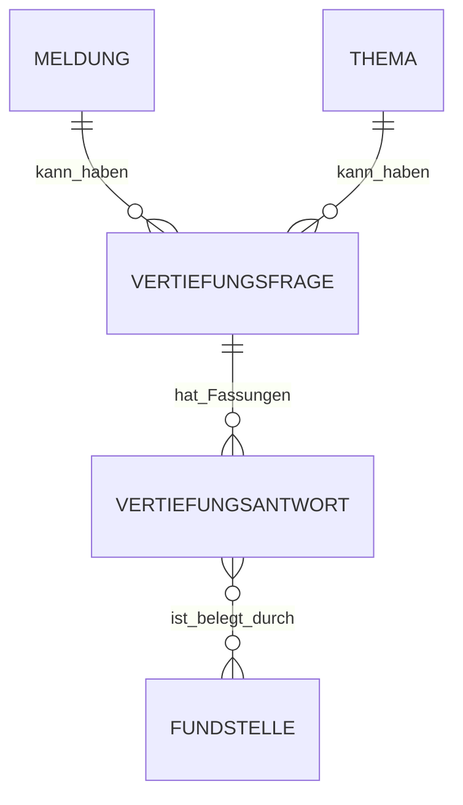

# „Mehr wissen?“ – Vertiefungsmodell – FIB Echtsystem

## Dokumentstand

| Version | Stand | Verantwortlich |
|---|---|---|
| 1.0 | 05.10.2026 | Josef Walter – erstellt mit KI-Unterstützung |

## 1. Zweck und Geltung

Dieses Dokument ist die verbindliche fachliche Primärquelle für das öffentliche Vertiefungsangebot **„Mehr wissen?“** im FIB-Echtsystem.

„Mehr wissen?“ erweitert eine Meldung oder ein Thema um verständliche weiterführende Fragen und quellengebundene Antworten. Die Funktion soll Neugier fördern und die Meldung bzw. das Thema als Einstieg in einen größeren Informationszusammenhang nutzbar machen.

Verbindliche Abgrenzung:

> **Eine „Mehr wissen?“-Frage ist ein öffentliches Vertiefungsangebot. Eine offene Frage/Wissenslücke beschreibt dagegen etwas, das FIB selbst noch nicht ausreichend weiß. Beide sind getrennte fachliche Objekte.**

## 2. Grundmodell

Für den MVP werden zwei fachliche Objekte unterschieden:

- `Vertiefungsfrage` – die öffentlich angebotene Frage,
- `Vertiefungsantwort` – die redaktionell freigegebene, quellengebundene Antwort auf diese Frage.

Eine Vertiefungsfrage gehört genau zu einem primären öffentlichen Kontext:

- einer `Meldung` oder
- einem `Thema`.

Ein solcher Kontext kann mehrere Vertiefungsfragen besitzen.

Eine Vertiefungsfrage kann zunächst ohne freigegebene Antwort existieren, darf öffentlich aber erst angeboten werden, wenn eine veröffentlichungsfähige Antwort vorhanden ist oder die UI ausdrücklich einen noch nicht beantworteten Zustand vorsieht. Für den MVP gilt der schlanke Normalfall: **öffentlich nur Frage mit freigegebener Antwort**.

## 3. Vertiefungsfrage

Eine Vertiefungsfrage muss fachlich mindestens enthalten:

- stabile Identität,
- primären Kontext (`Meldung` oder `Thema`),
- Fragetext,
- Herkunft (`KI-Vorschlag` oder redaktionell angelegt),
- Status,
- Reihenfolge bzw. Darstellungspriorität innerhalb des Kontexts,
- nachvollziehbare Änderungen.

Die Frage soll einen erkennbaren Mehrwert gegenüber dem Meldungs- oder Thementext bieten. Geeignete Fragetypen sind insbesondere:

- Hintergrund und Entstehung,
- Stand der Technik bzw. fachlicher Kontext,
- rechtlicher oder institutioneller Rahmen,
- Auswirkungen und Zielkonflikte,
- Vergleich mit anderen Kommunen oder Entwicklungen,
- mögliche zukünftige Bedeutung,
- Zusammenhang mit anderen FIB-Vorgängen oder Themen.

Eine Vertiefungsfrage darf nicht lediglich denselben Inhalt wie Überschrift oder Meldungstext wiederholen.

## 4. Vertiefungsantwort

Eine Vertiefungsantwort ist eine redaktionell verantwortete öffentliche Antwort auf eine Vertiefungsfrage.

Sie muss mindestens enthalten bzw. nachvollziehbar machen:

- Antworttext,
- zugehörige Vertiefungsfrage,
- verwendete Fundstellen/Quellen,
- fachlichen Stand bzw. Aktualitätsbezug,
- Freigabestatus,
- Zeitpunkt der letzten fachlich relevanten Prüfung,
- Herkunft bzw. Erstellungsart,
- relevante Änderungshistorie.

Mehrere Quellen sind ausdrücklich zulässig und erwünscht, wenn sie unterschiedliche Aspekte belegen oder die Antwort dadurch belastbarer wird.

Verbindlicher Grundsatz:

> **Öffentliche Tatsachenbehauptungen in einer Vertiefungsantwort müssen auf nachvollziehbare Fundstellen zurückführbar sein. Allgemeines KI-Wissen darf Recherche und Formulierung unterstützen, ersetzt aber nicht die Quellenbasis veröffentlichter Tatsachenbehauptungen.**

## 5. Versionierung und Aktualität

Eine Vertiefungsfrage benötigt keine eigene komplexe Gesamtversionslogik. Fachlich relevante Änderungen bleiben jedoch nachvollziehbar.

Für Antworten gilt:

- Eine veröffentlichte Antwort wird bei fachlich relevanter Änderung nicht spurlos überschrieben.
- Es muss nachvollziehbar bleiben, welche Fassung zu welchem Zeitpunkt freigegeben war.
- Eine reine sprachliche Korrektur ohne Bedeutungsänderung benötigt keine neue fachliche Fassung, wird aber bei Bedarf protokolliert.
- Ändert sich die Quellenlage oder der zugrunde liegende Sachstand wesentlich, muss die Antwort überprüft werden.
- Die KI darf Aktualisierungsbedarf erkennen und eine neue Fassung vorschlagen, veröffentlicht diese aber nicht selbständig.

Für den MVP genügt die Unterscheidung zwischen aktuellem freigegebenem Stand und historisch nachvollziehbaren früheren Fassungen; eine komplexe öffentliche Versionsnavigation ist nicht erforderlich.

## 6. Status und Freigabe

Mindestens folgende fachliche Zustände müssen unterscheidbar sein:

### Vertiefungsfrage

- `Entwurf/Vorschlag`,
- `freigegeben`,
- `zurückgezogen`.

### Vertiefungsantwort

- `Entwurf`,
- `freigegeben`,
- `veröffentlicht`,
- `zurückgezogen`.

Die genaue technische Abbildung kann im physischen Datenmodell vereinfacht werden, solange fachlich klar bleibt, ob Inhalt intern vorbereitet, redaktionell freigegeben, öffentlich sichtbar oder zurückgezogen ist.

Öffentliche Freigabe bzw. Veröffentlichung ist eine geschützte Aktion nach den allgemeinen S3-Regeln.

## 7. Quellen- und Aktualitätsprüfung

Vor Freigabe einer Vertiefungsantwort wird mindestens geprüft:

- ob die Antwort die Frage tatsächlich beantwortet,
- ob die wesentlichen Tatsachen durch geeignete Fundstellen gedeckt sind,
- ob aktuelle und historische Aussagen sprachlich getrennt werden,
- ob mögliche zukünftige Bedeutung als solche kenntlich gemacht wird,
- ob Unsicherheiten oder widersprüchliche Quellen sichtbar bleiben,
- ob die Antwort nicht unzulässig politische Einordnung als Tatsachenwissen ausgibt.

Neue oder geänderte Fundstellen zu einem beantworteten Gegenstand können einen Überprüfungsbedarf auslösen. Eine Antwort wird jedoch nicht allein deshalb automatisch geändert oder zurückgezogen.

## 8. Verhältnis zu anderen FIB-Objekten

### Offene Frage / Wissenslücke

Eine offene Frage kann Anlass für Recherche sein. Wird sie später geklärt, kann daraus bei redaktionellem Mehrwert zusätzlich eine Vertiefungsfrage entstehen. Es entsteht dadurch aber keine Identitätsgleichheit zwischen beiden Objekten.

### Meldung und Thema

Die Meldung bzw. das Thema bleibt der Einstiegspunkt. „Mehr wissen?“ ergänzt diesen Inhalt und ersetzt weder Meldung noch Thema.

### Vorgang

Vorgänge können als Wissens- und Quellenkontext einer Antwort verwendet werden. Im MVP werden Vertiefungsfragen jedoch nicht zusätzlich direkt an Vorgänge gebunden, solange kein konkreter UX-Bedarf dafür nachgewiesen ist. Dadurch bleibt das Modell schlank und orientiert sich an den bereits erprobten Einstiegen über Meldung und Thema.

### Referenzwissen

Referenzwissen kann beim Verständnis und bei der Recherche helfen, ist aber nicht automatisch veröffentlichbare Quelle einer Vertiefungsantwort.

## 9. Fachfunktion

Die fachliche Bearbeitung erfolgt über die in `docs/MVP-Fachfunktionen.md` definierte Familie `manage_deep_dive_content` sowie zugehörige strukturierte Lesezugriffe.

Die Funktion darf insbesondere:

- Fragen vorschlagen oder redaktionell anlegen,
- Antworten aus registrierten Fundstellen vorbereiten,
- Quellenbezüge pflegen,
- Aktualisierungsbedarf markieren,
- Entwürfe ändern,
- Freigabe/Veröffentlichung nach den allgemeinen Berechtigungs- und Bestätigungsregeln ausführen.

## 10. MVP-Abgrenzung

Für den MVP nicht erforderlich sind:

- individuelle personalisierte Fragen je Besucher,
- frei fortgesetzte öffentliche Chat-Unterhaltung innerhalb von „Mehr wissen?“,
- automatische Veröffentlichung neu generierter Antworten,
- eigene Wissensbasis außerhalb der vorhandenen FIB-Quellen-, Ereignis-, Vorgangs-, Themen- und Referenzstrukturen,
- komplexe öffentliche Versionsnavigation.

Damit bleibt „Mehr wissen?“ ein redaktionell kontrolliertes, quellengebundenes Vertiefungsangebot mit geringem zusätzlichen Pflegeaufwand.

## Änderungshistorie

| Version | Datum | Änderung |
|---|---|---|
| 1.0 | 05.10.2026 | Vertiefungsfrage und quellengebundene Vertiefungsantwort als getrennte fachliche Objekte definiert; Abgrenzung zur offenen Wissensfrage, Kontext Meldung/Thema, Quellenpflicht, Aktualitäts-/Versionslogik, Freigabe und MVP-Grenzen festgelegt. |
