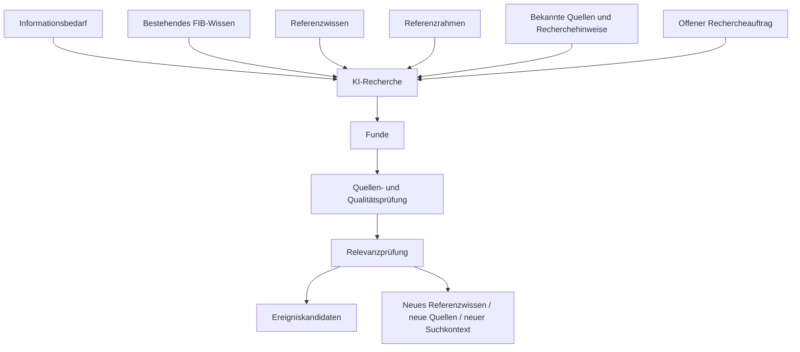
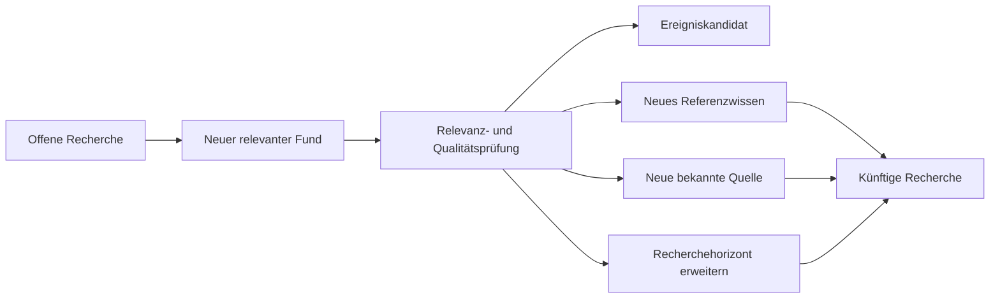

# Recherchearchitektur und Referenzrahmen – FIB Echtsystem

## Dokumentstand

| Version | Stand | Verantwortlich |
|---|---|---|
| 1.0 | 05.10.2026 | Josef Walter – erstellt mit KI-Unterstützung |

## 1. Zweck und Geltung

Dieses Dokument ist die verbindliche fachliche Primärquelle für die übergeordnete Recherchearchitektur von Feldkirchen im Blick (FIB) und für die Rolle des fachlichen Referenzrahmens bei Recherche, Analyse, Hinterfragen und Einordnung.

Es beschreibt die Regeln hinter der Architektur. Diese Regeln sollen sowohl für die KI als maschinenlesbare bzw. in den KI-Kontext überführbare Arbeitsgrundlage als auch für Menschen als nachvollziehbare Projektdokumentation dienen.

Konkrete Datenobjekte und Tabellen werden daraus erst im nachfolgenden G3-Datenmodell abgeleitet.

## 2. Übergeordnete Leitfrage

> **Welche Informationen und Regeln muss FIB der KI für regelmäßige Recherchen bereitstellen, damit sie möglichst vollständig FIB-relevante Entwicklungen findet, einschließlich solcher, die heute noch nicht bekannt sind?**

Die Recherche darf deshalb nicht auf bereits bekannte Begriffe, Quellen, Vorgänge oder Räume beschränkt werden.

## 3. Grundarchitektur der Recherche

Ein vollständiger Recherchelauf wird fachlich durch sechs Eingangskomponenten gesteuert:

1. **Informationsbedarf** – welche Sachgebiete, Fragen, Vorgänge und Entwicklungen für FIB grundsätzlich relevant sein können,
2. **bestehendes FIB-Wissen** – welche Ereignisse, Vorgänge, Themen, Sitzungen, Quellen und Zusammenhänge bereits bekannt sind,
3. **Referenzwissen** – welches dauerhaftere Kontextwissen die KI zum Erkennen und Verknüpfen benötigt,
4. **demokratisch-gesellschaftlicher und politischer Referenzrahmen** – welche Fragen, Qualitätsmaßstäbe und Wertbezüge beim Hinterfragen und Einordnen berücksichtigt werden,
5. **bekannte Quellen und Recherchehinweise** – wo gezielte Recherche besonders sinnvoll ist,
6. **offener Rechercheauftrag** – welche bislang unbekannten Quellen, Entwicklungen, Akteure, Begriffe und Zusammenhänge darüber hinaus entdeckt werden können.

## 4. Informationsbedarf statt geschlossener Themenliste

Der Informationsbedarf beschreibt, welche Arten von Entwicklungen FIB erkennen möchte. Er umfasst insbesondere:

- allgemeine Such- und Beobachtungsfelder,
- bestehende Vorgänge und Themen,
- laufende Sitzungen und Verfahren,
- redaktionell gesetzte Beobachtungsgegenstände,
- offene Fragen und Wissenslücken,
- mögliche zukünftige kommunale Herausforderungen.

Der Informationsbedarf ist keine abschließende Themenliste. Er steuert die Recherche, begrenzt sie aber nicht.

## 5. Bestehendes FIB-Wissen

Die KI berücksichtigt den aktuellen FIB-Wissensbestand, um insbesondere:

- Neues von Bekanntem zu unterscheiden,
- Aktualisierungen zu erkennen,
- Dubletten zu vermeiden,
- bestehende Zusammenhänge zu erkennen,
- neue Ereignisse mit Vorgängen und Themen in Beziehung zu setzen,
- Veränderungen eines bekannten Sachverhalts zu erkennen.

Das bestehende FIB-Wissen ist Arbeitsgrundlage, aber keine Grenze der Recherche.

## 6. Referenzwissen

Referenzwissen ist dauerhafteres Kontextwissen, das der KI beim Suchen, Verstehen und semantischen Verknüpfen hilft.

Beispiele:

- alternative Bezeichnungen und Aliase,
- räumliche und funktionale Zusammenhänge,
- wichtige Infrastruktur und Bezugsobjekte,
- Akteure, Institutionen und Zuständigkeiten,
- bekannte Großprojekte und Planungsräume,
- Projekt- und Fachbegriffe,
- institutionelle oder organisatorische Zusammenhänge.

Beispiele für FIB können sein:

- `B471 = Oberndorfer Straße`,
- funktionaler Zusammenhang A94 / A99 / Kreuz München Ost,
- „Kiesgrund“ als Bezeichnung eines großen Entwicklungsgebietes nördlich der S-Bahn.

Referenzwissen kann die Recherche steuern und Suchbegriffe erweitern. Es ist jedoch nicht automatisch eine veröffentlichbare Tatsachenquelle. Veröffentlichte Tatsachenbehauptungen benötigen weiterhin nachvollziehbare Quellen.

## 7. Dynamischer Recherchehorizont und offene Recherche

Der bisher verwendete Begriff `Suchraum` darf nicht als feste äußere Grenze verstanden werden.

FIB unterscheidet fachlich:

### 7.1 Bekannter Recherchehorizont

Er umfasst aktuell bekannte relevante:

- Orte und funktionale Räume,
- Quellen,
- Akteure,
- Projekte,
- Themen und Vorgänge,
- Fachbegriffe und Aliase.

Dieser Horizont dient der gezielten und effizienten Recherche.

### 7.2 Erweiterter Recherchehorizont

Er wird genutzt, wenn bestehende Zusammenhänge, Vorgänge, Themen oder Referenzwissen auf weiter entfernte oder bislang weniger offensichtliche Entwicklungen hinweisen.

### 7.3 Offene Recherche

Die offene Recherche ist ein regulärer Bestandteil von FIB. Sie ist ausdrücklich nicht auf den bekannten Recherchehorizont beschränkt.

Sie soll insbesondere entdecken können:

- neue relevante Entwicklungen,
- bislang unbekannte Quellen,
- neue Akteure,
- neue Projekte,
- neue Begriffe,
- neue räumliche oder funktionale Zusammenhänge,
- technische, wissenschaftliche oder gesellschaftliche Entwicklungen mit möglicher künftiger Bedeutung für Feldkirchen.

Der bekannte Recherchehorizont steuert die Suche, bildet aber keine abschließende Grenze.

## 8. Lernschleife der Recherche

Neue relevante Funde können nicht nur Ereigniskandidaten erzeugen, sondern den künftigen Recherchekontext selbst verändern.

Damit ist FIB als lernendes Wissens- und Recherchesystem angelegt.

## 9. Recherchebreite und Veröffentlichungsbreite

Breite Recherche und Veröffentlichung sind fachlich zu trennen.

Die Recherche darf bewusst deutlich breiter sein als der veröffentlichte FIB-Bestand. Erst nach einem Fund erfolgen Quellen-, Qualitäts- und Relevanzprüfung sowie redaktionelle Entscheidung.

Die für mittelbare oder erweiterte Relevanz verwendete 30-%-Arbeits- und Warnschwelle darf niemals die Recherche selbst begrenzen. Sie dient ausschließlich der Kontrolle der redaktionellen Balance des veröffentlichten Bestands.

## 10. Referenzrahmen: drei getrennte Ebenen

Der bisherige politische Referenzrahmen wird fachlich differenziert. FIB unterscheidet künftig drei Ebenen, die unterschiedliche Funktionen haben.

### 10.1 Allgemeine FIB-Qualitätsprinzipien

Diese Ebene umfasst methodische Anforderungen, die unabhängig von einer politischen Position für FIB gelten, insbesondere:

- Quellenbezug,
- Trennung von Sachinformation und Einordnung,
- nachvollziehbare Ableitungen und Begründungen,
- Kennzeichnung von Unsicherheit,
- Berücksichtigung belastbarer Gegenargumente und widersprechender Informationen,
- Schutz vor Bestätigungslogik,
- keine Veränderung der Tatsachenbasis durch politische Erwartungen.

### 10.2 Demokratisch-gesellschaftlicher Grundrahmen

Diese Ebene umfasst grundlegende demokratische und gesellschaftliche Maßstäbe, die nicht als spezifisch grünes Parteiprogramm behandelt werden sollen.

Dazu können insbesondere gehören:

- demokratische und rechtsstaatliche Verfahren,
- Menschenwürde und Grundrechte,
- Gleichberechtigung und Diskriminierungsfreiheit,
- Transparenz und Nachvollziehbarkeit öffentlicher Entscheidungen,
- pluralistische Meinungs- und Interessenvielfalt,
- reale Beteiligungs- und Teilhabemöglichkeiten,
- Schutz einer offenen demokratischen Öffentlichkeit.

Die konkrete fachliche Definition und die maßgeblichen Quellen dieses Grundrahmens werden noch gesondert abgestimmt. Der Begriff ist bewusst nicht mit einem wechselnden politischen „Mainstream“ gleichgesetzt.

### 10.3 Spezifisch grüner politischer Referenzrahmen

Diese Ebene enthält grüne politische Werte, Ziele, Programme und dokumentierte Positionen.

Sie dient insbesondere:

- der Herleitung von „Unsere Einordnung“,
- der Prüfung spezifisch grüner Zielkonflikte,
- der Begründung politischer Bewertungen und Gestaltungsoptionen.

Dokumentierte lokale Positionen der GRÜNEN Feldkirchen bleiben dabei von Positionen höherer Parteiebenen unterscheidbar.

Die bestehende Datei `docs/Gruene-Werte-und-politische-Ziele.md` bildet derzeit vor allem diese dritte Ebene ab und wird später an die neue Dreiteilung angepasst.

## 11. Rolle des Referenzrahmens in der Recherche

Der Referenzrahmen darf nicht bestimmen, welche Tatsachen gefunden oder akzeptiert werden.

Er dient dazu, die KI beim kritischen Hinterfragen zu unterstützen, etwa durch Fragen wie:

- Welche Auswirkungen können entstehen?
- Wer ist betroffen?
- Welche Zielkonflikte bestehen?
- Welche demokratischen, gesellschaftlichen, sozialen, ökologischen oder wirtschaftlichen Aspekte fehlen möglicherweise?
- Welche Informationen widersprechen bisherigen Erwartungen oder politischen Positionen?
- Welche Perspektiven oder Gegenargumente sind belastbar belegt?

Verbindlicher Grundsatz:

> **Werte und Qualitätsmaßstäbe steuern die Fragen und die Einordnung, nicht das gewünschte Rechercheergebnis.**

Dies dient zugleich dem Schutz vor scheinbarer Neutralität und vor Bestätigungslogik.

## 12. Sichtbarkeit des Referenzrahmens für Besucher

Die öffentliche Darstellung des demokratisch-gesellschaftlichen und des spezifisch grünen Referenzrahmens wird in einer späteren UX-/Transparenzphase konkret gestaltet.

Bereits jetzt gilt jedoch als fachliche Anforderung:

> **Der verwendete Wert- und Bewertungsmaßstab muss grundsätzlich so strukturiert und gespeichert werden, dass er gegenüber Besucherinnen und Besuchern transparent gemacht werden kann.**

Daraus folgt für die spätere Daten- und Systemarchitektur:

- demokratisch-gesellschaftliche und spezifisch grüne Maßstäbe müssen unterscheidbar bleiben,
- Herkunft und Quelle eines Maßstabs müssen nachvollziehbar sein,
- bei einer Einordnung muss erkennbar sein können, welche Maßstäbe tatsächlich verwendet wurden,
- die öffentliche Darstellung darf später vereinfacht werden, ohne die fachliche Herkunft zu verlieren.

Die konkrete Darstellung, etwa über „Über FIB“, Einordnungsdetails oder aufklappbare Begründungen, wird später festgelegt.

## 13. Architekturregel für KI und Dokumentation

Die fachlichen Regeln der Recherche dürfen nicht nur in Chatverläufen bestehen.

Verbindliche Architekturregel:

> **Alle fachlich wirksamen Recherche-, Relevanz-, Referenz- und Qualitätsregeln werden in versionierten FIB-Primärdokumenten geführt. Die KI-Funktionen des Echtsystems müssen diese Regeln aus dem dokumentierten und freigegebenen Regelbestand beziehen können.**

Damit gilt dieselbe fachliche Quelle für:

- menschliches Nachlesen,
- KI-Kontext bzw. Prompt-/RAG-Aufbereitung,
- Tests und Regressionstests,
- spätere Modellwechsel,
- Audit und Rekonstruktion.

Chatverläufe sind Arbeitsraum, aber keine dauerhafte Primärquelle für verbindliche FIB-Regeln.

## 14. Konsequenzen für G3

Vor der physischen bzw. logischen Modellierung von Referenzwissen und Quellenmonitor sind als nächste fachliche Schritte zu klären:

1. welche Kategorien von Referenzwissen benötigt werden,
2. welche Teile des Referenzwissens fachlich versioniert oder mit Gültigkeitszeiträumen versehen werden müssen,
3. wie Informationsbedarf und redaktionelle Beobachtungsaufträge beschrieben werden,
4. wie neue Quellen, Begriffe und Zusammenhänge aus offener Recherche in den bestätigten Recherchekontext übernommen werden,
5. wie der demokratisch-gesellschaftliche Grundrahmen konkret definiert und belegt wird,
6. wie die Herkunft eines Maßstabs (`allgemeines FIB-Qualitätsprinzip`, `demokratisch-gesellschaftlicher Grundrahmen`, `grüne Position`) gespeichert wird,
7. welche dieser Informationen bei einem konkreten Recherchelauf der KI zwingend übergeben werden müssen.

## Änderungshistorie

| Version | Datum | Änderung |
|---|---|---|
| 1.0 | 05.10.2026 | Recherchearchitektur als fachliche Primärquelle angelegt; Informationsbedarf, bestehendes FIB-Wissen, Referenzwissen, dynamischer Recherchehorizont, offene Recherche und Lernschleife festgelegt; Referenzrahmen in allgemeine FIB-Qualitätsprinzipien, demokratisch-gesellschaftlichen Grundrahmen und spezifisch grünen politischen Referenzrahmen differenziert; spätere Besuchersichtbarkeit als Architekturanforderung vorgesehen. |
