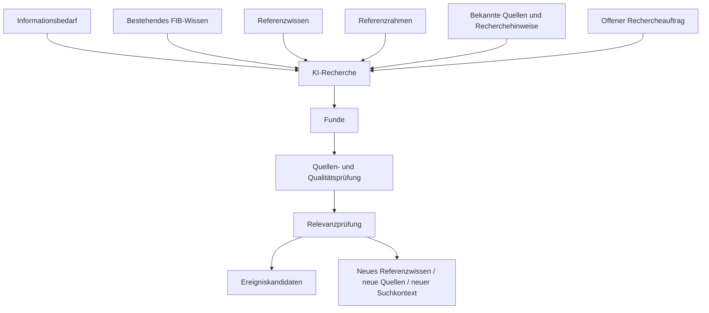
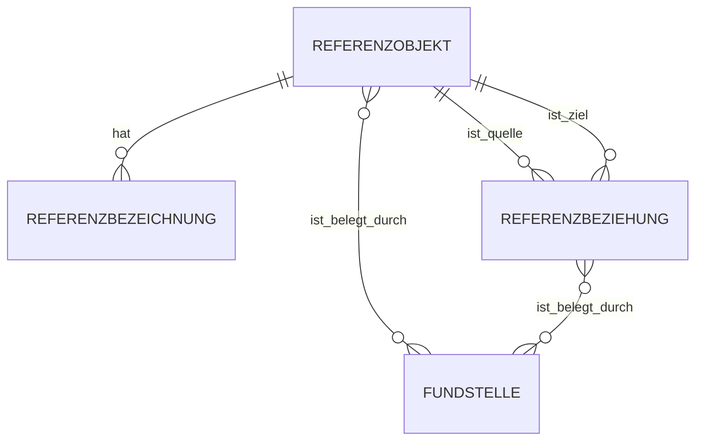
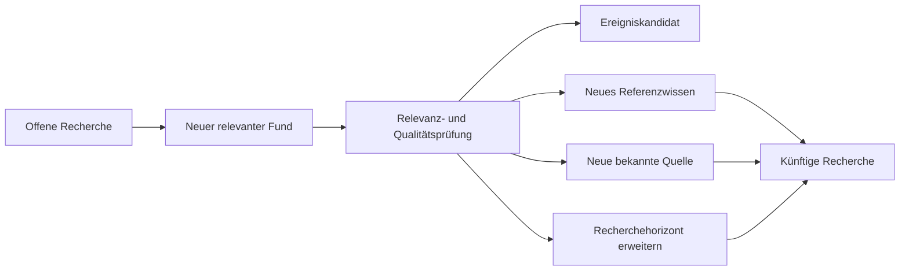

# Recherchearchitektur und Referenzrahmen – FIB Echtsystem

## Dokumentstand

| Version | Stand | Verantwortlich |
|---|---|---|
| 1.6 | 05.10.2026 | Josef Walter – erstellt mit KI-Unterstützung |

## 1. Zweck und Geltung

Dieses Dokument ist die verbindliche fachliche Primärquelle für die übergeordnete Recherchearchitektur von Feldkirchen im Blick (FIB) und für die Rolle des fachlichen Referenzrahmens bei Recherche, Analyse, Hinterfragen und Einordnung.

Es beschreibt die Regeln hinter der Architektur. Diese Regeln sollen sowohl für die KI als maschinenlesbare bzw. in den KI-Kontext überführbare Arbeitsgrundlage als auch für Menschen als nachvollziehbare Projektdokumentation dienen.

Konkrete Datenobjekte und Tabellen werden daraus erst im nachfolgenden G3-Datenmodell abgeleitet.

## 2. Übergeordnete Leitfrage

> **Welche Informationen und Regeln muss FIB der KI für regelmäßige Recherchen bereitstellen, damit sie möglichst vollständig FIB-relevante Entwicklungen findet, einschließlich solcher, die heute noch nicht bekannt sind?**

Die Recherche darf deshalb nicht auf bereits bekannte Begriffe, Quellen, Vorgänge oder Räume beschränkt werden.

## 3. Grundarchitektur der Recherche

Ein vollständiger Recherchelauf wird fachlich durch sechs Eingangskomponenten gesteuert:

1. **Informationsbedarf** – welche Sachgebiete, Fragen, Vorgänge und Entwicklungen für FIB grundsätzlich relevant sein können,
2. **bestehendes FIB-Wissen** – welche Ereignisse, Vorgänge, Themen, Sitzungen, Quellen und Zusammenhänge bereits bekannt sind,
3. **Referenzwissen** – welches dauerhaftere Kontextwissen die KI zum Erkennen und Verknüpfen benötigt,
4. **demokratisch-gesellschaftlicher und politischer Referenzrahmen** – welche Fragen, Qualitätsmaßstäbe und Wertbezüge beim Hinterfragen und Einordnen berücksichtigt werden,
5. **bekannte Quellen und Recherchehinweise** – wo gezielte Recherche besonders sinnvoll ist,
6. **offener Rechercheauftrag** – welche bislang unbekannten Quellen, Entwicklungen, Akteure, Begriffe und Zusammenhänge darüber hinaus entdeckt werden können.

## 4. Informationsbedarf und Beobachtungsauftrag

Der Informationsbedarf beschreibt, welche Arten von Entwicklungen FIB erkennen möchte. Er ist keine abschließende Themenliste und begrenzt die Recherche nicht.

Für konkrete, dauerhaft zu verfolgende Informationsbedarfe verwendet FIB einen schlanken **Beobachtungsauftrag**. Ein Beobachtungsauftrag beschreibt fachlich, **was** beobachtet bzw. geklärt werden soll. Er enthält keine fest verdrahtete Liste von Suchbegriffen, Quellen, Akteuren oder Suchwegen; die konkrete Recherchestrategie wird dynamisch aus Auftrag, bestehendem FIB-Wissen, Referenzwissen und Regelbestand abgeleitet.

Fachlich werden zunächst drei Typen unterschieden:

1. **Vorgang beobachten** – neue Entwicklungen zu einem bestehenden konkreten Sachverhalt erkennen,
2. **Thema beobachten** – neue Entwicklungen erkennen, die für eine übergeordnete Leitfrage relevant sind,
3. **offene Frage klären** – gezielt nach Informationen suchen, mit denen eine bestehende Wissenslücke beantwortet oder eingeordnet werden kann.

Ein Beobachtungsauftrag benötigt konzeptionell mindestens:

- Bezugstyp (`Vorgang`, `Thema` oder `offene Frage`),
- fachliche Beobachtungsfrage bzw. Beschreibung des Informationsbedarfs,
- Status,
- Herkunft (`redaktionell angelegt` oder `aus KI-Vorschlag übernommen`),
- kurze Begründung bzw. Zweck,
- nachvollziehbare Änderungshistorie.

Eine Priorität kann optional ergänzt werden, wenn sie sich im Betrieb als redaktionell nützlich erweist; sie ist kein zwingendes MVP-Merkmal.

### 4.1 Lebenszyklus

Ein Beobachtungsauftrag bleibt grundsätzlich aktiv, bis eine fachliche oder redaktionelle Entscheidung seinen Status verändert.

Vorgesehene Zustände sind zunächst:

- **aktiv** – der Auftrag steuert laufende bzw. wiederkehrende Recherche,
- **pausiert** – aktuell keine weitere Recherche, spätere Wiederaufnahme ist möglich,
- **beendet** – Beobachtungsziel erreicht, sachlich überholt oder redaktionell nicht mehr erforderlich.

Typische Gründe für Pause oder Ende sind:

- offene Frage beantwortet,
- beobachteter Sachverhalt fachlich abgeschlossen,
- Auftrag durch andere Entwicklung gegenstandslos geworden,
- derzeit keine sinnvolle weitere Recherche,
- bewusste redaktionelle Beendigung.

Die KI darf Pause oder Ende **vorschlagen**, nimmt diese Änderung aber nicht selbst verbindlich vor. Die redaktionelle Entscheidung bleibt maßgeblich.

### 4.2 Wiedervorlage

FIB führt keine pauschalen regelmäßigen Wiedervorlagen für alle Beobachtungsaufträge ein.

> **Wiedervorlage erfolgt nur bei konkretem Anlass.**

Ein solcher Anlass kann insbesondere sein:

- ein erwarteter Termin oder Verfahrensschritt ist erreicht,
- eine Quelle kündigt eine spätere Entscheidung oder Veröffentlichung an,
- ein pausierter Gegenstand erhält ein neues relevantes Ereignis,
- die KI erkennt eine wesentliche Veränderung der Ausgangslage,
- ein Auftrag bleibt über längere Zeit ohne belastbare neue Information und eine Überprüfung erscheint sinnvoll.

Ein optionaler nächster Prüfzeitpunkt oder fachlicher Auslöser kann gespeichert werden, wenn er sich aus dem Sachverhalt ergibt. Fehlt ein solcher konkreter Anlass, bleibt der Auftrag aktiv, ohne künstliche Wiedervorlagepflicht.

### 4.3 Abgrenzung: offene Recherche / „Entwicklung entdecken“

**„Entwicklung entdecken“ ist kein eigener Beobachtungsauftragstyp.**

Hier kennt FIB den konkreten Gegenstand noch nicht. Die KI recherchiert offen, findet eine neue Entwicklung und prüft erst danach anhand der Relevanzregeln, ob diese für Feldkirchen gegenwärtig oder künftig bedeutsam sein könnte.

Damit gilt:

> **Offene Recherche / Entwicklung entdecken ist ein regulärer Recherchemodus von FIB und benötigt keinen einzelnen redaktionell angelegten Beobachtungsauftrag.**

Erst aus einem relevanten Fund kann durch redaktionelle Entscheidung ein neuer Vorgang, ein neues Thema oder ein dauerhafter Beobachtungsauftrag entstehen.

### 4.4 Keine automatische Veröffentlichung

Ein Beobachtungsauftrag erzeugt niemals unmittelbar eine Veröffentlichung.

Der Ablauf bleibt:

> **Beobachtungsauftrag → Recherchefund → Quellen-/Qualitäts- und Relevanzprüfung → Ereigniskandidat → redaktionelle Entscheidung → ggf. Meldung**

Damit bleibt die redaktionelle Freigabe auch bei kontinuierlicher Beobachtung erhalten.

## 5. Bestehendes FIB-Wissen

Die KI berücksichtigt den aktuellen FIB-Wissensbestand, um insbesondere:

- Neues von Bekanntem zu unterscheiden,
- Aktualisierungen zu erkennen,
- Dubletten zu vermeiden,
- bestehende Zusammenhänge zu erkennen,
- neue Ereignisse mit Vorgängen und Themen in Beziehung zu setzen,
- Veränderungen eines bekannten Sachverhalts zu erkennen.

Das bestehende FIB-Wissen ist Arbeitsgrundlage, aber keine Grenze der Recherche.

## 6. Referenzwissen

Referenzwissen ist dauerhafteres Kontextwissen, das der KI beim Suchen, Verstehen und semantischen Verknüpfen hilft.

Beispiele:

- alternative Bezeichnungen und Aliase,
- räumliche und funktionale Zusammenhänge,
- wichtige Infrastruktur und Bezugsobjekte,
- Akteure, Institutionen und Zuständigkeiten,
- bekannte Großprojekte und Planungsräume,
- Projekt- und Fachbegriffe,
- institutionelle oder organisatorische Zusammenhänge.

Beispiele für FIB können sein:

- lokale Bezeichnungen bzw. Straßenabschnitte im Zusammenhang mit der B471/Oberndorfer Straße,
- funktionaler Zusammenhang A94 / A99 / Kreuz München Ost,
- „Kiesgrund“ als Bezeichnung eines großen Entwicklungsgebietes nördlich der S-Bahn.

Referenzwissen kann die Recherche steuern und Suchbegriffe erweitern. Es ist jedoch nicht automatisch eine veröffentlichbare Tatsachenquelle. Veröffentlichte Tatsachenbehauptungen benötigen weiterhin nachvollziehbare Quellen.

### 6.1 Orts- und Objektwissen

Orts- und Objektwissen beschreibt relativ stabile Identitäten, alternative Bezeichnungen und fachlich nützliche Beziehungen zwischen Orten, Räumen, Infrastruktur, Einrichtungen, Projekten und anderen Bezugsobjekten.

Verbindlicher Grundsatz:

> **Orts- und Objektwissen beschreibt stabile Identitäten, alternative Bezeichnungen und relevante Beziehungen. Veränderliche Sachstände gehören nicht in dieses Referenzwissen, sondern in Ereignisse, Vorgänge oder andere zeitabhängige FIB-Objekte.**

Ein Referenzobjekt besitzt eine stabile fachliche Identität. Alternative Bezeichnungen werden nicht als eigene Objekte geführt, sondern diesem Objekt zugeordnet.

Beispiel:

- Objekt: ein lokaler Straßenabschnitt bzw. Verkehrsbezug der B471,
- Hauptbezeichnung: `B471`,
- alternative bzw. lokale Bezeichnung im passenden räumlichen Kontext: `Oberndorfer Straße`.

### 6.2 Konzeptionelles Modell für Orts- und Objektwissen

Für das konzeptionelle G3-Modell werden folgende fachliche Bausteine vorgesehen:

- `REFERENZOBJEKT` – stabile Identität eines Ortes, Raums, Infrastruktur- oder sonstigen Bezugsobjekts,
- `REFERENZBEZEICHNUNG` – Alias, Abkürzung, amtliche, gebräuchliche oder frühere Bezeichnung eines Referenzobjekts,
- `REFERENZBEZIEHUNG` – fachlich nützliche Beziehung zwischen zwei Referenzobjekten,
- `FUNDSTELLE` bzw. Herkunft/Begründung – Nachweis oder dokumentierte Herkunft des Referenzwissens, soweit erforderlich.

Ein `REFERENZOBJEKT` benötigt konzeptionell mindestens:

- stabile fachliche ID,
- Hauptbezeichnung,
- Typ,
- kurzen fachlichen Kontext,
- fachlichen Status,
- Herkunft bzw. Erstellungsart.

### 6.3 Beziehungstypen im MVP

Die Beziehungstypen werden bewusst klein gehalten, damit das Referenzwissen pflegbar bleibt. Für den MVP genügen zunächst insbesondere:

- `ist Teil von`,
- `liegt in / an`,
- `verbindet`,
- `erschließt / versorgt`,
- `steht in funktionalem Zusammenhang mit`,
- `ist alternative Bezeichnung von` – soweit die technische Umsetzung Aliasbeziehungen nicht ausschließlich über `REFERENZBEZEICHNUNG` abbildet.

Beziehungen können gerichtet sein. Beispiel: `Kiesgrund liegt in Feldkirchen` ist fachlich nicht identisch mit der umgekehrten Aussage.

Verbindliche Pflegeregel:

> **Eine Beziehung wird nur dann als Referenzwissen gespeichert, wenn sie für Recherche, Erkennung, Zuordnung oder Relevanzprüfung wiederholt nützlich ist.**

Zeitabhängige Wirkungs- oder Bewertungsbeziehungen wie `beeinflusst`, `gefährdet`, `verbessert`, `verschlechtert` oder `ist Treiber von` werden nicht als dauerhafte Referenzbeziehungen modelliert, wenn sie fachlich eher in Ereignis-, Vorgangs- oder Wirkungsmodell gehören.

### 6.4 Kandidat, Bestätigung und Herkunft

Neues Referenzwissen kann auf drei Wegen entstehen:

1. Initialbefüllung aus bereits bekanntem und geprüftem FIB-Wissen,
2. KI-Vorschlag aus Recherche oder Quellenanalyse,
3. manuelle redaktionelle Ergänzung.

KI-Funde werden nicht automatisch fachlich wirksam. Referenzobjekte und Referenzbeziehungen müssen zwischen mindestens folgenden Zuständen unterscheiden können:

- `vorgeschlagen`,
- `bestätigt`,
- `nicht mehr gültig / zurückgenommen`.

Die genaue spätere technische Statusausprägung wird im Datenmodell festgelegt; fachlich gilt bereits jetzt, dass nur bestätigtes Referenzwissen den verbindlichen Recherchekontext erweitert.

Herkunft bzw. Begründung muss grundsätzlich nachvollziehbar sein. Nicht jede triviale geografische Beziehung benötigt einen aufwendigen Quellenapparat, das Modell muss aber eine Fundstelle, Herkunft oder redaktionelle Begründung aufnehmen können.

### 6.5 Abgrenzung zu Vorgängen und Zwei-Stufen-Logik

Ein Projekt oder Gebiet kann sowohl als Referenzobjekt als auch als `Vorgang` auftreten. Beide Objekte werden nicht zusammengeführt:

- das Referenzobjekt beschreibt die relativ stabile Identität und Bezeichnung,
- der Vorgang beschreibt die zeitliche Entwicklung des konkreten Sachverhalts.

Beispiel `Kiesgrund`: Die Bezeichnung und räumliche Identität gehören zum Referenzwissen; Planungsstände, neue Entscheidungen und Veränderungen gehören zum Vorgang bzw. zu Ereignissen.

Für die praktische Pflege gilt eine Zwei-Stufen-Logik:

**Stufe 1 – MVP / Erstbetrieb**

- Initialbefüllung aus stabilem vorhandenem FIB-Wissen,
- manuelle Pflege durch die Redaktion,
- KI-Vorschläge für Referenzwissenskandidaten,
- redaktionelle Bestätigung vor fachlicher Wirksamkeit,
- schlanke Objekt- und Beziehungsstruktur,
- stabile Einträge nur anlassbezogen prüfen.

**Stufe 2 – nur bei nachgewiesenem Bedarf nach MVP/Pilot**

Mögliche spätere Erweiterungen sind automatische Wiedervorlage, Konflikterkennung, feinere Gültigkeitszeiträume, zusätzliche Beziehungstypen und weitergehende räumliche oder semantische Beziehungen.

Diese Ausbaustufe ist kein vorab festgelegtes Vollausbaupaket. Sie wird nur umgesetzt, wenn der Echtbetrieb einen konkreten Bedarf zeigt. Die Wiedervorlage ist als GitHub-Issue dokumentiert.

### 6.6 Selektives Akteurs- und Zuständigkeitswissen statt Wissensduplikation

FIB führt **kein vollständiges Register allgemeiner institutioneller, organisatorischer oder rechtlicher Zuständigkeiten**. Dieses allgemeine Hintergrundwissen soll primär durch die eingesetzte KI und bei Bedarf durch aktuelle Recherche erschlossen werden.

Verbindlicher Grundsatz:

> **FIB speichert allgemeines Akteurs-, Zuständigkeits-, Verfahrens- und sonstiges Hintergrundwissen nur dann dauerhaft als Referenzwissen, wenn die Speicherung gegenüber dem allgemeinen KI-Hintergrundwissen einen konkreten zusätzlichen Nutzen für FIB bringt.**

Referenzwissen ist damit kein Vorratsspeicher für alles, was ein leistungsfähiges KI-Modell ohnehin zuverlässig erschließen kann. Es ist ein gezielter, modellunabhängig gespeicherter FIB-spezifischer Zusatz.

Eine dauerhafte Aufnahme ist insbesondere sinnvoll, wenn:

- ein Zusammenhang lokal oder projektspezifisch besonders ist,
- eine Bezeichnung, ein Alias oder eine Beziehung sonst leicht übersehen wird,
- die Information für wiederkehrende FIB-Recherchen besonders wichtig ist,
- allgemeines KI-Hintergrundwissen den Sachverhalt nicht zuverlässig oder eindeutig abbildet,
- wiederholte Fehlzuordnungen oder Recherchelücken einen expliziten FIB-Eintrag rechtfertigen,
- die Redaktion bewusst sicherstellen möchte, dass das Wissen unabhängig vom jeweils verwendeten KI-Modell verfügbar bleibt.

Der Ausbau dieses Wissensbestands erfolgt **anlassbezogen**, nicht durch vorsorgliche Vollerfassung aller bekannten oder denkbaren Akteure und Zuständigkeiten.

Dabei werden drei Ebenen unterschieden:

1. **allgemeine strukturelle bzw. rechtlich-organisatorische Rolle** – grundsätzlich KI-Hintergrundwissen; nur bei konkretem FIB-Zusatznutzen dauerhaft speichern,
2. **typische oder mögliche Rolle in einem Verfahrenstyp** – grundsätzlich KI-Hintergrundwissen bzw. Gegenstand bedarfsgesteuerter Recherche; nur bei konkretem FIB-Zusatznutzen dauerhaft speichern,
3. **tatsächlich ausgeübte Rolle in einem konkreten Vorgang** – konkretes FIB-Wissen und quellengebunden über Ereignis, Vorgang, Quelle/Fundstelle oder passende Fachbeziehung abzubilden; nicht als allgemeine Zuständigkeit zu verallgemeinern.

Beispiel: Die allgemeine Kenntnis, dass eine Behörde in bestimmten Verfahren typischerweise beteiligt oder zuständig sein kann, darf die KI als Recherchehinweis nutzen. Daraus darf jedoch nicht abgeleitet werden, dass die Behörde im konkreten Feldkirchner Vorgang tatsächlich beteiligt war oder gehandelt hat. Eine solche Tatsachenbehauptung benötigt einen konkreten Beleg.

Diese Arbeitsteilung dient zugleich der Pflegbarkeit, der Offenheit für bislang unbekannte Akteure und der Modellunabhängigkeit des FIB-Kerns.

### 6.7 Kein allgemeines Sach- und Fachwissensarchiv

FIB führt **keinen eigenen allgemeinen Wissensbestand für fachliche Grundlagen**, die ein leistungsfähiges KI-Modell in der Regel besser, breiter und bei Bedarf aktueller erschließen kann. Dazu gehören beispielsweise allgemeine Grundlagen des Bauplanungsrechts, typische Beteiligungsverfahren, Verkehrsplanung, Geothermie, autonomes Fahren oder andere technische, rechtliche und wissenschaftliche Grundlagen.

Solches Wissen darf und soll die KI für Suche, Verständnis, Fragengenerierung und Einordnung als Hintergrundwissen nutzen. Wenn daraus eine veröffentlichte Tatsachenbehauptung entsteht oder Aktualität bzw. Genauigkeit entscheidend sind, muss der konkrete Sachverhalt durch belastbare aktuelle Quellen abgesichert werden.

Eine eigene breite Kategorie `Sach- und Fachwissen` wird deshalb für FIB nicht aufgebaut.

Stattdessen gibt es nur einen kleinen Auffangbereich **FIB-spezifisches Kontextwissen**. Dort wird fachliches oder begriffliches Wissen nur dann dauerhaft gespeichert, wenn es einen konkreten FIB-spezifischen Zusatznutzen besitzt und nicht sinnvoll als Orts-/Objektwissen oder selektives Akteurs-/Zuständigkeitswissen abgebildet werden kann.

Typische Aufnahmegründe sind insbesondere:

- lokal oder projektspezifisch besondere Begriffsbedeutungen,
- projektspezifische Varianten, Kürzel oder Definitionen,
- wiederkehrende fachliche Abgrenzungen, die für mehrere FIB-Vorgänge wichtig sind,
- Sachzusammenhänge, die allgemeines KI-Wissen leicht missversteht oder nicht zuverlässig lokal zuordnet,
- bewusst modellunabhängig zu sicherndes FIB-Spezialwissen.

Beispiel: Eine projektspezifische Bezeichnung wie `Vario 5` kann als FIB-spezifisches Kontextwissen sinnvoll sein, wenn sie für wiederkehrende Recherchen und Zuordnungen benötigt wird. Die allgemeine Frage, was eine Verkehrsprognose ist, gehört dagegen nicht in den FIB-Referenzwissensbestand.

Verbindlicher Grundsatz:

> **FIB archiviert kein allgemeines Wissen, das die KI selbst zuverlässig erschließen kann. Dauerhaft gespeichert wird nur FIB-spezifisches Zusatzwissen mit erkennbarem Mehrwert für Recherche, Erkennung, Zuordnung, Relevanzprüfung oder Modellunabhängigkeit.**

Damit bestehen für den fachlichen Referenzwissensbestand zunächst drei bewusst schlanke Bereiche:

1. **Orts- und Objektwissen**,
2. **selektives Akteurs- und Zuständigkeitswissen**,
3. **FIB-spezifisches Kontextwissen**.

Der Ausbau aller drei Bereiche erfolgt anlassbezogen und nicht als vorsorgliche Vollerfassung.

## 7. Dynamischer Recherchehorizont und offene Recherche

Der bisher verwendete Begriff `Suchraum` darf nicht als feste äußere Grenze verstanden werden.

FIB unterscheidet fachlich:

### 7.1 Bekannter Recherchehorizont

Er umfasst aktuell bekannte relevante:

- Orte und funktionale Räume,
- Quellen,
- Akteure,
- Projekte,
- Themen und Vorgänge,
- Fachbegriffe und Aliase.

Dieser Horizont dient der gezielten und effizienten Recherche.

### 7.2 Erweiterter Recherchehorizont

Er wird genutzt, wenn bestehende Zusammenhänge, Vorgänge, Themen oder Referenzwissen auf weiter entfernte oder bislang weniger offensichtliche Entwicklungen hinweisen.

### 7.3 Offene Recherche

Die offene Recherche ist ein regulärer Bestandteil von FIB. Sie ist ausdrücklich nicht auf den bekannten Recherchehorizont beschränkt.

Sie soll insbesondere entdecken können:

- neue relevante Entwicklungen,
- bislang unbekannte Quellen,
- neue Akteure,
- neue Projekte,
- neue Begriffe,
- neue räumliche oder funktionale Zusammenhänge,
- technische, wissenschaftliche oder gesellschaftliche Entwicklungen mit möglicher künftiger Bedeutung für Feldkirchen.

Der bekannte Recherchehorizont steuert die Suche, bildet aber keine abschließende Grenze.

## 8. Lernschleife der Recherche

Neue relevante Funde können nicht nur Ereigniskandidaten erzeugen, sondern den künftigen Recherchekontext selbst verändern.

Damit ist FIB als lernendes Wissens- und Recherchesystem angelegt.

Für einen KI-erzeugten Kandidaten muss die fachliche Herleitung nachvollziehbar mitgeführt werden. Mindestens verfügbar sein müssen:

- die angewandte(n) Relevanz- bzw. Fachregel(n),
- eine kurze KI-Begründung, warum der Fund für FIB relevant sein könnte,
- die maßgeblichen Quellen/Fundstellen,
- eine Unsicherheits- bzw. Verlässlichkeitseinschätzung, soweit fachlich sinnvoll,
- ein vorgeschlagener nächster Zusammenhang, z. B. Zuordnung zu bestehendem Vorgang oder Thema, Vorschlag eines neuen Vorgangs/Themas oder Beobachtungsauftrag.

Diese Angaben dienen der redaktionellen Prüfung. Sie ersetzen keine redaktionelle Entscheidung und keine erforderliche Quellenprüfung.

## 9. Recherchebreite und Veröffentlichungsbreite

Breite Recherche und Veröffentlichung sind fachlich zu trennen.

Die Recherche darf bewusst deutlich breiter sein als der veröffentlichte FIB-Bestand. Erst nach einem Fund erfolgen Quellen-, Qualitäts- und Relevanzprüfung sowie redaktionelle Entscheidung.

Die für mittelbare oder erweiterte Relevanz verwendete 30-%-Arbeits- und Warnschwelle darf niemals die Recherche selbst begrenzen. Sie dient ausschließlich der Kontrolle der redaktionellen Balance des veröffentlichten Bestands.

## 10. Referenzrahmen: drei getrennte Ebenen

Der bisherige politische Referenzrahmen wird fachlich differenziert. FIB unterscheidet künftig drei Ebenen, die unterschiedliche Funktionen haben.

### 10.1 Allgemeine FIB-Qualitätsprinzipien

Diese Ebene umfasst methodische Anforderungen, die unabhängig von einer politischen Position für FIB gelten, insbesondere:

- Quellenbezug,
- Trennung von Sachinformation und Einordnung,
- nachvollziehbare Ableitungen und Begründungen,
- Kennzeichnung von Unsicherheit,
- Berücksichtigung belastbarer Gegenargumente und widersprechender Informationen,
- Schutz vor Bestätigungslogik,
- keine Veränderung der Tatsachenbasis durch politische Erwartungen.

### 10.2 Demokratisch-gesellschaftlicher Grundrahmen

Diese Ebene umfasst grundlegende demokratische und gesellschaftliche Maßstäbe, die nicht als spezifisch grünes Parteiprogramm behandelt werden sollen.

Dazu können insbesondere gehören:

- demokratische und rechtsstaatliche Verfahren,
- Menschenwürde und Grundrechte,
- Gleichberechtigung und Diskriminierungsfreiheit,
- Transparenz und Nachvollziehbarkeit öffentlicher Entscheidungen,
- pluralistische Meinungs- und Interessenvielfalt,
- reale Beteiligungs- und Teilhabemöglichkeiten,
- Schutz einer offenen demokratischen Öffentlichkeit.

Die konkrete fachliche Definition und die maßgeblichen Quellen dieses Grundrahmens werden noch gesondert abgestimmt. Der Begriff ist bewusst nicht mit einem wechselnden politischen „Mainstream“ gleichgesetzt.

### 10.3 Spezifisch grüner politischer Referenzrahmen

Diese Ebene enthält grüne politische Werte, Ziele, Programme und dokumentierte Positionen.

Sie dient insbesondere:

- der Herleitung von „Unsere Einordnung“,
- der Prüfung spezifisch grüner Zielkonflikte,
- der Begründung politischer Bewertungen und Gestaltungsoptionen.

Dokumentierte lokale Positionen der GRÜNEN Feldkirchen bleiben dabei von Positionen höherer Parteiebenen unterscheidbar.

Die bestehende Datei `docs/Gruene-Werte-und-politische-Ziele.md` bildet derzeit vor allem diese dritte Ebene ab und wird später an die neue Dreiteilung angepasst.

## 11. Rolle des Referenzrahmens in der Recherche

Der Referenzrahmen darf nicht bestimmen, welche Tatsachen gefunden oder akzeptiert werden.

Er dient dazu, die KI beim kritischen Hinterfragen zu unterstützen, etwa durch Fragen wie:

- Welche Auswirkungen können entstehen?
- Wer ist betroffen?
- Welche Zielkonflikte bestehen?
- Welche demokratischen, gesellschaftlichen, sozialen, ökologischen oder wirtschaftlichen Aspekte fehlen möglicherweise?
- Welche Informationen widersprechen bisherigen Erwartungen oder politischen Positionen?
- Welche Perspektiven oder Gegenargumente sind belastbar belegt?

Verbindlicher Grundsatz:

> **Werte und Qualitätsmaßstäbe steuern die Fragen und die Einordnung, nicht das gewünschte Rechercheergebnis.**

Dies dient zugleich dem Schutz vor scheinbarer Neutralität und vor Bestätigungslogik.

## 12. UI und Transparenz des Referenzwissens und Referenzrahmens

Referenzwissen und Referenzrahmen sind nicht nur technische KI-Kontexte. Sie müssen im Echtsystem als fachlich pflegbarer, überprüfbarer und nachvollziehbarer Bestandteil sichtbar werden.

### 12.1 Redaktions-UI für Referenzwissen

Das Echtsystem benötigt eine eigene redaktionelle Benutzeroberfläche für Referenzwissen. Diese muss mindestens ermöglichen:

- Referenzwissen anzeigen und durchsuchen,
- neue Einträge anlegen,
- bestehende Einträge fachlich ändern oder ergänzen,
- Aliase, Beziehungen und Zuordnungen pflegen,
- Herkunft und Quellen eines Eintrags erkennen,
- zwischen bestätigtem Referenzwissen und noch zu prüfenden Kandidaten unterscheiden,
- Änderungen nachvollziehen,
- veraltetes oder nicht mehr gültiges Referenzwissen kennzeichnen, ohne fachlich wirksame Historie spurlos zu löschen,
- aus neuen Recherchefunden vorgeschlagenes Referenzwissen prüfen und übernehmen oder verwerfen,
- erkennen, wofür ein Referenzwissenseintrag im Recherchekontext verwendet wird.

Die konkrete Bedienoberfläche wird später im UX-Konzept ausgearbeitet. Bereits in G3 muss das Datenmodell jedoch so angelegt werden, dass diese Pflege- und Prüffunktionen möglich sind.

### 12.2 Sichtbarkeit des Referenzrahmens für Besucher

Die öffentliche Darstellung des demokratisch-gesellschaftlichen und des spezifisch grünen Referenzrahmens wird in einer späteren UX-/Transparenzphase konkret gestaltet.

Bereits jetzt gilt jedoch als fachliche Anforderung:

> **Der verwendete Wert- und Bewertungsmaßstab muss grundsätzlich so strukturiert und gespeichert werden, dass er gegenüber Besucherinnen und Besuchern transparent gemacht werden kann.**

Daraus folgt für die spätere Daten- und Systemarchitektur:

- demokratisch-gesellschaftliche und spezifisch grüne Maßstäbe müssen unterscheidbar bleiben,
- Herkunft und Quelle eines Maßstabs müssen nachvollziehbar sein,
- bei einer Einordnung muss erkennbar sein können, welche Maßstäbe tatsächlich verwendet wurden,
- die öffentliche Darstellung darf später vereinfacht werden, ohne die fachliche Herkunft zu verlieren.

Die konkrete Darstellung, etwa über „Über FIB“, Einordnungsdetails oder aufklappbare Begründungen, wird später festgelegt.

## 13. Architekturregel für KI und Dokumentation

Die fachlichen Regeln der Recherche dürfen nicht nur in Chatverläufen bestehen.

Verbindliche Architekturregel:

> **Alle fachlich wirksamen Recherche-, Relevanz-, Referenz- und Qualitätsregeln werden in versionierten FIB-Primärdokumenten geführt. Die KI-Funktionen des Echtsystems müssen diese Regeln aus dem dokumentierten und freigegebenen Regelbestand beziehen können.**

Zusätzlich gilt die Konsistenzanforderung in beide Richtungen:

> **Jede fachlich wirksame, im System aktive maschinenlesbare Regel muss eindeutig auf eine dokumentierte und versionierte FIB-Primärregel zurückführbar sein. Umgekehrt muss jede als fachlich wirksam gekennzeichnete FIB-Regel eine maschinenlesbare Entsprechung besitzen oder ausdrücklich als noch nicht operativ umgesetzt bzw. deaktiviert gekennzeichnet sein.**

Damit darf es weder eine nur in der Datenbank vorhandene „Schattenregel“ noch eine als wirksam dokumentierte Regel geben, die vom produktiven System unbemerkt nicht verwendet wird.

Der operative Regelbestand muss deshalb mindestens ermöglichen:

- eine stabile Regel-ID,
- Verweis auf Primärdokument und Regel-/Abschnittsversion,
- Regeltyp und Geltungsbereich,
- fachlichen Status (`aktiv`, `deaktiviert`, ggf. `noch nicht operativ umgesetzt`),
- Version bzw. Gültigkeitsstand,
- Nachvollziehbarkeit, welcher Regelstand bei einem Recherche- oder Bewertungslauf verwendet wurde.

Damit gilt dieselbe fachliche Quelle für:

- menschliches Nachlesen,
- KI-Kontext bzw. Prompt-/RAG-Aufbereitung,
- Tests und Regressionstests,
- spätere Modellwechsel,
- Audit und Rekonstruktion.

Chatverläufe sind Arbeitsraum, aber keine dauerhafte Primärquelle für verbindliche FIB-Regeln.

## 14. Konsequenzen für G3

Aus den bisher festgelegten Recherche- und Referenzregeln folgen für G3 insbesondere folgende noch zu konkretisierende Datenanforderungen:

1. die drei schlanken Referenzwissensbereiche (`Orts- und Objektwissen`, `selektives Akteurs- und Zuständigkeitswissen`, `FIB-spezifisches Kontextwissen`),
2. notwendige Versionierung bzw. Gültigkeit von Referenzwissen,
3. das Fachobjekt `Beobachtungsauftrag` mit Bezugstyp, Beobachtungsfrage, Status, Herkunft, Zweck und Historie,
4. optionale anlassbezogene Wiedervorlage bzw. nächster Prüfzeitpunkt/Auslöser,
5. klare Trennung zwischen Beobachtungsauftrag und systemweitem Modus `offene Recherche / Entwicklung entdecken`,
6. Übernahme neuer Quellen, Begriffe und Zusammenhänge aus offener Recherche in den bestätigten Recherchekontext,
7. konkrete Definition und Belegung des demokratisch-gesellschaftlichen Grundrahmens,
8. Herkunft eines Maßstabs (`allgemeines FIB-Qualitätsprinzip`, `demokratisch-gesellschaftlicher Grundrahmen`, `grüne Position`),
9. welche Informationen bei einem konkreten Recherchelauf zwingend an die KI übergeben werden,
10. Daten und Zustände der Redaktions-UI für Referenzwissen und Beobachtungsaufträge,
11. Regel-ID, Regelversion und verwendeter Regelstand sowie deren Verknüpfung mit Recherche-/Bewertungsläufen und Kandidaten.

## Änderungshistorie

| Version | Datum | Änderung |
|---|---|---|
| 1.6 | 05.10.2026 | Informationsbedarf konkretisiert: schlanken Beobachtungsauftrag mit drei Typen (Vorgang beobachten, Thema beobachten, offene Frage klären), Lebenszyklus aktiv/pausiert/beendet, anlassbezogene Wiedervorlage und redaktionelle Hoheit über Pause/Ende festgelegt. `Entwicklung entdecken` ausdrücklich als systemweiten offenen Recherchemodus und nicht als Beobachtungsauftrag eingeordnet. Keine automatische Veröffentlichung aus Beobachtungsaufträgen. |
| 1.5 | 05.10.2026 | Bidirektionale Konsistenz zwischen dokumentierten fachlich wirksamen Regeln und maschinenlesbarem Regelbestand verbindlich festgelegt; Anforderungen an stabile Regel-ID, Primärquellenbezug, Status, Version und verwendeten Regelstand ergänzt. Nachvollziehbarkeit von KI-Kandidaten um Regelbezug, Begründung, Fundstellen, Unsicherheit und vorgeschlagenen nächsten Zusammenhang erweitert. |
| 1.4 | 05.10.2026 | Referenzwissen weiter verschlankt: keine eigene breite Kategorie `Sach- und Fachwissen`; allgemeines fachliches Hintergrundwissen bleibt grundsätzlich bei KI und aktueller Recherche. Kleinen Auffangbereich `FIB-spezifisches Kontextwissen` eingeführt und die drei schlanken Referenzwissensbereiche festgelegt. |
| 1.3 | 05.10.2026 | Allgemeine Grenze zwischen FIB-Referenzwissen und KI-Hintergrundwissen festgelegt; Akteurs-, Zuständigkeits- und Verfahrenswissen wird nicht vorsorglich vollständig in FIB dupliziert, sondern nur anlassbezogen bei konkretem FIB-Zusatznutzen gespeichert; strukturelle/typische Rollen von tatsächlich ausgeübten Rollen in konkreten Vorgängen getrennt. |
| 1.2 | 05.10.2026 | Orts- und Objektwissen fachlich konkretisiert: Referenzobjekt, Referenzbezeichnung, Referenzbeziehung und Herkunft/Beleg als konzeptionelle Bausteine festgelegt; kleine MVP-Beziehungstypologie und Pflegeregel beschlossen; Kandidat-vs.-bestätigt-Logik, drei Zuführungswege, Trennung Referenzobjekt↔Vorgang und Zwei-Stufen-Logik mit späterer bedarfsabhängiger Ausbaustufe dokumentiert. |
| 1.1 | 05.10.2026 | Redaktions-UI für Referenzwissen als verbindliche Systemanforderung ergänzt; Pflege, Prüfung, Freigabe, Historie und Übernahme von KI-Vorschlägen als G3-relevante Anforderungen festgelegt; Besuchersichtbarkeit des Referenzrahmens davon abgegrenzt. |
| 1.0 | 05.10.2026 | Recherchearchitektur als fachliche Primärquelle angelegt; Informationsbedarf, bestehendes FIB-Wissen, Referenzwissen, dynamischer Recherchehorizont, offene Recherche und Lernschleife festgelegt; Referenzrahmen in allgemeine FIB-Qualitätsprinzipien, demokratisch-gesellschaftlichen Grundrahmen und spezifisch grünen politischen Referenzrahmen differenziert; spätere Besuchersichtbarkeit als Architekturanforderung vorgesehen. |