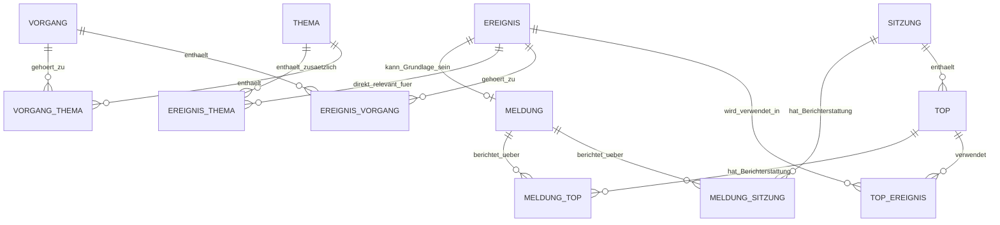
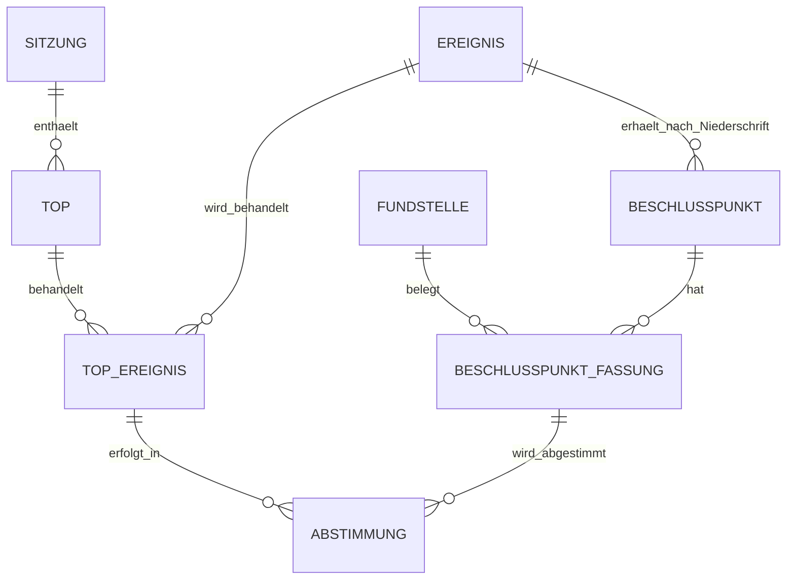

# Sitzungs- und Beschlussmodell – FIB Echtsystem

## Dokumentstand

| Version | Stand | Verantwortlich |
|---|---|---|
| 1.0 | 04.10.2026 | Josef Walter – erstellt mit KI-Unterstützung |

## 1. Zweck und Geltung

Dieses Dokument ist die verbindliche Primärquelle für das fachliche Teilmodell **Sitzung / TOP / Beschlussvorlage / Beschluss / Beschlusspunkt / Abstimmung / Niederschrift** im FIB-Echtsystem.

Es konkretisiert und korrigiert den bisher in `docs/Datenmodell.md`, insbesondere Abschnitt 3.10, beschriebenen Sitzungsbereich. Bei Widersprüchen hat für diesen Teilbereich dieses Dokument Vorrang, bis die nächste konsolidierte Fassung des Gesamtdatenmodells erstellt ist.

Ziel ist ein Modell, das den tatsächlichen Ablauf im Feldkirchner Ratsinformationssystem (RIS) abbildet und zugleich die Nutzung von Sitzungsinhalten in Meldungen, Vorgängen und Themen ermöglicht.

## 2. Grundmodell

Sitzungen mit ihren TOPs bestehen fachlich unabhängig von Meldungen, Vorgängen und Themen.

Ein Sitzungsereignis ist jedoch ein reguläres FIB-Ereignis und kann wie andere Ereignisse in Meldungen, Vorgängen und Themen verwendet werden.



## 3. Ereignis im Sitzungsmodell

### 3.1 Gemeinsames Ereignis-Grundobjekt

Ein Sitzungsereignis ist fachlich **kein eigener Ereignistyp außerhalb des allgemeinen FIB-Ereignismodells**. Aus Sicht des späteren physischen Datenmodells soll deshalb grundsätzlich dieselbe Ereignisidentität verwendet werden wie für Ereignisse, die in Meldungen, Vorgängen oder Themen vorkommen.

Ein Ereignis ist in diesem Teilmodell ein fachlich relevanter, persistent gespeicherter Sachstand bzw. Informationsgegenstand, der in Meldungen, Vorgängen und Themen genutzt werden kann. Bei Sitzungsereignissen kann dieser Sachstand insbesondere durch ein offizielles RIS-Dokument verkörpert werden.

### 3.2 Beschlussvorlage als Ereignis

Eine Beschlussvorlage ist bereits ein Ereignis, auch wenn sie noch keiner Sitzung und keinem TOP zugeordnet ist.

Damit kann eine neue Vorlage unabhängig von einer späteren Sitzung bereits:

- einem Vorgang zugeordnet werden,
- in einem Thema verwendet werden,
- bei ausreichendem Nachrichtenwert Grundlage einer Meldung sein.

Die spätere Zuordnung zu einem TOP verändert nicht die fachliche Identität dieses Ereignisses.

### 3.3 Beschlussvorlage und Beschluss

Beschlussvorlage und späterer Beschluss sind **nicht zwei verschiedene Ereignisse**. Sie sind dasselbe übergeordnete Ereignis in unterschiedlichen Verfahrens- bzw. Sachständen.

Der ursprüngliche Beschlussvorschlag bleibt dabei dauerhaft nachvollziehbar und einsehbar. Er wird nicht durch die später beschlossene Fassung überschrieben.

Insbesondere gilt:

> **Der Besucher soll bei einem Beschluss bei Bedarf auch den ursprünglichen Beschlussvorschlag einsehen können.**

Dadurch kann FIB transparent zeigen, ob und wie sich der Inhalt in der Sitzung verändert hat.

## 4. Sitzung und TOP

### 4.1 Sitzung

Eine Sitzung ist ein konkreter Termin eines politischen Gremiums.

Eine Sitzung besitzt mindestens:

- stabile Identität,
- Gremium,
- Sitzungstermin,
- RIS-Referenz bzw. Sitzungsschlüssel,
- Quellen/Fundstellen,
- Status,
- zugehörige TOPs,
- gegebenenfalls Niederschrift und deren Genehmigungs-/Verfügbarkeitsstatus.

### 4.2 TOP

Ein TOP ist ein konkreter Tagesordnungspunkt einer Sitzung. Er ist kein Ereignis, sondern der Verfahrens- und Behandlungskontext, in dem ein oder mehrere Ereignisse verwendet werden können.

Ein TOP gehört genau einer Sitzung.

Ein TOP kann mehrere fachliche Sachverhalte bzw. Ereignisse behandeln. Ein Ereignis kann wiederum in mehreren TOPs verwendet werden, insbesondere bei Vertagung, erneuter Behandlung oder Fortführung in einer späteren Sitzung.

Diese Beziehung darf deshalb nicht auf 1:1 begrenzt werden.

### 4.3 TOP-Verwendung eines Ereignisses

Die Beziehung zwischen TOP und Ereignis ist fachlich selbst relevant. Sie muss mindestens erkennen lassen:

- welches Ereignis in welchem TOP verwendet wurde,
- in welcher Sitzung dieser TOP lag,
- welchen Verfahrensstatus der TOP erreichte,
- ob sich der Sachstand des Ereignisses in diesem TOP änderte,
- welche Abstimmungen daraus hervorgingen.

Ein Vorgang oder Thema muss daraus ableiten können, **bei welchem TOP ein Ereignis einen bestimmten Verfahrens- oder Sachstand erreicht hat**.

## 5. Verfahrensstatus des TOP

Der TOP-Status beschreibt die Behandlung des Tagesordnungspunkts und ist vom Beschluss- bzw. Abstimmungsergebnis getrennt.

Mindestens vorgesehen sind:

- `aktiv` bzw. angekündigt – steht zur Behandlung an,
- `zurückgestellt` bzw. vertagt – Behandlung oder Entscheidung wurde auf einen späteren Zeitpunkt verschoben,
- `behandelt` – der TOP wurde tatsächlich behandelt,
- `abgesetzt / nicht behandelt` – ein angekündigter TOP wurde nicht behandelt.

Die endgültige Benennung der technischen Statuswerte wird erst im physischen Datenmodell festgelegt; fachlich müssen die genannten Zustände unterscheidbar bleiben.

## 6. Beschlussvorschlag, Beschlusspunkt, Fassung und Abstimmung

### 6.1 Keine vorzeitige Zerlegung der Beschlussvorlage

Aus einer Beschlussvorlage werden **noch keine FIB-Beschlusspunkte und keine Abstimmungen erzeugt**.

Begründung:

- Ein Beschlussvorschlag kann in der Sitzung verändert oder vollständig neu gefasst werden.
- Mehrere Sachverhalte können innerhalb eines Beschlussvorschlags enthalten sein.
- Erst die Niederschrift dokumentiert, welche Beschlusstexte tatsächlich zur Abstimmung gestellt wurden.

Der ursprüngliche Beschlussvorschlag bleibt als Originalinhalt der Vorlage gespeichert bzw. über seine Fundstelle einsehbar.

### 6.2 Entstehung der Beschlusspunkte

`Beschlusspunkt` und `Abstimmung` entstehen erst mit der Auswertung der Niederschrift.

Für die Feldkirchner Niederschriften gilt nach Prüfung mehrerer Beispiele als verbindliche Extraktionsregel:

> **Der Text unmittelbar vor einer Abstimmungszeile ist der Beschlusstext, über den diese Abstimmung erfolgt.**

Enthält ein TOP mehrere solche Kombinationen, entstehen mehrere Beschlusspunkte bzw. Abstimmungen innerhalb desselben TOPs.

Ein TOP kann daher mehrere Beschlusspunkte enthalten, und ein Beschlusspunkt kann mehrere Abstimmungen haben, wenn im Sitzungsverlauf über denselben Sachverhalt mehrfach abgestimmt wird.

### 6.3 Fassung eines Beschlusspunkts

Ein Beschlusspunkt besitzt eine fachliche Identität und kann mehrere Fassungen haben.

Mindestens unterschieden werden können:

- ursprünglicher Beschlussvorschlag bzw. Ausgangstext aus der Vorlage, soweit dem späteren Beschlusspunkt semantisch zuordenbar,
- tatsächlich zur Abstimmung gestellte Fassung aus der Niederschrift,
- gegebenenfalls weitere während der Sitzung entstandene Fassungen.

Die Abstimmung bezieht sich immer auf genau die Fassung, die unmittelbar vor der betreffenden Abstimmungszeile dokumentiert ist.

Der ursprüngliche Beschlussvorschlag wird nicht überschrieben. Er bleibt als Vergleichsfassung verfügbar.

### 6.4 Mehrere Abstimmungen

Ein Beschlusspunkt kann mehrere Abstimmungen haben, beispielsweise wenn:

- eine Fassung zunächst abgelehnt wird,
- der Wortlaut anschließend geändert wird,
- über eine neue Fassung erneut abgestimmt wird.

Deshalb werden `Beschlusspunkt` und `Abstimmung` als getrennte fachliche Entitäten modelliert.



### 6.5 Semantischer Vergleich mit der Beschlussvorlage

Erst nachdem die Niederschrift die tatsächlich abgestimmten Beschlusspunkte und Fassungen erkennen lässt, vergleicht die KI diese mit dem ursprünglichen Beschlussvorschlag.

Dabei kann sie insbesondere feststellen:

- inhaltlich unverändert,
- nur sprachlich/redaktionell verändert,
- fachlich verändert,
- vollständig neu gefasst,
- ursprünglicher Inhalt aufgeteilt,
- mehrere ursprüngliche Inhalte zusammengeführt,
- zusätzlicher neuer Beschlusspunkt,
- ursprünglicher Vorschlag nicht beschlossen bzw. nicht wiederzufinden.

Es wird nicht vorausgesetzt, dass zwischen Vorlage und Niederschrift eine 1:1-Zuordnung einzelner Textteile besteht.

## 7. KI-Auswertung der Niederschrift

### 7.1 Struktur des RIS

Die geprüften Feldkirchner Niederschriften verwenden je TOP eine hinreichend strukturierte Form mit Vortrag, Beratung, Beschluss und nachfolgender Abstimmung. Der gesamte TOP-Abschnitt beschreibt den tatsächlich behandelten Stand.

Für die Ermittlung des beschlossenen Inhalts ist der unmittelbar vor der Abstimmungszeile stehende Beschlusstext maßgeblich.

`Vortrag` und `Beratung` liefern Kontext. Sie werden nicht ohne Weiteres als verbindlicher Beschlussinhalt behandelt.

### 7.2 KI-Aufgaben

Die KI übernimmt semantisch insbesondere:

1. Zuordnung des Niederschriften-TOPs zum bereits bekannten Ereignis bzw. zur Beschlussvorlage,
2. Erkennung der tatsächlich abgestimmten Beschlusstexte,
3. Bildung der Beschlusspunkte,
4. Zuordnung jeder Abstimmung zur unmittelbar vorausgehenden Beschlusspunkt-Fassung,
5. semantischen Vergleich mit dem ursprünglichen Beschlussvorschlag,
6. Kennzeichnung fachlich relevanter Änderungen.

Für die Ereigniszuordnung werden möglichst mehrere Merkmale gemeinsam genutzt, insbesondere:

- Sitzung,
- TOP-Nummer,
- TOP-Titel,
- Vorlagen-/Beschlussnummer,
- Dokumentbeziehungen,
- semantischer Inhalt.

### 7.3 Unsichere Zuordnung und Pflichtprüfung

Kann die KI eine Zuordnung nicht hinreichend sicher vornehmen, gilt verbindlich:

> **Das Redaktionssystem muss einen deutlichen, nicht übersehbaren Prüfhinweis anzeigen. Die unsichere Zuordnung darf vor redaktioneller Bestätigung nicht fachlich wirksam werden.**

Dies gilt insbesondere bei Unsicherheit über:

- das zugehörige Ereignis,
- den zugehörigen TOP,
- die Abgrenzung eines Beschlusspunkts,
- die Zuordnung einer Abstimmung,
- die Zuordnung einer neuen Fassung zum ursprünglichen Beschlussvorschlag,
- Aufteilung oder Zusammenführung von Beschlussinhalten.

Die KI darf in diesen Fällen einen begründeten Vorschlag liefern, entscheidet aber nicht autonom.

## 8. Niederschrift und Sitzungsabschluss

Die Niederschrift gehört zur Sitzung als Ganzes.

In einer späteren Sitzung gibt es einen TOP zur Genehmigung der Niederschrift. Erst wenn diese Genehmigung öffentlich belegt ist, gilt die zugehörige Sitzung als fachlich `abgeschlossen`.

Dabei sind zwei Sachverhalte strikt getrennt:

1. **Genehmigungsstatus der Niederschrift**,
2. **öffentliche Verfügbarkeit des Niederschriftsdokuments**.

Eine Sitzung kann daher abgeschlossen sein, obwohl die genehmigte Niederschrift nicht als öffentlich abrufbares Dokument vorliegt.

Dieser Fall muss ausdrücklich dokumentiert und öffentlich verständlich dargestellt werden können, zum Beispiel:

> Niederschrift genehmigt am 22.10.2026 – Dokument nicht öffentlich verfügbar.

## 9. Presse- und FIB-Meldungen zu Sitzungen und TOPs

Zur Sitzung können eigenständige Presse- oder FIB-Meldungen existieren. Diese Meldungen werden regulär als Meldungen angezeigt und sollen zusätzlich bei der zugehörigen Sitzung sichtbar werden können.

Dafür sind eigenständige fachliche Beziehungen `Meldung ↔ Sitzung` und bei konkreter TOP-Berichterstattung `Meldung ↔ TOP` zulässig und sinnvoll.

Diese Beziehungen bedeuten:

> **Die Meldung berichtet über diese Sitzung bzw. diesen TOP.**

Sie ersetzen nicht die Beziehung zwischen TOP und Ereignis.

## 10. Navigation zwischen TOP, Vorgang und Thema

Ein TOP soll öffentlich anzeigen können, ob das zugehörige Ereignis in einem Vorgang oder Thema behandelt wird. Diese Information soll nach Möglichkeit nicht redundant am TOP gepflegt werden, sondern aus den fachlichen Beziehungen abgeleitet werden:

```text
TOP
→ TOP-Ereignis
→ Ereignis
→ Vorgang
→ Thema
```

Damit sind beide Navigationsrichtungen möglich:

```text
Vorgang/Thema → Ereignis → TOP → Sitzung
```

und

```text
Sitzung → TOP → Ereignis → Vorgang/Thema
```

Öffentlich kann der TOP beispielsweise Links auf den zugehörigen Vorgang und das zugehörige Thema anzeigen.

## 11. Öffentliche Darstellung von Beschlüssen

Im Normalfall soll für Besucher der tatsächlich abgestimmte Beschluss im Vordergrund stehen:

- Beschlusstext,
- Abstimmungsergebnis,
- Sitzung und TOP,
- gegebenenfalls Bezug zu Vorgang/Thema.

Zusätzlich muss bei vorhandenem ursprünglichem Beschlussvorschlag eine Möglichkeit bestehen, diesen einzusehen, beispielsweise über:

> **Ursprünglichen Beschlussvorschlag anzeigen**

Damit bleibt transparent, ob der Gemeinderat den ursprünglichen Vorschlag unverändert, verändert oder vollständig neu gefasst beschlossen hat.

## 12. Abgrenzung zur physischen Datenbank

Die in diesem Dokument genannten Entitäten und Beziehungen sind fachliche/logische Modellbestandteile. Die konkrete Umsetzung als PostgreSQL-/Supabase-Tabellen, Spalten, Fremdschlüssel, Views oder technische Historientabellen wird erst beim physischen Datenmodell festgelegt.

Insbesondere wird erst dort entschieden, ob bestimmte Zustandsinformationen direkt an der TOP-Ereignis-Beziehung gespeichert oder aus gesonderten Änderungs-/Verlaufsdaten abgeleitet werden.

Nicht offen ist dagegen die fachliche Anforderung, dass rekonstruierbar sein muss:

- welches Ereignis in welchem TOP behandelt wurde,
- welche Beschlusspunkte aus der Niederschrift entstanden,
- welche Fassung tatsächlich abgestimmt wurde,
- welches Abstimmungsergebnis dazu gehört,
- wie der ursprüngliche Beschlussvorschlag lautete,
- ob und wie sich der Beschluss gegenüber dem Vorschlag änderte,
- in welchem TOP ein Ereignis einen bestimmten Sach- oder Verfahrensstand erreichte.

## Änderungshistorie

| Version | Datum | Änderung |
|---|---|---|
| 1.0 | 04.10.2026 | Sitzungs- und Beschlussmodell nach Prüfung realer Feldkirchner Niederschriften neu festgelegt. Beschlussvorlage als bereits nutzbares Ereignis; Beschlussvorlage und Beschluss als dasselbe übergeordnete Ereignis; n:m-fähige TOP-Ereignis-Beziehung; Beschlusspunkte und Abstimmungen entstehen erst aus der Niederschrift; Beschlusspunkt-Fassungen und mehrere Abstimmungen modelliert; ursprünglicher Beschlussvorschlag bleibt einsehbar; KI-Zuordnung mit zwingendem sichtbarem Prüfhinweis bei Unsicherheit; Genehmigung und Dokumentverfügbarkeit der Niederschrift getrennt; Meldungen können Sitzung/TOP direkt als Berichterstattungsbezug haben; Navigation TOP↔Vorgang/Thema ableitbar. |
