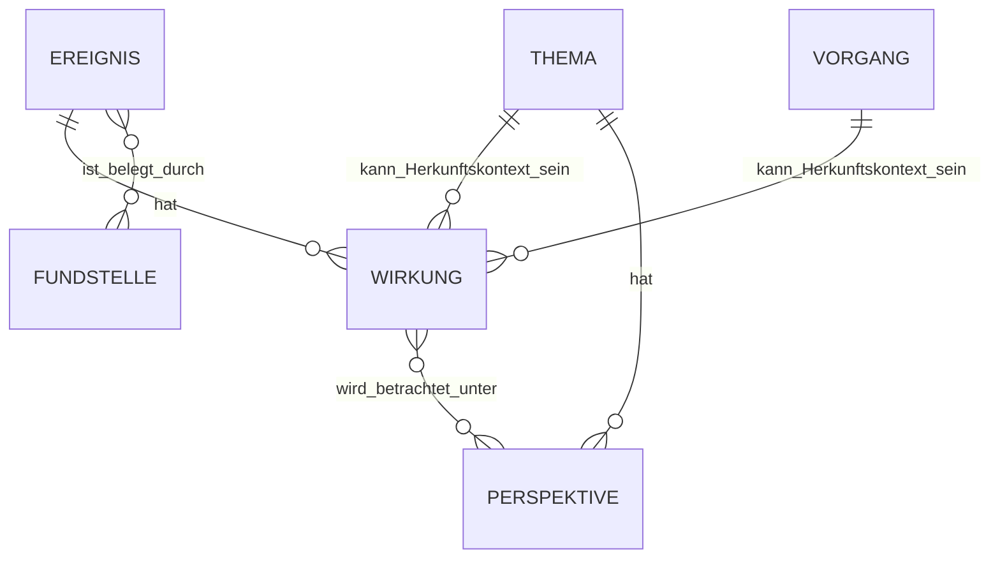

# Wirkungsmodell – FIB Echtsystem

## Dokumentstand

| Version | Stand | Verantwortlich |
|---|---|---|
| 1.1 | 05.10.2026 | Josef Walter – erstellt mit KI-Unterstützung |

## 1. Zweck und Geltung

Dieses Dokument ist die verbindliche Primärquelle für die fachliche Modellierung von `Wirkung` im FIB-Echtsystem.

Es gilt ergänzend zu `docs/Datenmodell.md` und `docs/Redaktionsworkflow.md`. Im G3-Gesamtaudit wurde die frühere Fassung 1.0 als überholt erkannt, weil sie Wirkungen ausschließlich Vorgang oder Thema zuordnete. Die zwischenzeitlich konsolidierte Entscheidung lautet dagegen: **Wirkungen sind an Ereignissen verankert und besitzen zusätzlich einen fachlichen Herkunftskontext.**

## 2. Grundsatz

> **Jede Wirkung ist einem Ereignis zugeordnet. Zusätzlich wird gespeichert, in welchem fachlichen Bearbeitungskontext – insbesondere Vorgang oder Thema – sie angelegt und bestätigt wurde.**

Damit gilt:

- ein Ereignis kann keine, eine oder mehrere Wirkungen besitzen,
- eine Wirkung gehört genau zu einem Ereignis,
- eine Wirkung kann als Herkunftskontext insbesondere einen Vorgang oder ein Thema besitzen,
- ein Ereignis benötigt weder Meldung noch Vorgangszuordnung, damit eine Wirkung erfasst werden kann,
- eine bestehende Wirkung wird nur in ihrem Herkunftskontext fachlich geändert,
- andere Kontexte dürfen die Wirkung verwenden und analysieren, aber nicht stillschweigend verändern oder durch eine konkurrierende Fassung derselben Aussage ersetzen.

## 3. Fachliche Begründung

Das Ereignis ist die quellengebundene Tatsachenbasis, an der die konkrete Folge verankert wird. Der Herkunftskontext erklärt dagegen, **in welchem redaktionellen Analysezusammenhang** diese Wirkung gebildet wurde.

Dadurch bleibt zugleich nachvollziehbar:

- aus welchem realen Geschehen die Wirkung abgeleitet wurde,
- in welchem Vorgang oder Thema sie redaktionell entstanden ist,
- welcher Bearbeitungskontext sie ändern darf,
- in welchen anderen Themen oder Analysen sie wiederverwendet wird.

Beispiel:

`Ereignis E1 → Wirkung W1 → Herkunftskontext Vorgang V1`

Wird E1 später über V1 Bestandteil eines Themas T1, wird W1 dort berücksichtigt. Das Thema darf W1 analysieren und Perspektiven zuordnen; eine fachliche Änderung an W1 erfolgt jedoch im Herkunftskontext V1.

## 4. Fachliche Beziehungen

Die konkrete physische Umsetzung der Herkunftskontext-Beziehung wird erst im physischen Datenmodell festgelegt.

## 5. Mehrere Wirkungen desselben Ereignisses

Ein Ereignis kann mehrere Wirkungen besitzen, wenn diese eigenständige sachliche Aussagen darstellen.

Unterschiedliche Formulierungen derselben sachlichen Wirkung sollen dagegen nicht als mehrere unabhängige Wirkungen gewertet werden. Die KI prüft deshalb bei neuen Wirkungen auf:

- semantische Gleichheit,
- starke Überschneidung,
- scheinbare oder tatsächliche Widersprüche.

Mögliche Dubletten oder Widersprüche werden der Redaktion sichtbar angezeigt. Eine Wirkung wird nicht automatisch gelöscht, zusammengeführt oder umgedeutet.

## 6. Verwendung im Vorgang

Ein Vorgang berücksichtigt die Wirkungen seiner zugehörigen Ereignisse. Im Vorgang entstandene Wirkungen tragen den Vorgang als Herkunftskontext.

Mehrere Ereignisse eines Vorgangs können unterschiedliche, ergänzende oder widersprüchliche Wirkungen besitzen. Solche Unterschiede sind nicht automatisch Fehler, sondern können zeitliche Entwicklung, unterschiedliche Bedingungen oder unsichere Erkenntnislagen ausdrücken.

## 7. Verwendung im Thema

Mit einem ausgewählten Vorgang werden dessen Ereignisse und damit die vorhandenen Wirkungen in die Themenanalyse einbezogen. Dasselbe gilt für direkt ergänzte Ereignisse.

> **Ereignis im Thema + vorhandene Wirkung = Wirkung wird im Thema behandelt.**

Eine vorhandene Wirkung wird nicht allein für die Themenanalyse dupliziert. Entsteht im Themenkontext tatsächlich eine neue eigenständige Wirkung zu einem Ereignis, erhält diese das Thema als Herkunftskontext.

## 8. Bezug zu Perspektiven

Perspektiven gehören zum Thema. Eine im Thema berücksichtigte Wirkung wird einer oder mehreren bestätigten Perspektiven zugeordnet.

Die Zuordnung `Wirkung ↔ Perspektive` wird persistent gespeichert und nur bei fachlichem Anlass neu geprüft, insbesondere wenn:

- sich die Wirkung fachlich ändert,
- sich eine Perspektive ändert,
- eine neue Perspektive entsteht,
- eine Plausibilitätsprüfung eine auffällige Zuordnung erkennt,
- die Redaktion eine Neubewertung verlangt.

## 9. Anti-Doppelzählung

Gleichbedeutende Wirkungen desselben Ereignisses dürfen in einer übergeordneten Analyse nicht mehrfach gewichtet werden.

Wird fachlich bestätigt, dass zwei Wirkungen im Wesentlichen dieselbe sachliche Auswirkung beschreiben, bleiben ihre Identitäten und Herkunftskontexte nachvollziehbar, werden aber in Themenanalyse, Abwägung und Textformulierung nur einmal als sachliche Aussage gewichtet.

## 10. Keine eigene Versionshistorie der Wirkung

> **Wirkungen erhalten keine eigene unabhängige Versionskette.**

Eine fachlich wesentliche Änderung einer Wirkung wird im zuständigen Herkunftskontext vorgenommen und kann eine neue Gesamtversion des betreffenden Vorgangs bzw. Themas auslösen. Die frühere Fassung bleibt über den vorherigen strukturierten Gesamtstand rekonstruierbar.

## 11. Abgrenzung zur Bewertung

`Wirkung` beschreibt eine sachlich belegbare oder begründet erwartbare Folge.

Davon getrennt bleiben insbesondere:

- `Zielbereich`,
- `Wirkungsrichtung`,
- `Bedeutung der Wirkung`,
- `Verlässlichkeit`,
- `politisches Gewicht`,
- `Begründung`,
- `politischer Bezug`,
- strukturierte `Abwägung`.

Diese Angaben gehören zur strukturierten redaktionellen Einordnung und dürfen nicht mit der Tatsachenbasis der Wirkung vermischt werden.

## 12. Persistenz

Ein späterer Recherchelauf darf eine bestätigte Wirkung nicht allein deshalb entfernen, weil das Ereignis oder eine Fundstelle in diesem Lauf nicht erneut gefunden wurde.

Eine fachlich wirksame Änderung oder Aufhebung muss begründet und nachvollziehbar sein. Historische Nachvollziehbarkeit erfolgt über die Gesamtversionen des zuständigen Vorgangs bzw. Themas und die Auditspur der Beziehung.

## 13. Verbindliche Kurzregel

> **Wirkungen sind an Ereignissen verankert. Ihr Herkunftskontext bestimmt, wo sie fachlich geändert werden dürfen. Andere Vorgänge oder Themen dürfen sie verwenden und analysieren, aber nicht verdeckt verändern. Gleichbedeutende Wirkungen werden in übergeordneten Analysen nicht mehrfach gewichtet.**

## Änderungshistorie

| Version | Datum | Änderung |
|---|---|---|
| 1.1 | 05.10.2026 | G3-Gesamtaudit: Widerspruch zu Datenmodell und Redaktionsworkflow beseitigt. Wirkung wieder verbindlich am Ereignis verankert; Herkunftskontext Vorgang/Thema, Änderungszuständigkeit, Themenverwendung und Anti-Doppelzählung konsolidiert. |
| 1.0 | 04.10.2026 | Zwischenstand: Wirkung wurde ausschließlich Vorgang oder Thema zugeordnet. Diese Fassung wurde durch die spätere G3-Konsolidierung abgelöst. |
