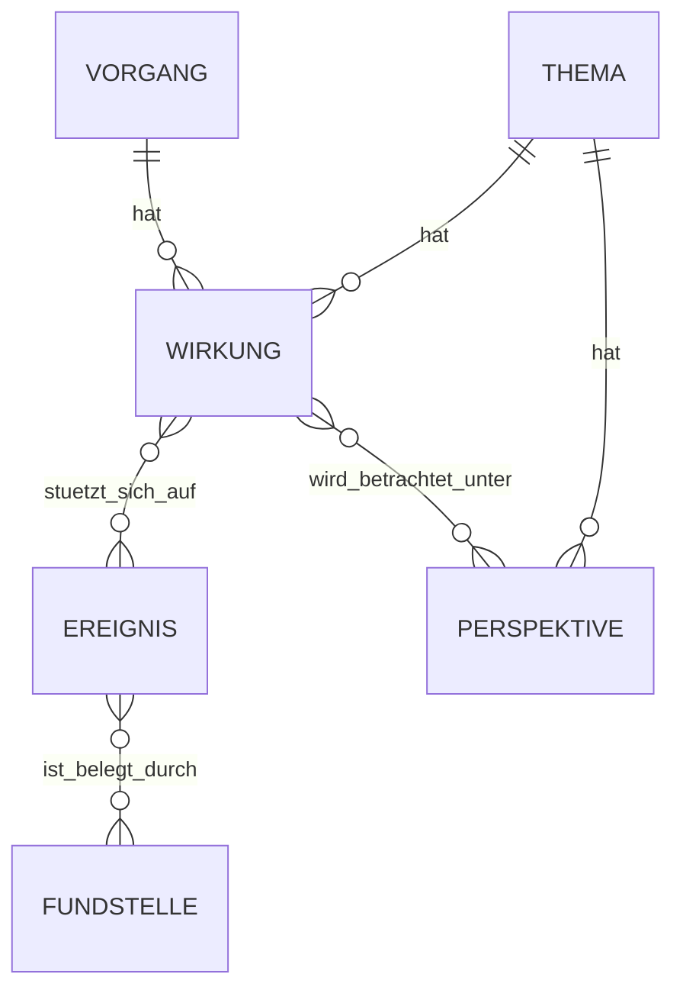

# Wirkungsmodell – FIB Echtsystem

## Dokumentstand

| Version | Stand | Verantwortlich |
|---|---|---|
| 1.0 | 04.10.2026 | Josef Walter – erstellt mit KI-Unterstützung |

## 1. Zweck und Geltung

Dieses Dokument ist die verbindliche Primärquelle für die fachliche Modellierung von `Wirkung` im FIB-Echtsystem.

Es korrigiert die bisher in `docs/Datenmodell.md` und `docs/Redaktionsworkflow.md` enthaltene ältere Annahme, Wirkungen seien als eigene fachliche Objekte am `Ereignis` verankert. Bei Widersprüchen hat für die Wirkungslogik dieses Dokument Vorrang, bis die betroffenen Gesamtdokumente konsolidiert sind.

## 2. Grundsatz

> **Eine Wirkung gehört zu genau einem Analysekontext: einem `Vorgang` oder einem `Thema`. Sie beschreibt den aktuell fachlich gültigen Wirkungsstand in diesem Kontext.**

Ereignisse und Quellen bilden die Tatsachen- und Begründungsgrundlage einer Wirkung, sind aber nicht deren fachlicher Eigentümer.

Damit gilt:

- eine Wirkung gehört genau zu einem `Vorgang` oder genau zu einem `Thema`,
- eine Wirkung kann sich auf ein oder mehrere `Ereignisse` stützen,
- ein Ereignis kann in unterschiedlichen Vorgängen oder Themen zu unterschiedlichen Wirkungen beitragen,
- dieselbe Wirkung wird nicht als globale unveränderliche Eigenschaft eines Ereignisses geführt,
- fachliche Änderungen einer Wirkung werden im zuständigen Vorgangs- oder Themenkontext vorgenommen.

## 3. Begründung

Ein Ereignis beschreibt einen fachlich relevanten Sachstand bzw. Informationsgegenstand. Welche Folgen daraus hervorgehoben, zusammengeführt oder bewertet werden, hängt vom jeweiligen Analysekontext ab.

Beispiel:

Ein Beschluss zur Hundewiese kann im `Vorgang Hundewiese` unter anderem zu folgenden Wirkungen führen:

- verbesserte Möglichkeit zum Freilauf von Hunden,
- mögliche zusätzliche Lärmbelastung,
- zusätzlicher Flächenbedarf.

Dasselbe Ereignis kann in einem übergeordneten Thema unter einer anderen Leitfrage anders gebündelt oder gewichtet werden. Die Wirkung ist deshalb keine kontextfreie Eigenschaft des Ereignisses.

## 4. Fachliche Beziehungen

Die Darstellung ist fachlich zu lesen. Die endgültige physische Umsetzung kann technisch anders normalisiert werden.

## 5. Wirkung im Vorgang

Eine Vorgangswirkung beschreibt eine aktuell relevante Folge im konkreten Sachverhalt.

Sie kann sich auf ein oder mehrere Ereignisse des Vorgangs stützen. Eine Vorgangswirkung muss daher nicht einem einzelnen Ereignis exklusiv zugeordnet werden.

Beispiel:

Mehrere Ereignisse – etwa eine ursprüngliche Planung, eine geänderte Beschlussvorlage und ein späterer Beschluss – können gemeinsam die aktuelle Wirkung „zusätzliche Lärmbelastung ist gegenüber dem früheren Plan reduziert“ begründen.

## 6. Wirkung im Thema

Eine Themenwirkung beschreibt eine aktuell relevante Folge unter der Leitfrage und den Perspektiven des Themas.

Sie kann aus:

- Vorgängen des Themas,
- den darin enthaltenen Ereignissen,
- direkt ergänzten einzelnen Ereignissen

abgeleitet werden.

Eine Themenwirkung ist dabei eine eigenständige kontextbezogene Analyse. Sie ist nicht automatisch identisch mit einer Vorgangswirkung und wird nicht durch bloßes Kopieren erzeugt.

## 7. Bezug zu Perspektiven

Perspektiven gehören zum Thema. Eine Themenwirkung kann einer oder mehreren Perspektiven zugeordnet werden.

Die Zuordnung `Wirkung ↔ Perspektive` wird persistent gespeichert und nur bei fachlichem Anlass neu geprüft, insbesondere wenn:

- sich die Wirkung fachlich ändert,
- sich eine Perspektive ändert,
- eine neue Perspektive entsteht,
- eine Plausibilitätsprüfung eine auffällige Zuordnung erkennt,
- die Redaktion eine Neubewertung verlangt.

Eine Wirkung kann mehreren Perspektiven zugeordnet sein.

## 8. Keine eigene Versionshistorie der Wirkung

> **Wirkungen erhalten keine eigene unabhängige Versionskette.**

Eine Wirkung beschreibt den aktuell fachlich gültigen Stand ihres Vorgangs- oder Themenkontexts.

Ändert sich eine Wirkung fachlich:

1. wird die aktuelle Wirkung im zuständigen Kontext angepasst,
2. eine fachlich wesentliche Änderung kann eine neue Gesamtversion des zugehörigen Vorgangs bzw. Themas auslösen,
3. die frühere Wirkung bleibt über den vorherigen versionierten Gesamtstand rekonstruierbar.

Mehrere gleichzeitig unterschiedliche Folgen werden als mehrere Wirkungen geführt. Sie sind keine Versionen derselben Wirkung.

## 9. Quellen- und Ereignisbezug

Für jede Wirkung muss nachvollziehbar sein, auf welche Tatsachengrundlage sie sich stützt.

Dazu können gehören:

- ein oder mehrere Ereignisse,
- deren Quellen/Fundstellen,
- gegebenenfalls weitere bestätigte fachliche Angaben des Vorgangs bzw. Themas.

Der Bezug auf mehrere Ereignisse ist ausdrücklich zulässig und häufig sinnvoll.

Ein späterer Recherchelauf darf eine bestätigte Wirkung nicht allein deshalb entfernen, weil ein zugrunde liegendes Ereignis oder eine Quelle in diesem Lauf nicht erneut gefunden wurde. Eine fachliche Änderung muss begründet und redaktionell nachvollziehbar sein.

## 10. Dubletten und Widersprüche

Dublettenprüfung erfolgt innerhalb des jeweiligen Analysekontexts.

Die KI prüft neue Wirkungen insbesondere auf:

- semantische Gleichheit zu vorhandenen Wirkungen,
- starke Überschneidung,
- scheinbare oder tatsächliche Widersprüche.

Mögliche Dubletten oder Widersprüche werden der Redaktion sichtbar angezeigt. Eine Wirkung wird nicht automatisch gelöscht, zusammengeführt oder umgedeutet.

Unterschiedliche Wirkungen können gleichzeitig richtig sein, beispielsweise bei unterschiedlichen räumlichen, zeitlichen oder sachlichen Bedingungen.

## 11. Redaktioneller Workflow

Für Vorgänge und Themen gilt:

1. KI analysiert den aktuellen Tatsachenbestand aus Ereignissen und Quellen.
2. KI schlägt kontextbezogene Wirkungen vor bzw. weist auf Änderungsbedarf bestehender Wirkungen hin.
3. Redaktion bestätigt, ändert, trennt, ergänzt oder verwirft die Vorschläge.
4. Bestätigte Wirkungen werden Bestandteil des aktuellen strukturierten Redaktionsstands des Vorgangs bzw. Themas.
5. Bei fachlich wesentlicher Änderung wird geprüft, ob eine neue Gesamtversion des Vorgangs bzw. Themas erforderlich ist.

## 12. Abgrenzung zur Bewertung

`Wirkung` beschreibt eine sachlich belegbare oder begründet erwartbare Folge.

Davon getrennt bleiben:

- `Zielbereich`,
- `Wirkungsrichtung`,
- `Bedeutung der Wirkung`,
- `Verlässlichkeit`,
- `politisches Gewicht`,
- `Begründung`,
- `politischer Bezug`,
- strukturierte `Abwägung`.

Diese Angaben bewerten bzw. erklären die Wirkung im jeweiligen Analysekontext; sie sind nicht Bestandteil des Ereignisses.

## 13. Verbindliche Kurzregel

> **Ereignisse und Quellen liefern die Tatsachenbasis. Wirkungen gehören zum aktuellen Analysezustand eines Vorgangs oder Themas. Sie können sich auf mehrere Ereignisse stützen, werden nicht eigenständig versioniert und bleiben historisch über die Gesamtversionen ihres Vorgangs bzw. Themas rekonstruierbar.**

## Änderungshistorie

| Version | Datum | Änderung |
|---|---|---|
| 1.0 | 04.10.2026 | Wirkungsmodell korrigiert: Wirkung gehört zu Vorgang oder Thema statt zum Ereignis; Mehrfachbezug auf Ereignisse zugelassen; keine eigene Wirkungs-Versionierung; Historisierung über Gesamtversionen von Vorgang/Thema; Perspektivzuordnung und redaktioneller Workflow angepasst. |
