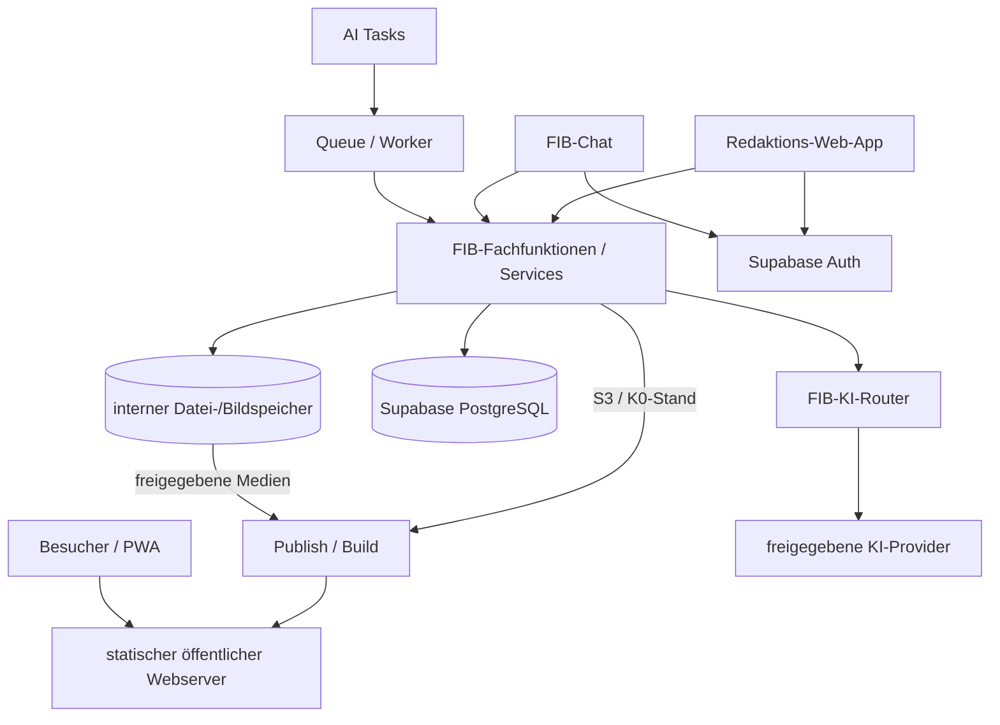

# Zielarchitektur – FIB Echtsystem

## Dokumentstand

| Version | Stand | Verantwortlich |
|---|---|---|
| 0.5 | 06.10.2026 | Josef Walter – erstellt mit KI-Unterstützung |

## 1. Zweck und Geltung

Dieses Dokument ist die verbindliche Integrationsquelle für **G5 – Zielarchitektur / Stack / Hosting / Deployment** des FIB-Echtsystems.

Es übersetzt die fachlichen Entscheidungen aus G1–G4 in eine technische Zielarchitektur, ohne das fachliche Datenmodell oder die Fachfunktionen erneut zu definieren.

Verbindliche Grundlagen insbesondere:

- `docs/Datenmodell.md`
- `docs/MVP-Fachfunktionen.md`
- `docs/KI-Zugangswege-und-Fachfunktionen.md`
- `docs/Schutzbedarf-Datenschutz-und-Offline.md`
- `docs/KI-Provider-und-DSFA-Pruefrahmen.md`
- `docs/Migrationsstrategie.md`
- `docs/KI-Betrieb-und-Kosten.md`
- `docs/decisions/ADR-001-Web-und-Service-Stack.md`
- `docs/decisions/ADR-002-Datei-und-Bildspeicher.md`
- `docs/decisions/ADR-003-Publikations-und-Deploymentprozess.md`
- `docs/decisions/ADR-004-Suche-und-RAG.md`
- `docs/decisions/ADR-005-AI-Tasks-Scheduler-und-Queue.md`
- `docs/decisions/ADR-006-Authentifizierung-und-Rechtearchitektur.md`

## 2. Architekturprinzipien

1. **Eine gemeinsame Fachfunktionsschicht:** Web-App, FIB-Chat und AI Tasks lesen und schreiben fachliche Daten ausschließlich über dieselben Fachservices.
2. **Supabase/PostgreSQL als strukturierter Kern:** fachliche strukturierte Daten, Beziehungen, Status, Historisierung, Audit und Authentifizierung werden dort technisch umgesetzt, soweit kein spezialisierter externer Dienst sachlich geeigneter ist.
3. **Datei-/Bildspeicher vom relationalen Kern entkoppeln:** Binärdateien werden nicht in PostgreSQL eingebettet; die Datenbank speichert Identität, Metadaten, Rechte-/Schutzstatus und technische Speicherreferenzen.
4. **Providerunabhängige KI-Schicht:** Fachfunktionen kennen keine fest verdrahteten Modellnamen. KI-Aufrufe laufen über einen zentralen FIB-KI-Router.
5. **Schutzklassenbewusste Datenweitergabe:** K0–K3 und Personenbezug werden vor Storage-, KI- und Cache-Aktionen berücksichtigt.
6. **Keine direkte fachliche DB-Nutzung:** Direkter SQL-/DB-Zugriff bleibt technischen Betriebsaufgaben vorbehalten.
7. **Konfiguration statt persönlicher Bindung:** Domains, Projekt-IDs, Speicherendpunkte, Provider, Redirects und Secrets werden konfiguriert, nicht in Fachlogik hart codiert.
8. **Migration ist Architekturmerkmal:** Entwicklungs-/Pilotbetrieb und späterer GRÜNEN-Zielbetrieb verwenden dieselbe Software und dasselbe reproduzierbare Schema.
9. **MVP online-first für Redaktion:** kein dauerhafter lokaler Spiegel interner K1/K2-Daten.
10. **Öffentliche Auslieferung static-first:** Besucher lesen einen freigegebenen, versionierten K0-Stand und benötigen für normales Lesen weder Supabase noch KI.
11. **Suche folgt der Fachstruktur:** explizite Beziehungen und strukturierte Filter haben Vorrang vor Volltext; Volltext hat Vorrang vor optionaler semantischer Suche.
12. **Automatisierung ist persistent und wiederaufnehmbar:** fachlich wichtige AI Tasks werden als Runs/Jobs nachvollziehbar gespeichert und nicht an einen einzelnen kurzlebigen Prozess gebunden.
13. **Autorisierung ist mehrstufig:** Fachservices prüfen die fachliche Berechtigung; RLS schützt zusätzlich die Datenbank.

## 3. Logische Gesamtarchitektur



Damit sind interner Arbeitsbetrieb, Automatisierung und öffentliche Auslieferung bewusst entkoppelt.

## 4. Technischer Kern: Supabase / PostgreSQL

Supabase bleibt die bevorzugte Backend-Basis des MVP.

Vorgesehen sind insbesondere:

- PostgreSQL für strukturierte FIB-Daten,
- Supabase Auth für Redakteur-/Admin-Authentifizierung,
- Row Level Security als zusätzliche technische Schutzschicht,
- reproduzierbare Migrationen für Schema, Constraints, Policies, Funktionen und Trigger,
- technische Audit-/Betriebsdaten, soweit passend,
- PostgreSQL-Volltextsuche,
- optional `pgvector` für ausgewählte semantische Such-/RAG-Fälle nach Qualitätsnachweis,
- Supabase Cron/`pg_cron` für geplante Auslöser,
- Supabase Queues/`pgmq` für durable asynchrone Jobs.

> **RLS ersetzt die Fachfunktionsschicht nicht.**

Fachregeln, Zustandsübergänge, Bestätigungen, Freigaben und Audit werden durch die Fachservices erzwungen. Ein öffentlicher Browser erhält keinen regulären direkten Zugriff auf FIB-Fachtabellen.

## 5. Datei- und Bildspeicher

Die FIB-Datenbank speichert fachliche Identität, Herkunft, Rechte, Schutzklasse, Freigabestatus, Beziehungen und eine technische Speicherreferenz. Die Binärdatei selbst liegt in einem dafür vorgesehenen Speicher.

FIB verwendet einen gekapselten Storage-Adapter statt produktabhängiger Pfade in der Fachlogik.

Nextcloud ist für Entwicklung/Pilot ein geeigneter Kandidat. Verbindlich ist aber:

- keine Abhängigkeit von einem persönlichen Nextcloud-Konto,
- standardisierte/gekapselte Schnittstelle,
- K1/K2-Dateien nicht öffentlich ausliefern,
- Produktwechsel ohne Änderung des Fachmodells ermöglichen.

Öffentlich freigegebene Medien werden bei der Veröffentlichung in den öffentlichen K0-Stand bzw. dessen Medienablage übernommen. Besucher greifen dadurch nicht auf den internen Dateispeicher zu.

Details: `docs/decisions/ADR-002-Datei-und-Bildspeicher.md`.

## 6. Öffentliche Webanwendung / PWA

Die öffentliche FIB-Anwendung wird **static-first** umgesetzt.

Vorgesehener Stack gemäß ADR-001:

- TypeScript,
- Astro für die öffentliche Website und statische Seitengenerierung,
- gezielte interaktive Komponenten statt vollständiger SPA-Abhängigkeit,
- PWA-Funktionen für App-Installation, lokalen Neuigkeitsstatus und Push.

Ziele:

- öffentliche Inhalte ohne Anmeldung,
- normales Lesen ohne laufenden KI-Aufruf,
- normales Lesen ohne laufenden Datenbankzugriff,
- stabile URLs,
- SEO-fähige HTML-Ausgabe,
- gerätebezogener Neuigkeitsstatus ohne zentrales Besucherprofil,
- Web Push nur nach Opt-in,
- K0 kann kontrolliert lokal gecacht werden,
- keine K1/K2-Daten im öffentlichen PWA-Cache.

## 7. Redaktions-Web-App

Die Redaktions-Web-App ist der strukturierte Arbeitszugang.

Sie nutzt:

- Supabase Auth,
- administrativ eingerichtete Redakteur-/Admin-Konten statt öffentlicher Selbstregistrierung,
- gemeinsame Fachfunktionen,
- Online-Betrieb im MVP,
- keine dauerhafte Offline-Spiegelung interner Daten,
- serverseitig erzwungene Rollen-, Schutzklassen-, Status- und Freigaberegeln.

Die Geschäftslogik liegt nicht ausschließlich im Browser. Die App kann gezielt interaktive React-Komponenten verwenden; fachliche Regeln bleiben in den Services.

## 8. FIB-Chat

Der FIB-Chat ist ein eigener produktiver Zugang zur gleichen Fachfunktionsschicht.

```text
Benutzer
  ↓
FIB-Chat UI
  ↓
Chat-Orchestrierung / Intent-Erkennung
  ↓
FIB-Fachfunktionen
  ├─ strukturierte Daten
  ├─ Recherche
  └─ FIB-KI-Router
```

Der Chat besitzt keinen pauschalen DB-Zugriff. Er erhält nur den für die jeweilige Fachfunktion zulässigen Kontext. Das verwendete Sprachmodell bleibt austauschbar.

## 9. AI Tasks, Scheduler und Queue

Fachlich wichtige automatische Aufgaben werden nicht als einzelner langer Cron-/Function-Aufruf behandelt.

Der MVP verwendet:

```text
AI Task
   ↓
Supabase Cron oder fachlicher Trigger
   ↓
AITaskRun
   ↓
Supabase Queue / pgmq
   ↓
Edge-Function Worker
   ↓
FIB-Fachfunktionen / Recherche / KI-Router
```

Verbindlich:

- Zeitplanung und Verarbeitung sind getrennt,
- Queue-Jobs bleiben bei kurzfristigen Fehlern erhalten,
- Runs besitzen sichtbaren Status und Fehler,
- Retry darf fachliche Ablehnungen nicht umgehen,
- Jobs/Schritte müssen idempotent sein,
- lange Aufgaben werden in wiederaufnehmbare Schritte zerlegt,
- AI Tasks dürfen keine S2-/S3-Aktion eigenmächtig durchführen,
- manueller Start und Folgeaufträge verwenden dasselbe Run-/Queue-Modell.

Ein eigener dauerhaft laufender Worker-Server ist im MVP nicht vorgesehen und wird nur bei nachgewiesenem Bedarf eingeführt.

Details: `docs/decisions/ADR-005-AI-Tasks-Scheduler-und-Queue.md`.

## 10. KI-Router

Der FIB-KI-Router ist eine zentrale technische Komponente.

Er berücksichtigt pro Auftrag mindestens:

- FIB-Aufgabenklasse,
- erforderliche Qualitäts-/Leistungsklasse,
- Schutzklasse und Personenbezug,
- erlaubte Provider/Modelle,
- Kosten-/Tokenrahmen,
- Fallback-/Review-Regel,
- Tool-/Recherchefreigabe.

Verbindlich:

- keine festen Modellnamen in Fachfunktionen,
- K3 niemals an KI,
- K2 nur an ausdrücklich K2-freigegebene Betriebswege,
- Providerwechsel über Konfiguration,
- Nutzung und Kosten protokollierbar.

## 11. Suche und RAG

FIB verwendet keine pauschale „alles per Vektorsuche“-Architektur.

> **Struktur vor Text, Text vor Semantik.**

### Öffentliche Suche

Beim Static Build wird ein eigener K0-Suchindex erzeugt. Die öffentliche Suche greift damit nicht auf interne Daten oder direkt auf Supabase zu. Für das MVP ist keine öffentliche Vektorsuche erforderlich.

### Interne Suche

Redaktion und FIB-Chat suchen gestuft über:

1. explizite FIB-Beziehungen,
2. strukturierte Filter wie Typ, Status, Zeitraum und Schutzklasse,
3. PostgreSQL-Volltextsuche.

### RAG

KI-Kontext wird ausgehend vom konkreten Fachobjekt zusammengestellt. Explizite Beziehungen und Quellenbindung werden zuerst genutzt. Volltext ergänzt diesen Kontext.

Semantische Suche/Embeddings werden erst dann ergänzt, wenn Tests einen klaren Mehrwert zeigen, insbesondere bei längeren unstrukturierten Dokumenten oder sprachlich stark abweichenden Formulierungen.

Wenn Semantik eingeführt wird, ist hybride Suche – Volltext plus semantische Suche – der bevorzugte Prüfansatz.

Embeddings sind abgeleitete technische Suchdaten und dürfen jederzeit neu erzeugt werden. Sie übernehmen mindestens die Schutzklasse ihres zugrunde liegenden Inhalts.

Details: `docs/decisions/ADR-004-Suche-und-RAG.md`.

## 12. Authentifizierung und Rechtearchitektur

Besucher benötigen kein Konto. Authentifizierung betrifft im MVP ausschließlich Redakteure und Admins.

Technische Grundsätze:

- Supabase Auth dient als Identitätsdienst,
- Konten werden administrativ angelegt/eingeladen; keine offene Selbstregistrierung,
- fachliche Rollen werden serverseitig verwaltet und nicht aus frei änderbaren `user_metadata`-Feldern abgeleitet,
- jeder fachlich wirksame Aufruf wird serverseitig gegen Identität, aktive Rolle, Schutzklasse, Objektzustand und erforderliche Bestätigung geprüft,
- RLS bildet eine zusätzliche Sicherheitsbarriere und ersetzt diese Prüfung nicht,
- öffentliche Besucher erhalten keine fachlichen Schreibrechte und benötigen keinen direkten Data-API-Zugriff,
- privilegierte Service-/Secret-Schlüssel bleiben ausschließlich serverseitig,
- MFA wird technisch unterstützt; Admin-MFA muss durchsetzbar sein,
- Rollenentzug muss serverseitig kurzfristig wirksam werden und darf nicht allein auf veraltete JWT-Claims warten,
- AI Tasks sind technische Akteure und erben keine menschlichen Redakteur-/Adminrechte.

Die konkrete Rollen-/Policy-Matrix, S2-/S3-Bestätigungen und MFA-Pflichten je Rolle/Aktion werden in G6 festgelegt.

Details: `docs/decisions/ADR-006-Authentifizierung-und-Rechtearchitektur.md`.

## 13. Publikationsprozess

Eine fachliche S3-Freigabe schreibt nicht direkt in öffentliche Webdateien.

```text
S3-Freigabe
   ↓
versionierter öffentlicher K0-Stand
   ↓
Static Build
   ├─ HTML
   ├─ Suchindex
   ├─ Sitemap / SEO
   ├─ PWA-Artefakte
   └─ freigegebene Medien
   ↓
Validierung
   ↓
atomarer Deploy
   ↓
öffentliche Seite
```

Wesentliche Regeln:

- nur freigegebene K0-Daten gelangen in den öffentlichen Build,
- fehlgeschlagener Build ersetzt niemals die bisherige Website,
- Besucher sehen keinen halbfertigen Mischstand,
- Deployments sind versioniert und rollbackfähig,
- Redaktionssystem zeigt Publish-Status und Fehler,
- fachlich veröffentlicht und technisch öffentlich ausgeliefert werden als zwei nachvollziehbare Zustände unterschieden.

Details: `docs/decisions/ADR-003-Publikations-und-Deploymentprozess.md`.

## 14. Hosting- und Umgebungsmodell

Mindestens drei logisch getrennte Umgebungen werden vorgesehen:

1. **lokale/Entwicklungsumgebung**,
2. **Pilot-/Entwicklerumgebung**,
3. **Produktivumgebung GRÜNE Feldkirchen**.

Zielbetrieb:

- GRÜNEN-Webserver,
- eigenes Supabase-Projekt der Organisation,
- organisationskontrollierter Datei-/Bildspeicher und Providerkonten,
- organisationskontrollierte Domains, Secrets und Administrationszugänge,
- mindestens zwei administrativ handlungsfähige Personen.

Der statische öffentliche Build ist transportabel und kann in der Pilotphase auf IONOS und später auf dem GRÜNEN-Webserver ausgeliefert werden.

## 15. Deployment und Reproduzierbarkeit

Im Repository versioniert werden mindestens:

- Frontend-Code,
- Fachservice-/Backend-Code,
- Datenbankmigrationen,
- Policies/Constraints/Trigger/Funktionen,
- AI-Task-Definitionen soweit als Code/Konfiguration geführt,
- Edge-/Serverfunktionen,
- Konfigurationsschemas,
- Tests und Regressionstests,
- Build-/Deployment-Skripte bzw. Workflows,
- dokumentierte notwendige externe Projekteinstellungen.

Nicht ins Repository gehören Secrets und produktive personenbezogene Daten.

Eine Zielumgebung muss aus Repository plus dokumentierter Konfiguration reproduzierbar aufgebaut werden können.

## 16. Cache, Versionierung und Aktualität

Die Cache-Strategie folgt dem versionierten Static-Publish-Modell:

- stabile Inhalts-URLs bleiben stabil,
- statische Assets erhalten versions-/hashbasierte Dateinamen und können lange gecacht werden,
- HTML und öffentliche Inhalts-/Versionsmanifeste werden kurz bzw. revalidierbar gecacht,
- Service Worker und PWA erkennen neue Releases,
- neue Veröffentlichungen dürfen nicht dauerhaft durch alte Browser-/PWA-Caches verdeckt werden,
- K1/K2 dürfen nie in öffentlichen Caches landen,
- jeder Deploy besitzt eine technisch prüfbare Releasekennung.

Damit wird das im Demonstrator beobachtete Mehrfach-Reload-/Cacheproblem strukturell vermieden.

## 17. Sichere Ausgabe dynamischer Inhalte

Alle dynamisch erzeugten oder aus externen Quellen übernommenen Inhalte werden vor öffentlicher Ausgabe sicher gerendert.

Verbindlich:

- keine ungeprüfte HTML-Ausgabe von KI-/Quelltext,
- Markdown/strukturierte Inhalte nur über kontrollierten Renderer,
- URLs/Embeds nach Positivregeln,
- Schutz vor XSS/Script-Injektion,
- externe Inhalte erhalten keine Möglichkeit, FIB-Fachfunktionen oder Browserkontext zu manipulieren.

## 18. In G5 bereits entschieden

- TypeScript als gemeinsame Implementierungssprache für Web-/Service-Schicht,
- Astro/static-first für die öffentliche Seite,
- gemeinsame serverseitige Fachservice-Schicht,
- Supabase/PostgreSQL als strukturierter Kern,
- Supabase Auth als Authentifizierungsbasis,
- keine Besucher-Konten und keine offene Selbstregistrierung im MVP,
- serverseitig verwaltete Redakteur-/Adminrollen,
- Fachservices als primäre Autorisierungsinstanz, RLS als Defense in Depth,
- privilegierte Schlüssel ausschließlich serverseitig,
- MFA-fähige Architektur mit durchsetzbarer Admin-MFA,
- interner Datei-/Bildspeicher über austauschbaren Adapter,
- Nextcloud als Pilotkandidat, aber nicht als Systemvoraussetzung,
- öffentliche Medien werden aus internem Speicher in den K0-Deploy übernommen,
- versionierter Build mit Validierung, atomarem Deploy und Rollbackfähigkeit,
- öffentlicher statischer K0-Suchindex,
- interne strukturierte Suche + PostgreSQL-Volltext,
- Vektorsuche nur optional nach Qualitätsnachweis,
- RAG priorisiert explizite Fachbeziehungen vor semantischer Ähnlichkeit,
- Supabase Cron + durable Queue + Edge-Function Worker als MVP-Automatisierung,
- lange AI-/Rechercheläufe werden resumierbar in Schritte zerlegt.

## 19. Noch offene G5-Entscheidungen

Vor Abschluss von G5 sind insbesondere noch zu entscheiden:

1. konkrete Provider-/Routerintegration,
2. konkrete CI/CD-Plattform und Upload-/Deploymentmethode,
3. Detailstruktur des Repositories bzw. der Anwendungen/Packages.

Die konkrete RLS-/Rechtematrix ist keine offene G5-Grundsatzfrage mehr, sondern wird in G6 aus dem fachlichen Rollen-/Aktionsmodell und ADR-006 abgeleitet.

## Änderungshistorie

| Version | Datum | Änderung |
|---|---|---|
| 0.5 | 06.10.2026 | ADR-006 integriert; Authentifizierung auf Redakteur/Admin begrenzt, keine Besucher-Konten, serverseitige Rollenverwaltung, Fachservices als primäre Autorisierungsinstanz, RLS als Defense in Depth, privilegierte Schlüssel nur serverseitig und MFA-fähige Architektur festgelegt. |
| 0.4 | 06.10.2026 | ADR-005 integriert; Supabase Cron + durable Queue + Edge-Function Worker für AI Tasks festgelegt; lange Läufe als wiederaufnehmbare Schritte, Idempotenz und Retry-Grundsätze verankert; eigener Worker-Server im MVP ausgeschlossen. |
| 0.3 | 06.10.2026 | ADR-004 integriert; öffentliche statische Suche, interne strukturierte/Volltextsuche und gestufte RAG-Kontextbeschaffung festgelegt; Vektorsuche als optionale Ergänzung nach Qualitätsnachweis statt MVP-Pflicht eingeordnet. |
| 0.2 | 06.10.2026 | ADR-001 bis ADR-003 integriert; static-first als verbindliche öffentliche Architektur festgelegt; versionierter K0-Publish, Validierung, atomarer Deploy, Rollback und Cache-Strategie ergänzt; interne und öffentliche Medienauslieferung getrennt; offene G5-Punkte bereinigt. |
| 0.1 | 06.10.2026 | G5 gestartet; logische Zielarchitektur mit Supabase/PostgreSQL-Kern, gemeinsamer Fachfunktionsschicht, entkoppeltem Datei-/Bildspeicher, Storage-Adapter, Nextcloud als Pilotkandidat, Web-App/PWA, FIB-Chat, AI Tasks, KI-Router, Umgebungs-/Deploymentmodell, Cache- und sichere Renderinganforderungen festgelegt. |
