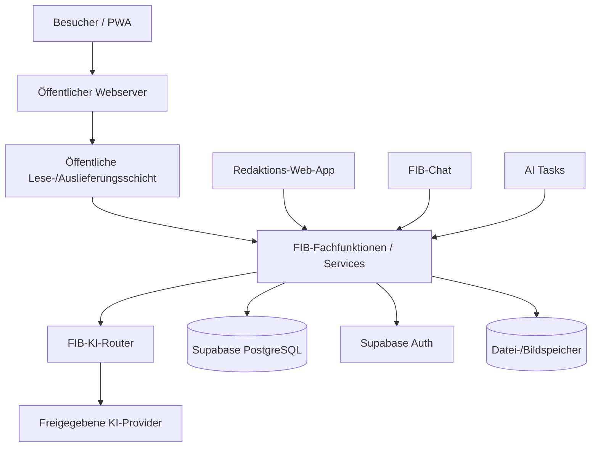

# Zielarchitektur – FIB Echtsystem

## Dokumentstand

| Version | Stand | Verantwortlich |
|---|---|---|
| 0.1 | 06.10.2026 | Josef Walter – erstellt mit KI-Unterstützung |

## 1. Zweck und Geltung

Dieses Dokument ist die verbindliche Integrationsquelle für **G5 – Zielarchitektur / Stack / Hosting / Deployment** des FIB-Echtsystems.

Es übersetzt die fachlichen Entscheidungen aus G1–G4 in eine technische Zielarchitektur, ohne das fachliche Datenmodell oder die Fachfunktionen erneut zu definieren.

Verbindliche Grundlagen insbesondere:

- `docs/Datenmodell.md`
- `docs/MVP-Fachfunktionen.md`
- `docs/KI-Zugangswege-und-Fachfunktionen.md`
- `docs/Schutzbedarf-Datenschutz-und-Offline.md`
- `docs/KI-Provider-und-DSFA-Pruefrahmen.md`
- `docs/Migrationsstrategie.md`
- `docs/KI-Betrieb-und-Kosten.md`

## 2. Architekturprinzipien

1. **Eine gemeinsame Fachfunktionsschicht:** Web-App, FIB-Chat und AI Tasks lesen und schreiben fachliche Daten ausschließlich über dieselben Fachservices.
2. **Supabase/PostgreSQL als strukturierter Kern:** fachliche strukturierte Daten, Beziehungen, Status, Historisierung, Audit und Authentifizierung werden dort technisch umgesetzt, soweit kein spezialisierter externer Dienst sachlich geeigneter ist.
3. **Datei-/Bildspeicher vom relationalen Kern entkoppeln:** Binärdateien werden nicht in PostgreSQL eingebettet; die Datenbank speichert Identität, Metadaten, Rechte-/Schutzstatus und technische Speicherreferenzen.
4. **Providerunabhängige KI-Schicht:** Fachfunktionen kennen keine fest verdrahteten Modellnamen. KI-Aufrufe laufen über einen zentralen FIB-KI-Router.
5. **Schutzklassenbewusste Datenweitergabe:** K0–K3 und Personenbezug werden vor Storage-, KI- und Cache-Aktionen berücksichtigt.
6. **Keine direkte fachliche DB-Nutzung:** Direkter SQL-/DB-Zugriff bleibt technischen Betriebsaufgaben vorbehalten.
7. **Konfiguration statt persönlicher Bindung:** Domains, Projekt-IDs, Speicherendpunkte, Provider, Redirects und Secrets werden konfiguriert, nicht in Fachlogik hart codiert.
8. **Migration ist Architekturmerkmal:** Entwicklungs-/Pilotbetrieb und späterer GRÜNEN-Zielbetrieb verwenden dieselbe Software und dasselbe reproduzierbare Schema.
9. **MVP online-first für Redaktion:** kein dauerhafter lokaler Spiegel interner K1/K2-Daten.
10. **Öffentliche Auslieferung möglichst einfach und robust:** Besucherzugriff soll keine KI und kein Benutzerkonto benötigen.

## 3. Logische Gesamtarchitektur



Die Darstellung ist logisch. Ob einzelne Services später als Edge Function, serverseitiger API-Endpunkt, Datenbankfunktion oder eigener schlanker Dienst umgesetzt werden, wird innerhalb von G5 weiter konkretisiert.

## 4. Technischer Kern: Supabase / PostgreSQL

Supabase bleibt die bevorzugte Backend-Basis des MVP.

Vorgesehen sind insbesondere:

- PostgreSQL für strukturierte FIB-Daten,
- Supabase Auth für Redakteur-/Admin-Authentifizierung,
- Row Level Security bzw. gleichwertige serverseitige Zugriffssicherung als zusätzliche technische Schutzschicht,
- reproduzierbare Migrationen für Schema, Constraints, Policies, Funktionen und Trigger,
- technische Audit-/Betriebsdaten, soweit passend,
- gegebenenfalls PostgreSQL-Vektor-/Suchfunktionen, sofern der spätere Such-/RAG-Entwurf dies tatsächlich benötigt.

Verbindlicher Grundsatz:

> **RLS ersetzt die Fachfunktionsschicht nicht.**

RLS schützt Datenzugriffe technisch. Fachregeln, Zustandsübergänge, Bestätigungen, Freigaben und Audit werden weiterhin durch die Fachservices erzwungen.

## 5. Datei- und Bildspeicher

### 5.1 Trennung von Metadaten und Binärdatei

Die FIB-Datenbank speichert insbesondere:

- fachliche Bild-/Dateiidentität,
- Herkunft und Rechte,
- Schutzklasse,
- Veröffentlichungs-/Freigabestatus,
- Beziehungen zu FIB-Objekten,
- technische Speicherreferenz.

Die Binärdatei selbst liegt in einem dafür vorgesehenen Speicher.

### 5.2 Speicheradapter statt fest verdrahtetem Produkt

FIB erhält eine kleine Storage-Abstraktion. Fachfunktionen arbeiten nicht direkt mit herstellerspezifischen URLs oder Dateipfaden.

Mindestens erforderliche Speicheroperationen:

- Datei ablegen,
- Datei lesen/streamen,
- Metadaten bzw. technischen Identifier erhalten,
- Datei ersetzen/versionieren soweit erforderlich,
- Datei löschen bzw. sperren, wenn dies fachlich/rechtlich zulässig und vorgesehen ist,
- öffentliche bzw. geschützte Auslieferung entsprechend Schutz-/Freigabestatus.

### 5.3 Nextcloud

Nextcloud ist für Entwicklungs-/Pilotbetrieb ein geeigneter Kandidat für Dokument- und Bildspeicherung, insbesondere wenn bereits eine verwaltete Instanz vorhanden ist.

Für die Zielarchitektur gilt jedoch:

- keine Abhängigkeit von einem persönlichen Nextcloud-Konto,
- Zugriff über standardisierte bzw. klar gekapselte Schnittstelle, vorzugsweise WebDAV/geeignete API,
- fachliche Speicherreferenz unabhängig von der konkreten Nextcloud-URL,
- öffentliche Dateien/Bilder nur nach FIB-Freigabe bereitstellen,
- K1/K2-Dateien nicht über erratbare öffentliche Links ausliefern,
- späterer Wechsel auf organisationsgebundene Nextcloud, Supabase Storage oder einen anderen geeigneten Speicher muss ohne Änderung des Fachmodells möglich bleiben.

Eine selbst installierte Nextcloud auf gemeinsam genutztem Webhosting ist **keine Architekturvoraussetzung**. Die bestehende IONOS-Webhosting-Plattform unterstützt zwar PHP/SSH; Nextcloud gehört jedoch nicht zu den offiziell angebotenen Click-&-Build-Anwendungen. Deshalb wird G5 nicht davon abhängig gemacht, dass dort eine zusätzliche Nextcloud ohne Mehrkosten betrieben werden kann.

## 6. Öffentliche Webanwendung / PWA

Die öffentliche FIB-Anwendung ist eine mobile-first Webanwendung/PWA.

Ziel:

- statische bzw. cachebare App-Shell und öffentliche Assets,
- öffentliche Inhalte ohne Anmeldung,
- keine KI-Aufrufe für normales Lesen,
- stabile öffentliche URLs,
- SEO-fähige Ausgabe,
- lokaler gerätebezogener Neuigkeitsstatus ohne zentrales Besucherprofil,
- Web Push nur nach Opt-in,
- öffentliche K0-Inhalte können kontrolliert gecacht werden,
- keine K1/K2-Daten im öffentlichen PWA-Cache.

Die genaue Rendering-Strategie – statische Vorabgenerierung, serverseitige Ausgabe oder Hybrid – wird in G5 nach SEO-, Hosting- und Aktualitätsanforderungen entschieden.

## 7. Redaktions-Web-App

Die Redaktions-Web-App ist der strukturierte Arbeitszugang.

Sie nutzt:

- Supabase Auth,
- gemeinsame Fachfunktionen,
- keine direkten frei verfügbaren Tabellenänderungen,
- Online-Betrieb im MVP,
- keine dauerhafte Offline-Spiegelung interner Daten,
- serverseitig erzwungene Rollen-, Schutzklassen-, Status- und Freigaberegeln.

Die Web-App darf als technischer Client austauschbar bleiben; die Geschäftslogik liegt nicht ausschließlich im Browser.

## 8. FIB-Chat

Der FIB-Chat ist ein eigener produktiver Zugang zur gleichen Fachfunktionsschicht.

Architektur:

```text
Benutzer
  ↓
FIB-Chat UI
  ↓
Chat-Orchestrierung / Intent-Erkennung
  ↓
FIB-Fachfunktionen
  ├─ strukturierte Daten
  ├─ Recherche
  └─ FIB-KI-Router
```

Der Chat besitzt keinen pauschalen DB-Zugriff. Er erhält nur den für die jeweilige Fachfunktion zulässigen Kontext.

Das verwendete Sprachmodell ist austauschbar.

## 9. AI Tasks und Scheduler

AI Tasks werden getrennt von ihren Runs gespeichert.

Die technische Ausführung benötigt:

- Scheduler/Trigger,
- kontrollierten Aufruf zulässiger Fachfunktionen,
- Laufstatus und Fehlerbehandlung,
- Retry-/Timeout-Regeln,
- Kosten-/Modellprotokollierung,
- Schutzklassenprüfung vor externem KI-Aufruf,
- keine eigenmächtige S2-/S3-Eskalation.

Ob Scheduler/Worker über Supabase-Funktionen, externes Cron oder einen kleinen separaten Dienst realisiert werden, wird anhand Zuverlässigkeit und Hostingmöglichkeiten entschieden.

## 10. KI-Router

Der FIB-KI-Router ist eine zentrale technische Komponente.

Er erhält pro Auftrag mindestens:

- FIB-Aufgabenklasse,
- erforderliche Qualitäts-/Leistungsklasse,
- Schutzklasse und Personenbezug des übermittelten Kontexts,
- erlaubte Provider/Modelle,
- Kosten-/Tokenrahmen,
- Fallback-/Review-Regel,
- Tool-/Recherchefreigabe.

Er wählt daraus den freigegebenen Betriebsweg.

Verbindlich:

- keine festen Modellnamen in Fachfunktionen,
- K3 niemals an KI,
- K2 nur an ausdrücklich K2-freigegebene Betriebswege,
- Providerwechsel über Konfiguration,
- Nutzung und Kosten protokollierbar.

## 11. Hosting- und Umgebungsmodell

Mindestens drei logisch getrennte Umgebungen werden vorgesehen:

1. **lokale/Entwicklungsumgebung** – Entwicklung und Tests,
2. **Pilot-/Entwicklerumgebung** – produktionsnaher Testbetrieb unter Entwicklerverantwortung,
3. **Produktivumgebung GRÜNE Feldkirchen** – organisationskontrollierter Zielbetrieb.

Nicht zwingend jede Umgebung benötigt dauerhaft vollständig eigene kostenpflichtige Infrastruktur. Entscheidend ist die Konfigurations- und Datenabgrenzung sowie reproduzierbare Herstellung.

Zielbetrieb gemäß Migrationsstrategie:

- GRÜNEN-Webserver,
- eigenes Supabase-Projekt der Organisation,
- organisationskontrollierte Storage-/Providerkonten,
- organisationskontrollierte Domains, Secrets und Administrationszugänge,
- mindestens zwei administrativ handlungsfähige Personen.

## 12. Deployment und Reproduzierbarkeit

Im Repository versioniert werden mindestens:

- Frontend-Code,
- Fachservice-/Backend-Code,
- Datenbankmigrationen,
- Policies/Constraints/Trigger/Funktionen,
- AI-Task-Definitionen soweit als Code/Konfiguration geführt,
- Edge-/Serverfunktionen,
- Konfigurationsschemas,
- Tests und Regressionstests,
- Deployment-Skripte bzw. Workflows,
- dokumentierte notwendige externe Projekteinstellungen.

Nicht ins Repository gehören Secrets und produktive personenbezogene Daten.

Deployment muss so gestaltet werden, dass eine Zielumgebung aus Repository + dokumentierter Konfiguration reproduzierbar aufgebaut werden kann.

## 13. Cache, Versionierung und Aktualität

G5 muss für öffentliche Inhalte eine explizite Cache-/Invalidierungsstrategie festlegen.

Mindestens gilt:

- fachlich relevante Veröffentlichung/Änderung erzeugt eine neue öffentliche Version bzw. einen eindeutigen Aktualitätsstand,
- Browser/PWA/CDN dürfen veröffentlichte neue Stände nicht durch alten Cache dauerhaft verdecken,
- stabile URLs bleiben stabil; Cache-Busting erfolgt über Version/ETag/Manifest oder vergleichbare technische Mechanismen,
- öffentliche Assets dürfen aggressiver gecacht werden als veränderliche FIB-Inhalte,
- K1/K2 dürfen nie in öffentlichen Caches landen.

Die im Demonstrator beobachteten Mehrfach-Reload-/Cacheprobleme dürfen im Echtsystem nicht wieder auftreten.

## 14. Sichere Ausgabe dynamischer Inhalte

Alle dynamisch erzeugten oder aus externen Quellen übernommenen Inhalte werden vor öffentlicher Ausgabe sicher gerendert.

Verbindlich:

- keine ungeprüfte HTML-Ausgabe von KI-/Quelltext,
- Markdown/strukturierte Inhalte nur über kontrollierten Renderer,
- URLs/Embeds nach Positivregeln,
- Schutz vor XSS/Script-Injektion,
- externe Inhalte erhalten keine Möglichkeit, FIB-Fachfunktionen oder Browserkontext zu manipulieren.

## 15. Noch offene G5-Entscheidungen

Vor Abschluss von G5 sind insbesondere noch zu entscheiden:

1. konkrete Frontend-/Web-App-Technologie,
2. konkrete öffentliche Rendering-/Deploymentstrategie,
3. konkrete Implementierungsform der Fachservices,
4. konkrete technische Auth-/RLS-Architektur,
5. produktiver Datei-/Bildspeicher und Storage-Adapter,
6. Scheduler-/Worker-Technik für AI Tasks,
7. technische Such-/RAG-Architektur und Notwendigkeit von Vektorsuche,
8. konkrete Provider-/Routerintegration,
9. genaue Cache-/Invalidierungsmechanik,
10. CI/CD- und Test-/Deploymentablauf.

## Änderungshistorie

| Version | Datum | Änderung |
|---|---|---|
| 0.1 | 06.10.2026 | G5 gestartet; logische Zielarchitektur mit Supabase/PostgreSQL-Kern, gemeinsamer Fachfunktionsschicht, entkoppeltem Datei-/Bildspeicher, Storage-Adapter, Nextcloud als Pilotkandidat, Web-App/PWA, FIB-Chat, AI Tasks, KI-Router, Umgebungs-/Deploymentmodell, Cache- und sichere Renderinganforderungen festgelegt. |
